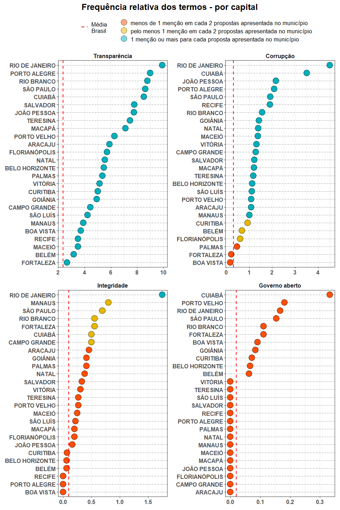
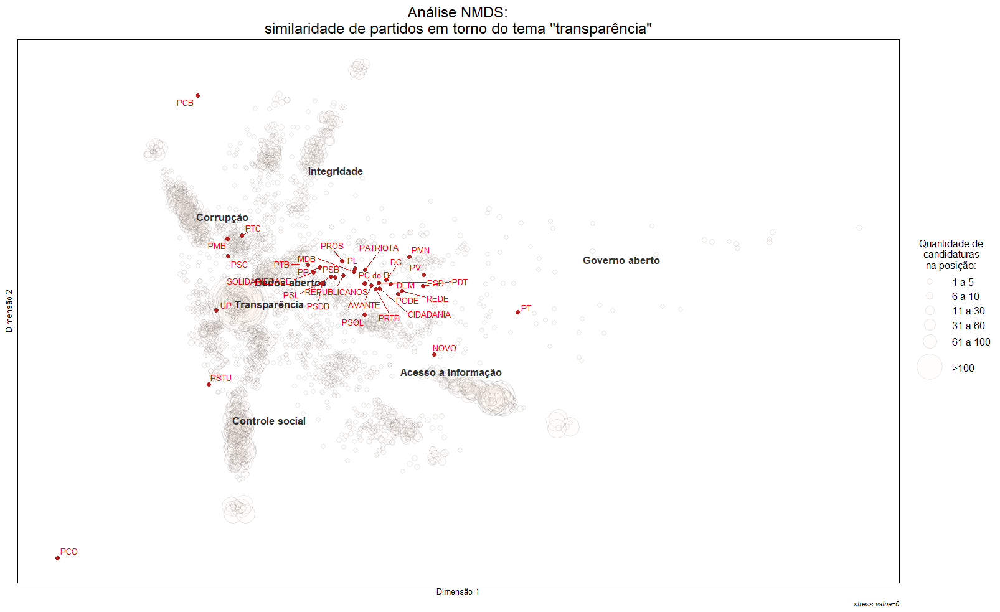

Relatório
================

  - [Total de candidaturas por UF](#total-de-candidaturas-por-uf)
      - [Prevalência dos termos](#prevalência-dos-termos)
      - [Frequência relativa dos
        termos](#frequência-relativa-dos-termos)
          - [Por partido](#por-partido)
          - [Por genero](#por-genero)
          - [Capitais](#capitais)
      - [NMDS](#nmds)
  - [2º Turno](#º-turno)
      - [Total de candidaturas](#total-de-candidaturas)
      - [Total de candidaturas por
        partido](#total-de-candidaturas-por-partido)
      - [Frequencia relativa dos termos segundo o resultado das
        eleições](#frequencia-relativa-dos-termos-segundo-o-resultado-das-eleições)
      - [Frequencia relativa dos termos nas cidades onde há 2º
        turno](#frequencia-relativa-dos-termos-nas-cidades-onde-há-2º-turno)

``` r
library(tidyverse)
library(vegan)
library(sf)
library(janitor)
library(here)
library(patchwork)
```

``` r
source("../code/propostas0_candidaturas_validas.R")
source("../code/propostas2_aplica_buscador.R")
```

# Total de candidaturas por UF

``` r
propostas1 %>%
  count(sg_uf, sort = TRUE) %>% 
  ggplot(
    aes(x = fct_reorder(sg_uf, n, .desc = T),
        y = n,
        label = format(n, big.mark = ".", decimal.mark = ","))
    ) + 
  geom_col() + 
  geom_text(hjust = -.1, size =3) +
  coord_flip() +
  scale_y_continuous(breaks = c(0,1000,2000, 3000),
                     labels = format(c(0,1000,2000, 3000), big.mark = ".", decimal.mark = ","),
                     limits = c(0,2500),
                     expand = c(.005,0)) +
  theme_bw() +
  theme(panel.grid = element_blank()) +
  labs(
    x = NULL,
    y = NULL,
    title = "Total de candidaturas por Unidade da Federação",
    subtitle = "Eleições municipais 2020"
  )
```


## Prevalência dos termos

``` r

termos_resumo <- propostas2 %>% 
  select(-texto_tidy) %>% 
  pivot_longer(-c(index:nm_urna_candidato), names_to = "termo", values_to = "qtd_mencoes") %>% 
  group_by(termo) %>% 
  summarise(qtd_mencoes = sum(qtd_mencoes)) %>% 
  ungroup() %>% 
  mutate(
    termo = termo %>% 
      str_replace_all("_", " ") %>% 
      str_to_sentence() %>% 
      str_replace("cao", "ção") %>% 
      str_replace("en", "ên") %>% 
      fct_reorder(qtd_mencoes),
   per = qtd_mencoes / sum(qtd_mencoes)

  ) 

lbl <- paste0(format(termos_resumo$qtd_mencoes, decimal.mark = ",", big.mark = ".", justify = "centre"),
               " (",  scales::percent(termos_resumo$per, justify = "centre", accuracy = 1), ")")

termos_resumo %>% 
  ggplot(aes(x = termo, y = qtd_mencoes)) + 
  geom_col(fill = "#00AFBB", color = "black") + 
  geom_text(aes(label = lbl), hjust = -.1) +
  scale_y_continuous(breaks = seq(0,30000, 10000),
                     labels = format(seq(0,30000, 10000), decimal.mark = ",", big.mark = "."),
                     limits = c(0, 50000)) +
  coord_flip() +
  labs(x = NULL, y = NULL, title = "Quantidade de menções de cada termo em todas as candidaturas") +
  theme_bw() + 
  theme(panel.grid = element_blank(),
        axis.text = element_text(size = 12))
```


## Frequência relativa dos termos

### Por partido

``` r
pivot_termos <- propostas2 %>% 
  select(-texto_tidy) %>% 
  pivot_longer(transparencia:dados_abertos, values_to = "qtd", names_to = "termo") %>% 
  mutate(
    termo = termo%>% 
      str_replace_all("_", " ") %>% 
      str_to_sentence() %>% 
      str_replace("cao", "ção") %>% 
      str_replace("en", "ên")
  ) %>% 
  group_by(termo, sg_partido) %>% 
  mutate(qt_termo_partido = sum(qtd),
         qt_candidatura = n(),
         freq_termo = qt_termo_partido / qt_candidatura) %>% 
  ungroup()  %>%
  mutate(
    grau = case_when(
      freq_termo < 0.5 ~ "menos de 1 menção em cada 2 propostas apresentada pelo partido",
      freq_termo < 1.0 ~ "pelo menos 1 menção em cada 2 propostas apresentada pelo partido",
      freq_termo >= 1.0 ~ "1 menção ou mais para cada proposta apresentada pelo partido"
    ) %>%
      factor(
        levels = c(
          "menos de 1 menção em cada 2 propostas apresentada pelo partido",
          "pelo menos 1 menção em cada 2 propostas apresentada pelo partido",
          "1 menção ou mais para cada proposta apresentada pelo partido"
        )
      )
  )

termo <- pivot_termos %>% distinct(termo) %>% pull()

plot_freq_termos <- function(token) {
  
  pivot_termos %>% 
    filter(termo == token) %>% 
    mutate(sg_partido = fct_reorder(sg_partido, freq_termo),
           termo = fct_reorder(termo, freq_termo)) %>% 
    ggplot(aes(x = sg_partido, y = freq_termo, fill = grau)) +
    geom_vline(aes(xintercept = sg_partido), lty = 2, color = "gray60") + 
    geom_point(shape = 21, size = 6, alpha = .5) +
    scale_fill_manual(values = c("#FC4E07", "#E7B800", "#00AFBB"), drop=FALSE) +
    facet_wrap(~termo, scales = "free_x") +
    labs(x = NULL,
         y = NULL,
         fill = NULL) + 
    coord_flip() +
    theme_bw() +
    theme(plot.title = element_text(hjust = .5, vjust = .5, size = 18),
          legend.text = element_text(size = 13),
          axis.text = element_text(size = 12, face = "bold"),
          strip.text = element_text(size = 12, face = "bold"),
          strip.background = element_blank()
    ) + 
    guides(fill = guide_legend(ncol = 1))
  
  
}
```

``` r
p1 <- map(termo[1:2], plot_freq_termos) %>%
  reduce(~ `+`(.x, .y)) +
  plot_layout(guides = "collect") &
  theme(legend.position = 'top')

p2 <- map(termo[3:4], plot_freq_termos) %>% 
  reduce(~ `+`(.x, .y)) &
  theme(legend.position = 'none')

p1 / p2 + 
  plot_annotation(title = 'Frequência relativa dos termos - por partido') & 
  theme(plot.title = element_text(hjust = .5, vjust = .5, size = 18, face = "bold"))
```


``` r
p3 <- map(termo[5:6], plot_freq_termos) %>%
  reduce(~ `+`(.x, .y)) +
  plot_layout(guides = "collect") &
  theme(legend.position = 'top')

p4 <- map(termo[7], plot_freq_termos) %>%
  reduce(~ `+`(.x, .y)) &
  theme(legend.position = 'none')

(p3 + p4) + 
  plot_layout(nrow = 2) +
  plot_annotation(title = 'Frequência relativa dos termos - por partido') & 
  theme(plot.title = element_text(hjust = .5, vjust = .5, size = 18, face = "bold"))
```


### Por genero

``` r
caract <- propostas %>% select(index, ds_genero)

propostas3 <- left_join(propostas2, caract)

colunas <- c(
  "transparencia",
  "corrupcao",
  "integridade",
  "governo_aberto",
  "acesso_a_informacao", 
  "controle_social",
  "dados_abertos"
)

genero <- propostas3 %>% 
  count(ds_genero) %>%
  mutate(tot = sum(n), per = n / tot,
         proposta_legivel = "Propostas\nlegíveis\npor máquina") %>% 
  bind_rows(
    
    caract %>% 
      anti_join(.,select(propostas3, index, ds_genero)) %>% 
      count(ds_genero) %>% 
      mutate(tot = sum(n), per = n / tot,
             proposta_legivel = "Sem proposta ou\nproposta\nilegível")
    
  )

lbl <- paste0(format(genero$n, decimal.mark = ",", big.mark = ".", justify = "centre"),
              " (",  scales::percent(genero$per, justify = "centre", accuracy = 1), ")")

genero %>% 
  ggplot(aes(x = proposta_legivel, y = n, fill = ds_genero)) +
  geom_col(position = "dodge",
           color = "black") +
  geom_text(
    aes(label = lbl),
    size = 4.5,
    hjust = -.01,
    position=position_dodge(0.9)
  ) +
  coord_flip() +
  labs(x = NULL,
       y = NULL,
       title = "Número e percentual de candidaturas por gênero",
       fill = NULL) + 
  ylim(c(0,16000)) +
  theme_bw() +
  theme(panel.grid = element_blank(),
        legend.position = "top",
        plot.title = element_text(size = 18),
        # plot.title = element_text(hjust = .5, vjust = .5),
        legend.justification = c(0,1),
        axis.text.y = element_text(size = 15)) +
  scale_fill_manual(values = c( "#00AFBB", "#E7B800"))
```


``` r
genero_freq <- propostas3 %>% 
  select(-texto_tidy) %>% 
  pivot_longer(col = all_of(colunas), names_to = "termo", values_to = "qt_mencoes") %>%
  mutate(
    termo = termo%>% 
      str_replace_all("_", " ") %>% 
      str_to_sentence() %>% 
      str_replace("cao", "ção") %>% 
      str_replace("en", "ên")
  ) %>% 
  group_by(termo, ds_genero) %>% 
  summarise(qt_mencao_termo_genero = sum(qt_mencoes),
            qt_candidatura_genero = n(),
            freq_termo_genero = mean(qt_mencoes)) %>% 
  ungroup() %>%
  group_by(termo) %>% 
  mutate(freq_mencoes_termo = sum(qt_mencao_termo_genero) / sum(qt_candidatura_genero)) %>% 
  ungroup()

genero_freq %>% 
  mutate(termo = fct_reorder(termo, freq_mencoes_termo)) %>% 
  ggplot(aes(x = freq_termo_genero, y = termo)) +
  geom_hline(aes(yintercept = termo), lty = 2, color = "gray60") +
  # geom_vline(aes(xintercept = .5), color = "gray60") +
  geom_point(aes(x = freq_mencoes_termo, color = "Média")) +
  geom_point(aes(fill = ds_genero), shape = 21, alpha = .6, size = 8) +
  scale_color_manual(values = c("Média" = "black")) +
  scale_x_continuous(breaks = c(0, .5,  2),
                     labels = c(
                       "0",
                       "O termo é\ncitado 1 vez a cada\n2 candidaturas",
                       "O termo é\ncitado 2 vezes\n por candidaturas")
                     ) +
  scale_fill_manual(values = c("#00AFBB", "#E7B800")) +
  labs(
    fill = NULL,
    color = NULL,
    x = NULL,
    y = NULL,
    title = "Frequência relativa dos termos - por gênero"
  )+
  theme_bw() +
  theme(legend.position = "top",
        panel.grid.major.y = element_blank(),
        panel.grid.minor.x = element_blank(),
        panel.grid.major.x = element_line(size = 2),
        plot.title = element_text(size = 18),
        legend.justification = c(0,1),
        axis.text.y = element_text(size = 13),
        axis.text.x = element_text(size = 12)) +
  guides(color = guide_legend(label.vjust = .2), fill = guide_legend(reverse = T))
```


### Capitais

``` r
capitais <- toupper(
  c(
    "Rio Branco",
    "Maceió",
    "Macapá",
    "Manaus",
    "Salvador",
    "Fortaleza",
    "Brasília",
    "Vitória",
    "Goiânia",
    "São Luís",
    "Cuiabá",
    "Campo Grande",
    "Belo Horizonte",
    "Belém",
    "João Pessoa",
    "Curitiba",
    "Recife",
    "Teresina",
    "Rio de Janeiro",
    "Natal",
    "Porto Alegre",
    "Porto Velho",
    "Boa Vista",
    "Florianópolis",
    "São Paulo",
    "Aracaju",
    "Palmas"
  )
)

pivot_termos <- propostas2 %>% 
  filter(nm_ue %in% capitais) %>% 
  select(-texto_tidy) %>% 
  pivot_longer(transparencia:dados_abertos, values_to = "qtd", names_to = "termo") %>% 
  mutate(
    termo = termo%>% 
      str_replace_all("_", " ") %>% 
      str_to_sentence() %>% 
      str_replace("cao", "ção") %>% 
      str_replace("en", "ên")
  ) %>% 
  group_by(termo, nm_ue) %>% 
  mutate(qt_termo_capital = sum(qtd),
         qt_candidatura = n(),
         freq_termo = qt_termo_capital / qt_candidatura) %>% 
  ungroup() %>% 
  mutate(
    grau = case_when(
      freq_termo < 0.5 ~ "menos de 1 menção em cada 2 propostas apresentada no município",
      freq_termo < 1.0 ~ "pelo menos 1 menção em cada 2 propostas apresentada no município",
      freq_termo >= 1.0 ~ "1 menção ou mais para cada proposta apresentada no município"
    ) %>%
      factor(
        levels = c(
          "menos de 1 menção em cada 2 propostas apresentada no município",
          "pelo menos 1 menção em cada 2 propostas apresentada no município",
          "1 menção ou mais para cada proposta apresentada no município"
        )
      )
  )

pivot_termos_brasil <- propostas2 %>% 
  select(-texto_tidy) %>% 
  pivot_longer(transparencia:dados_abertos, values_to = "qtd", names_to = "termo") %>% 
  mutate(
    termo = termo%>% 
      str_replace_all("_", " ") %>% 
      str_to_sentence() %>% 
      str_replace("cao", "ção") %>% 
      str_replace("en", "ên")
  ) %>% 
  group_by(termo) %>% 
  summarise(qt_termo_capital = sum(qtd),
         qt_candidatura = n(),
         freq_termo = qt_termo_capital / qt_candidatura) %>% 
  ungroup() %>% 
  mutate(
    grau = case_when(
      freq_termo < 0.5 ~ "menos de 1 menção em cada 2 propostas apresentada no município",
      freq_termo < 1.0 ~ "pelo menos 1 menção em cada 2 propostas apresentada no município",
      freq_termo >= 1.0 ~ "1 menção ou mais para cada proposta apresentada no município"
    ) %>%
      factor(
        levels = c(
          "menos de 1 menção em cada 2 propostas apresentada no município",
          "pelo menos 1 menção em cada 2 propostas apresentada no município",
          "1 menção ou mais para cada proposta apresentada no município"
        )
      )
  )

plot_freq_termos <- function(token) {
    
    pivot_termos %>% 
      filter(termo == token) %>% 
      mutate(nm_ue = fct_reorder(nm_ue, freq_termo),
             termo = fct_reorder(termo, freq_termo)) %>% 
      ggplot(aes(x = nm_ue, y = freq_termo, fill = grau)) +
      geom_vline(aes(xintercept = nm_ue), lty = 2, color = "gray60") + 
      geom_point(shape = 21, size = 6, alpha = .5) +
      geom_hline(data = pivot_termos_brasil %>% filter(termo == token),
                 aes(yintercept = freq_termo, color = "Média\nBrasil"),
                 lty = 2,
                 size = 1) +
      scale_fill_manual(values = c("#FC4E07", "#E7B800", "#00AFBB"), drop=FALSE) +
      scale_color_manual(values = "red") +
      facet_wrap(~termo, scales = "free_x") +
      labs(x = NULL,
           y = NULL,
           fill = NULL,
           color = NULL) + 
      coord_flip() +
      theme_bw() +
      theme(plot.title = element_text(hjust = .5, vjust = .5, size = 18),
            legend.text = element_text(size = 13),
            axis.text = element_text(size = 12, face = "bold"),
            strip.text = element_text(size = 12, face = "bold"),
            strip.background = element_blank()
      ) + 
      guides(fill = guide_legend(ncol = 1), 
             color = guide_legend(title.position = "top", title.hjust = .5))
    
  }
  
```

``` r
p1 <- map(termo[1:2], plot_freq_termos) %>%
  reduce(~ `+`(.x, .y)) +
  plot_layout(guides = "collect") &
  theme(legend.position = 'top')

p2 <- map(termo[3:4], plot_freq_termos) %>% 
  reduce(~ `+`(.x, .y)) &
  theme(legend.position = 'none')

p1 / p2 + 
  plot_annotation(title = 'Frequência relativa dos termos - por capital') & 
  theme(plot.title = element_text(hjust = .5, vjust = .5, size = 18, face = "bold"))
```



``` r
p3 <- map(termo[5:6], plot_freq_termos) %>%
  reduce(~ `+`(.x, .y)) +
  plot_layout(guides = "collect") &
  theme(legend.position = 'top')

p4 <- map(termo[7], plot_freq_termos) %>%
  reduce(~ `+`(.x, .y)) &
  theme(legend.position = 'none')

(p3 + p4) + 
  plot_layout(nrow = 2) +
  plot_annotation(title = 'Frequência relativa dos termos - por capital') & 
  theme(plot.title = element_text(hjust = .5, vjust = .5, size = 18, face = "bold"))
```


## NMDS



# 2º Turno

## Total de candidaturas

``` r
# resultados -------------------------------------------------------------------
resultados <- read_delim(here("load_data", "resultados.csv"), 
                         ";",
                         escape_double = FALSE,
                         locale = locale(encoding = "Latin1"), 
                         trim_ws = TRUE) %>%
  select(sq_candidato,
         sg_ue,
         nm_urna_candidato,
         sg_partido,
         ds_situacao,
         qt_votos_candidato,
         qt_votos_computados,
         qt_votos_brancos,
         qt_votos_nulos)

# propostas + resultados -------------------------------------------------------
sg_ue <- propostas %>% select(index, sg_ue, sq_candidato)

pr <- propostas2 %>% 
  left_join(sg_ue) %>%
  mutate(sg_ue = as.integer(sg_ue)) %>% 
  left_join(resultados) %>% 
  mutate(pr_votos_candidato = qt_votos_candidato / qt_votos_computados)

# total no 2º turno
res_2t <- resultados %>% 
  filter(ds_situacao == "2º turno") %>% 
  select(sg_ue, nm_urna_candidato, sg_partido, qt_votos_candidato, qt_votos_computados) %>%
  mutate(perc_votos_validos = qt_votos_candidato / qt_votos_computados) %>% 
  group_by(sg_ue) %>% 
  mutate(pos = ifelse(perc_votos_validos == max(perc_votos_validos), 1, 2)) %>% 
  ungroup()

# apresentação de propostas ----------------------------------------------------
res_2t_ <- pr %>% 
  filter(ds_situacao == "2º turno") %>% 
  select(sg_ue, nm_ue, nm_urna_candidato, qt_votos_candidato, qt_votos_computados) %>%
  mutate(perc_votos_validos = qt_votos_candidato / qt_votos_computados) %>% 
  full_join(res_2t) %>%
  mutate(proposta = ifelse(is.na(nm_ue), "Não apresentou\nproposta\nde governo", "Apresentou\nproposta\nde governo")) %>% 
  arrange(sg_ue) %>% 
  fill(nm_ue) %>% 
  arrange(sg_ue, pos) %>% 
  print(n = Inf)
#> # A tibble: 114 x 9
#>     sg_ue nm_ue nm_urna_candida~ qt_votos_candid~ qt_votos_comput~
#>     <dbl> <chr> <chr>                       <dbl>            <dbl>
#>   1    35 PORT~ HILDON CHAVES               74728           219749
#>   2    35 PORT~ CRISTIANE LOPES             31461           219749
#>   3  1392 RIO ~ TIÃO BOCALOM                87987           177462
#>   4  1392 RIO ~ SOCORRO NERI                40250           177462
#>   5  2550 MANA~ AMAZONINO MENDES           234088           979014
#>   6  2550 MANA~ DAVID ALMEIDA              218929           979014
#>   7  3018 BOA ~ ARTHUR HENRIQUE             78425           157985
#>   8  3018 BOA ~ OTTACI                      16735           157985
#>   9  4278 BELÉM EDMILSON RODRIG~           248751           726937
#>  10  4278 BELÉM DELEGADO FEDERA~           167599           726937
#>  11  5355 SANT~ NÉLIO AGUIAR                71594           166449
#>  12  5355 SANT~ MARIA                       60051           166449
#>  13  9210 SÃO ~ EDUARDO BRAIDE             193578           512030
#>  14  9210 SÃO ~ DUARTE                     113430           512030
#>  15 12190 TERE~ DR PESSOA                  142769           413522
#>  16 12190 TERE~ KLEBER MONTEZUMA           110395           413522
#>  17 13730 CAUC~ NAUMI AMORIM                69262           169229
#>  18 13730 CAUC~ VITOR VALIM                 47171           169229
#>  19 13897 FORT~ SARTO                      457622          1281079
#>  20 13897 FORT~ CAPITÃO WAGNER             426803          1281079
#>  21 20516 JOÃO~ CICERO LUCENA               75610           364851
#>  22 20516 JOÃO~ NILVAN FERREIRA             60615           364851
#>  23 25135 PAUL~ YVES RIBEIRO                51351           146782
#>  24 25135 PAUL~ FRANCISCO PADIL~            38372           146782
#>  25 25313 RECI~ JOÃO CAMPOS                233028           798791
#>  26 25313 RECI~ MARILIA ARRAES             223248           798791
#>  27 27855 MACE~ ALFREDO GASPAR ~           110234           381808
#>  28 27855 MACE~ JHC                        109053           381808
#>  29 31054 ARAC~ EDVALDO                    119681           262642
#>  30 31054 ARAC~ DELEGADA DANIEL~            55973           262642
#>  31 35157 FEIR~ ZÉ NETO                    119862           288467
#>  32 35157 FEIR~ COLBERT MARTINS            110146           288467
#>  33 39659 VITÓ~ ZÉ RAIMUNDO                 81721           171575
#>  34 39659 VITÓ~ HERZEM GUSMÃO               78732           171575
#>  35 43710 CONT~ MARÍLIA                    118955           284375
#>  36 43710 CONT~ FELIPE SALIBA               52371           284375
#>  37 45535 GOVE~ ANDRE MERLO                 49183           128506
#>  38 45535 GOVE~ DR LUCIANO                  24823           128506
#>  39 47333 JUIZ~ MARGARIDA SALOM~           102489           259721
#>  40 47333 JUIZ~ WILSON REZATO               59633           259721
#>  41 54011 UBER~ ELISA ARAÚJO                54581           150575
#>  42 54011 UBER~ TONY CARLOS                 37625           150575
#>  43 56251 CARI~ EUCLERIO SAMPAIO            30934           164442
#>  44 56251 CARI~ CELIA TAVARES               23087           164442
#>  45 56995 SERRA SERGIO VIDIGAL             100837           212453
#>  46 56995 SERRA FABIO                       41194           212453
#>  47 57037 VILA~ ARNALDINHO BORGO            73122           203097
#>  48 57037 VILA~ MAX FILHO                   46523           203097
#>  49 57053 VITÓ~ DELEGADO PAZOLI~            53014           171308
#>  50 57053 VITÓ~ JOAO COSER                  37373           171308
#>  51 58190 CAMP~ WLADIMIR GAROTI~           106526           248075
#>  52 58190 CAMP~ CAIO VIANNA                 68732           248075
#>  53 58777 PETR~ RUBENS BOMTEMPO             39093           142814
#>  54 58777 PETR~ BERNARDO ROSSI              23923           142814
#>  55 58971 SÃO ~ DIMAS GADELHA              117346           374213
#>  56 58971 SÃO ~ CAPITÃO NELSON              85399           374213
#>  57 59013 SÃO ~ DR JOÃO                     71730           222281
#>  58 59013 SÃO ~ LEO VIEIRA                  43499           222281
#>  59 60011 RIO ~ EDUARDO PAES               974804          2633911
#>  60 60011 RIO ~ CRIVELLA                   576825          2633911
#>  61 62197 BAURU SUÉLLEN ROSIM               57844           162475
#>  62 62197 BAURU DR RAUL                     53299           162475
#>  63 62910 CAMP~ DARIO SAADI                121932           472962
#>  64 62910 CAMP~ RAFA ZIMBALDI              103397           472962
#>  65 63770 DIAD~ FILIPPI                     92670           203019
#>  66 63770 DIAD~ TAKA YAMAUCHI               31301           203019
#>  67 64254 FRAN~ FLÁVIA LANCHA               35338           143599
#>  68 64254 FRAN~ ALEXANDRE FERRE~            27772           143599
#>  69 64777 GUAR~ GUTI                       261211           572221
#>  70 64777 GUAR~ ELÓI PIETÁ                 184502           572221
#>  71 66397 LIME~ MARIO BOTION                45248           139988
#>  72 66397 LIME~ MURILO FELIX                31402           139988
#>  73 66893 MAUÁ  ATILA                       70490           193234
#>  74 66893 MAUÁ  MARCELO OLIVEIRA            38330           193234
#>  75 67130 MOGI~ MARCUS MELO                 81555           192853
#>  76 67130 MOGI~ CAIO CUNHA                  54591           192853
#>  77 68756 PIRA~ BARJAS NEGRI                56760           165313
#>  78 68756 PIRA~ LUCIANO ALMEIDA             25786           165313
#>  79 69213 PRAI~ RAQUEL CHINI                55204           141356
#>  80 69213 PRAI~ DANILO MORGADO              50317           141356
#>  81 69698 RIBE~ DUARTE NOGUEIRA            115724           252286
#>  82 69698 RIBE~ SUELY VILELA                52266           252286
#>  83 71072 SÃO ~ BRUNO COVAS               1754013          5338786
#>  84 71072 SÃO ~ GUILHERME BOULOS          1080736          5338786
#>  85 71218 SÃO ~ SOLANGE FREITAS             67558           162894
#>  86 71218 SÃO ~ KAYO AMADO                  55307           162894
#>  87 71455 SORO~ RODRIGO MANGA              116020           294345
#>  88 71455 SORO~ JAQUELINE COUTI~            48955           294345
#>  89 71579 TABO~ ENGENHEIRO DANI~            46350           138688
#>  90 71579 TABO~ APRIGIO                     44400           138688
#>  91 71838 TAUB~ SAUD                        41201           143021
#>  92 71838 TAUB~ LORENY                      36333           143021
#>  93 77771 PONT~ MABEL CANTO                 61702           165556
#>  94 77771 PONT~ PROFESSORA ELIZ~            51565           165556
#>  95 80470 BLUM~ MÁRIO HILDEBRAN~            68222           160406
#>  96 80470 BLUM~ JOÃO PAULO KLEI~            24957           160406
#>  97 81795 JOIN~ DARCI DE MATOS              66838           264229
#>  98 81795 JOIN~ ADRIANO SILVA               60728           264229
#>  99 85898 CANO~ JAIRO JORGE                 71968           159219
#> 100 85898 CANO~ LUIZ CARLOS BUS~            54903           159219
#> 101 85995 CAXI~ PEPE VARGAS                 75619           221327
#> 102 85995 CAXI~ ADILÓ                       34204           221327
#> 103 87912 PELO~ PAULA MASCARENH~            78599           158015
#> 104 87912 PELO~ IVAN DUARTE                 22889           158015
#> 105 88013 PORT~ SEBASTIÃO MELO             200280           645755
#> 106 88013 PORT~ MANUELA                    187262           645755
#> 107 88412 SANT~ SERGIO CECCHIN              35218           132926
#> 108 88412 SANT~ POZZOBOM                    33080           132926
#> 109 90670 CUIA~ ABILIO                      90631           268811
#> 110 90670 CUIA~ EMANUEL PINHEIRO            82367           268811
#> 111 92215 ANÁP~ ROBERTO NAVES               82139           176127
#> 112 92215 ANÁP~ ANTONIO GOMIDE              50843           176127
#> 113 93734 GOIÂ~ MAGUITO VILELA             217194           602924
#> 114 93734 GOIÂ~ VANDERLAN CARDO~           148739           602924
#> # ... with 4 more variables: perc_votos_validos <dbl>, sg_partido <chr>,
#> #   pos <dbl>, proposta <chr>

# res_2t_ %>% 
#   googlesheets4::write_sheet(ss = "1uH61t_mkKU-a5FySNRRqWe58Goqrif4pkqmlfaL9FYc", sheet = "2º turno")

res_2t_  %>% 
  count(proposta) %>% 
  mutate(perc = n / sum(n)) %>% 
  ggplot(aes(x = fct_reorder(proposta, n),
             y = n,
             label = paste0(n, " (", scales::percent(perc), ")"))) +
  geom_col(fill = "#00AFBB", color = "black") +
  geom_text(hjust = -.3) +
  coord_flip() +
  scale_y_continuous(limits = c(0, 120), breaks = c(0, 10, 50, 100)) +
  labs(
    x = NULL,
    y = "Quantidade de candidaturas",
    title = "Candidaturas do 2º turno e apresentação de propostas pelos candidatos"
  ) +
  theme_bw() +
  theme(axis.text = element_text(size = 12),
        panel.grid = element_blank())
```


## Total de candidaturas por partido

``` r
pr %>% 
  filter(ds_situacao == "2º turno") %>% 
  count(sg_partido, sort = T) %>% 
  mutate(sg_partido = fct_reorder(sg_partido, n)) %>% 
  ggplot(aes(x = sg_partido, y = n, label = n)) +
  geom_col(fill = "#00AFBB", color = "black") +
  geom_text(hjust = -.4) +
  coord_flip() +
  labs(x = NULL,
       y = "Quantidade de candidaturas",
       title = "Quantidade de candidaturas no 2º turno - por partido") +
  theme_bw() +
  theme(axis.text = element_text(size = 12, face = "bold"),
        plot.title = element_text(size = 18),
        axis.title = element_text(size = 12),
        panel.grid = element_blank())
```


## Frequencia relativa dos termos segundo o resultado das eleições

``` r
# resultados -------------------------------------------------------------------
resultados <- read_delim(here("load_data", "resultados.csv"), 
                         ";",
                         escape_double = FALSE,
                         locale = locale(encoding = "Latin1"), 
                         trim_ws = TRUE) %>%
  select(sq_candidato,
         sg_ue,
         nm_urna_candidato,
         sg_partido,
         ds_situacao,
         qt_votos_candidato,
         qt_votos_computados,
         qt_votos_brancos,
         qt_votos_nulos)

# propostas + resultados -------------------------------------------------------
sg_ue <- propostas %>% select(index, sg_ue, sq_candidato)

pr <- propostas2 %>% 
  left_join(sg_ue) %>%
  mutate(sg_ue = as.integer(sg_ue)) %>% 
  left_join(resultados) %>% 
  mutate(pr_votos_candidato = qt_votos_candidato / qt_votos_computados)

# colunas para operações -------------------------------------------------------
colunas <- c(
  "transparencia",
  "corrupcao",
  "integridade",
  "governo_aberto",
  "acesso_a_informacao", 
  "controle_social",
  "dados_abertos"
)

# uso dos termos: situação -----------------------------------------------------
situacao_freq <- pr %>%
  select(index:ds_situacao, -texto_tidy) %>% 
  pivot_longer(col = all_of(colunas), names_to = "termo", values_to = "qt_mencoes") %>%
  filter(!is.na(ds_situacao)) %>% 
  mutate(
    termo = termo%>% 
      str_replace_all("_", " ") %>% 
      str_to_sentence() %>% 
      str_replace("cao", "ção") %>% 
      str_replace("en", "ên")
  ) %>% 
  group_by(termo, ds_situacao) %>% 
  summarise(qt_mencao_termo_situacao = sum(qt_mencoes),
            qt_candidatura_situacao = n(),
            freq_termo_situacao = mean(qt_mencoes)) %>% 
  ungroup() %>% 
  group_by(termo) %>% 
  mutate(freq_mencoes_termo = sum(qt_mencao_termo_situacao) / sum(qt_candidatura_situacao)) %>% 
  ungroup()

situacao_freq %>% 
  mutate(termo = fct_reorder(termo, freq_mencoes_termo),
         ds_situacao = factor(ds_situacao, levels = c("Não eleito", "2º turno", "Eleito"))) %>% 
  ggplot(aes(x = freq_termo_situacao, y = termo)) +
  geom_hline(aes(yintercept = termo), lty = 2, color = "gray60") +
  geom_point(aes(x = freq_mencoes_termo, color = "Média")) +
  geom_point(aes(fill = ds_situacao), shape = 21, alpha = .6, size = 8) +
  scale_color_manual(values = c("Média" = "black")) +
  scale_x_continuous(breaks = c(0, 1,  3),
                     labels = c(
                       "0",
                       "O termo é\ncitado 1 vez a cada\ncandidatura",
                       "O termo é\ncitado 3 vezes\n por candidatura")
  ) +
  scale_fill_manual(values = c("Não eleito" = "#FC4E07","Eleito" = "#00AFBB", "2º turno" = "#E7B800")) +
  labs(
    fill = NULL,
    color = NULL,
    x = NULL,
    y = NULL,
    title = "Frequência relativa dos termos",
    subtitle = "por situação dos candidatos"
  )+
  theme_bw() +
  theme(legend.position = "top",
        panel.grid.major.y = element_blank(),
        panel.grid.minor.x = element_blank(),
        panel.grid.major.x = element_line(size = 2),
        plot.title = element_text(size = 18),
        legend.justification = c(0,1),
        axis.text.y = element_text(size = 13),
        axis.text.x = element_text(size = 12)) +
  guides(color = guide_legend(label.vjust = .2), fill = guide_legend(reverse = T))
```


\#\# Frequência relativa dos termos entre partidos do 2º turno

``` r
# partidos no 2T ---------------------------------------------------------------

partidos_2t <- pr %>% 
  filter(ds_situacao == "2º turno") %>% 
  distinct(sg_partido) %>% 
  pull()

# frequencia por partido no 2T -------------------------------------------------

pivot_termos <- pr %>% 
  filter(sg_partido %in% partidos_2t) %>% 
  select(-texto_tidy) %>% 
  pivot_longer(all_of(colunas), values_to = "qtd", names_to = "termo") %>% 
  mutate(
    termo = termo%>% 
      str_replace_all("_", " ") %>% 
      str_to_sentence() %>% 
      str_replace("cao", "ção") %>% 
      str_replace("en", "ên")
  ) %>% 
  group_by(termo, sg_partido) %>% 
  mutate(qt_termo_partido = sum(qtd),
         qt_candidatura = n(),
         freq_termo = qt_termo_partido / qt_candidatura) %>% 
  ungroup()  %>%
  mutate(
    grau = case_when(
      freq_termo < 0.5 ~ "menos de 1 menção em cada 2 propostas apresentada pelo partido",
      freq_termo < 1.0 ~ "pelo menos 1 menção em cada 2 propostas apresentada pelo partido",
      freq_termo >= 1.0 ~ "1 menção ou mais para cada proposta apresentada pelo partido"
    ) %>%
      factor(
        levels = c(
          "menos de 1 menção em cada 2 propostas apresentada pelo partido",
          "pelo menos 1 menção em cada 2 propostas apresentada pelo partido",
          "1 menção ou mais para cada proposta apresentada pelo partido"
        )
      )
  )

pivot_termos_2t <- pr %>% 
  filter(ds_situacao == "2º turno") %>%
  select(-texto_tidy) %>% 
  pivot_longer(all_of(colunas), values_to = "qtd", names_to = "termo") %>% 
  mutate(
    termo = termo%>% 
      str_replace_all("_", " ") %>% 
      str_to_sentence() %>% 
      str_replace("cao", "ção") %>% 
      str_replace("en", "ên")
  ) %>% 
  group_by(termo, sg_partido) %>% 
  mutate(qt_termo_partido = sum(qtd),
         qt_candidatura = n(),
         freq_termo = qt_termo_partido / qt_candidatura) %>% 
  ungroup()  %>%
  mutate(
    grau = case_when(
      freq_termo < 0.5 ~ "menos de 1 menção em cada 2 propostas apresentada pelo partido",
      freq_termo < 1.0 ~ "pelo menos 1 menção em cada 2 propostas apresentada pelo partido",
      freq_termo >= 1.0 ~ "1 menção ou mais para cada proposta apresentada pelo partido"
    ) %>%
      factor(
        levels = c(
          "menos de 1 menção em cada 2 propostas apresentada pelo partido",
          "pelo menos 1 menção em cada 2 propostas apresentada pelo partido",
          "1 menção ou mais para cada proposta apresentada pelo partido"
        )
      )
  )


termo <- pivot_termos %>% distinct(termo) %>% pull()

plot_freq_termos <- function(token) {
  
  pivot_termos <- pivot_termos %>%
    filter(termo == token) %>%
    mutate(sg_partido = fct_reorder(sg_partido, freq_termo),
           termo = fct_reorder(termo, freq_termo))
  
  pivot_termos_2t %>%
    filter(termo == token) %>%
    mutate(sg_partido = fct_reorder(sg_partido, freq_termo),
           termo = fct_reorder(termo, freq_termo)) %>%
    ggplot(aes(x = sg_partido, y = freq_termo, fill = grau)) +
    geom_vline(aes(xintercept = sg_partido), lty = 2, color = "gray60") +
    geom_point(shape = 21, size = 6) +
    geom_point(data = pivot_termos,
               aes(x = sg_partido, y = freq_termo, shape = "Média do partido no Brasil")) +
    scale_fill_manual(values = c("#FC4E07", "#E7B800", "#00AFBB"), drop=FALSE) +
    facet_wrap(~termo, scales = "free_x") +
    labs(x = NULL,
         y = NULL,
         fill = NULL) + 
    coord_flip() +
    theme_bw() +
    theme(plot.title = element_text(hjust = .5, vjust = .5, size = 18),
          legend.text = element_text(size = 13),
          axis.text = element_text(size = 12, face = "bold"),
          strip.text = element_text(size = 12, face = "bold"),
          strip.background = element_blank()
    ) + 
    guides(fill = guide_legend(ncol = 1))
  
  
}
```

``` r
p1 <- map(termo[1:2], plot_freq_termos) %>%
  reduce(~ `+`(.x, .y)) +
  plot_layout(guides = "collect") &
  theme(legend.position = 'top')

p2 <- map(termo[3:4], plot_freq_termos) %>% 
  reduce(~ `+`(.x, .y)) &
  theme(legend.position = 'none')

(p1 / p2) + 
  plot_annotation(title = 'Frequência relativa dos termos no 2º turno - por partido') & 
  theme(plot.title = element_text(hjust = .5, vjust = .5, size = 18, face = "bold"))
```


``` r
p3 <- map(termo[5:6], plot_freq_termos) %>%
  reduce(~ `+`(.x, .y)) +
  plot_layout(guides = "collect") &
  theme(legend.position = 'top')

p4 <- map(termo[7], plot_freq_termos) %>%
  reduce(~ `+`(.x, .y)) &
  theme(legend.position = 'none')

(p3 + p4) + 
  plot_layout(nrow = 2) +
  plot_annotation(title = 'Frequência relativa dos termos no 2º turno - por partido') & 
  theme(plot.title = element_text(hjust = .5, vjust = .5, size = 18, face = "bold"))
```


## Frequencia relativa dos termos nas cidades onde há 2º turno

``` r
# cod cidades no 2ºT -----------------------------------------------------------
sg_ue_2t <- pr %>% 
  filter(ds_situacao == "2º turno") %>% 
  distinct(sg_ue, nm_ue) %>% 
  pull()

pivot_termos <- pr %>% 
  mutate(across(transparencia:dados_abertos, ~ ifelse(index == 232917, . / 3, .))) %>% 
  filter(sg_ue %in% sg_ue_2t) %>%  
  select(index:ds_situacao, -texto_tidy) %>% 
  pivot_longer(col = all_of(colunas), names_to = "termo", values_to = "qt_mencoes") %>%
  filter(!is.na(ds_situacao)) %>% 
  mutate(
    termo = termo%>% 
      str_replace_all("_", " ") %>% 
      str_to_sentence() %>% 
      str_replace("cao", "ção") %>% 
      str_replace("en", "ên")
    
  ) %>% 
  group_by(termo, nm_ue) %>% 
  mutate(qt_termo = sum(qt_mencoes),
         qt_candidatura = n(),
         freq_termo = qt_termo / qt_candidatura) %>% 
  ungroup() %>% 
  mutate(
    grau = case_when(
      freq_termo < 0.5 ~ "menos de 1 menção em cada 2 propostas apresentada no município",
      freq_termo < 1.0 ~ "pelo menos 1 menção em cada 2 propostas apresentada no município",
      freq_termo >= 1.0 ~ "1 menção ou mais para cada proposta apresentada no município"
    ) %>%
      factor(
        levels = c(
          "menos de 1 menção em cada 2 propostas apresentada no município",
          "pelo menos 1 menção em cada 2 propostas apresentada no município",
          "1 menção ou mais para cada proposta apresentada no município"
        )
      )
  )

pivot_termos_candidato <- pr %>% 
  mutate(across(transparencia:dados_abertos, ~ ifelse(index == 232917, . / 3, .))) %>% 
  filter(sg_ue %in% sg_ue_2t) %>% 
  select(index:ds_situacao, -texto_tidy) %>% 
  pivot_longer(col = all_of(colunas), names_to = "termo", values_to = "qt_mencoes") %>%
  filter(!is.na(ds_situacao)) %>% 
  mutate(
    termo = termo%>% 
      str_replace_all("_", " ") %>% 
      str_to_sentence() %>% 
      str_replace("cao", "ção") %>% 
      str_replace("en", "ên")
    
  ) %>% 
  group_by(termo, nm_urna_candidato) %>% 
  mutate(qt_termo = sum(qt_mencoes),
         qt_candidatura = n(),
         freq_termo = qt_termo / qt_candidatura) %>% 
  ungroup() %>% 
  mutate(
    grau = case_when(
      freq_termo < 0.5 ~ "menos de 1 menção em cada 2 propostas apresentada no município",
      freq_termo < 1.0 ~ "pelo menos 1 menção em cada 2 propostas apresentada no município",
      freq_termo >= 1.0 ~ "1 menção ou mais para cada proposta apresentada no município"
    ) %>%
      factor(
        levels = c(
          "menos de 1 menção em cada 2 propostas apresentada no município",
          "pelo menos 1 menção em cada 2 propostas apresentada no município",
          "1 menção ou mais para cada proposta apresentada no município"
        )
      )
  )

munics_2t <- pivot_termos %>%
  filter(ds_situacao == "2º turno") %>% 
  mutate(nm_ue = paste(nm_ue, "-", sg_uf)) %>% 
  distinct(nm_ue) %>%
  pull()

plot_freq_termos <- function(city) {
    
    pivot_termos <- pivot_termos %>% 
      mutate(nm_ue = paste(nm_ue, "-", sg_uf))
  
    pivot_termos %>% 
      filter(nm_ue == city) %>% 
      #filter(termo == token) %>% 
      mutate(nm_ue = fct_reorder(nm_ue, freq_termo),
             termo = fct_reorder(termo, freq_termo)) %>% 
      ggplot(aes(x = termo, y = freq_termo, fill = grau)) +
      geom_vline(aes(xintercept = termo), lty = 2, color = "gray60") + 
      geom_point(shape = 21, size = 6, alpha = .5) +
      geom_point(data = pivot_termos_candidato  %>% 
                   mutate(nm_ue = paste(nm_ue, "-", sg_uf)) %>% 
                   filter(nm_ue == city),
                  aes(shape = ds_situacao, color = ds_situacao), size = 3) +
      # geom_hline(data = pivot_termos_brasil %>% filter(termo == token),
      #            aes(yintercept = freq_termo, color = "Média\nBrasil"),
      #            lty = 2,
      #            size = 1) +
      scale_fill_manual(values = c("#FC4E07", "#E7B800", "#00AFBB"), drop=FALSE) +
      scale_shape_manual(values = c(1, 4)) +
      facet_wrap(~ nm_ue, scales = "free_x") +
      labs(x = NULL,
           y = NULL,
           fill = NULL,
           color = NULL,
           shape = "Situação\ndo candidato") + 
      coord_flip() +
      theme_bw() +
      theme(plot.title = element_text(hjust = .5, vjust = .5, size = 18),
            legend.text = element_text(size = 13),
            axis.text = element_text(size = 12, face = "bold"),
            strip.text = element_text(size = 12, face = "bold"),
            strip.background = element_blank()
      ) + 
      guides(fill = guide_legend(ncol = 1, override.aes = list(shape = 21)), 
             color = FALSE,
             shape = guide_legend(nrow = 2, title.position = "top", title.hjust = .5))
    
  }
```

``` r
p1 <- map(munics_2t[1:10], plot_freq_termos) %>%
  reduce(~ `+`(.x, .y)) +
  plot_layout(guides = "collect") &
  theme(legend.position = 'top')

(p1) + 
  plot_layout(nrow = 5) +
  plot_annotation(title = "Frequência relativa de uso dos termos nos\nmunicípios onde há 2º turno") & 
  theme(plot.title = element_text(hjust = .5, vjust = .5, size = 18, face = "bold"))
```


``` r
p2 <- map(munics_2t[11:20], plot_freq_termos) %>%
  reduce(~ `+`(.x, .y)) +
  plot_layout(guides = "collect") &
  theme(legend.position = 'top')

(p2) + 
  plot_layout(nrow = 5) +
  plot_annotation(title = "Frequência relativa de uso dos termos nos\nmunicípios onde há 2º turno") & 
  theme(plot.title = element_text(hjust = .5, vjust = .5, size = 18, face = "bold"))
```


``` r
p1 <- map(munics_2t[21:30], plot_freq_termos) %>%
  reduce(~ `+`(.x, .y)) +
  plot_layout(guides = "collect") &
  theme(legend.position = 'top')

(p1) + 
  plot_layout(nrow = 5) +
  plot_annotation(title = "Frequência relativa de uso dos termos nos\nmunicípios onde há 2º turno") & 
  theme(plot.title = element_text(hjust = .5, vjust = .5, size = 18, face = "bold"))
```


``` r
p1 <- map(munics_2t[31:40], plot_freq_termos) %>%
  reduce(~ `+`(.x, .y)) +
  plot_layout(guides = "collect") &
  theme(legend.position = 'top')

(p1) + 
  plot_layout(nrow = 5) +
  plot_annotation(title = "Frequência relativa de uso dos termos nos\nmunicípios onde há 2º turno") & 
  theme(plot.title = element_text(hjust = .5, vjust = .5, size = 18, face = "bold"))
```


``` r
p1 <- map(munics_2t[41:50], plot_freq_termos) %>%
  reduce(~ `+`(.x, .y)) +
  plot_layout(guides = "collect") &
  theme(legend.position = 'top')

(p1) + 
  plot_layout(nrow = 5) +
  plot_annotation(title = "Frequência relativa de uso dos termos nos\nmunicípios onde há 2º turno") & 
  theme(plot.title = element_text(hjust = .5, vjust = .5, size = 18, face = "bold"))
```


``` r
p1 <- map(munics_2t[51:57], plot_freq_termos) %>%
  reduce(~ `+`(.x, .y)) +
  plot_layout(guides = "collect") &
  theme(legend.position = 'top')

(p1) + 
  plot_layout(nrow = 5) +
  plot_annotation(title = "Frequência relativa de uso dos termos nos\nmunicípios onde há 2º turno") & 
  theme(plot.title = element_text(hjust = .5, vjust = .5, size = 18, face = "bold"))
```


