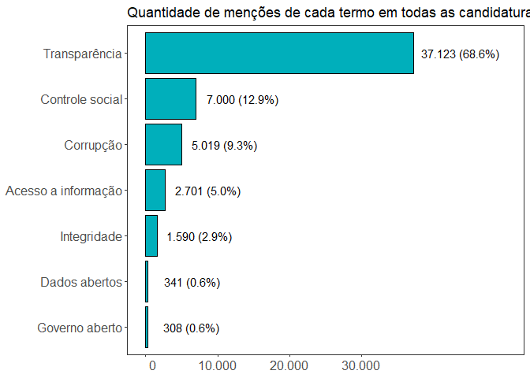
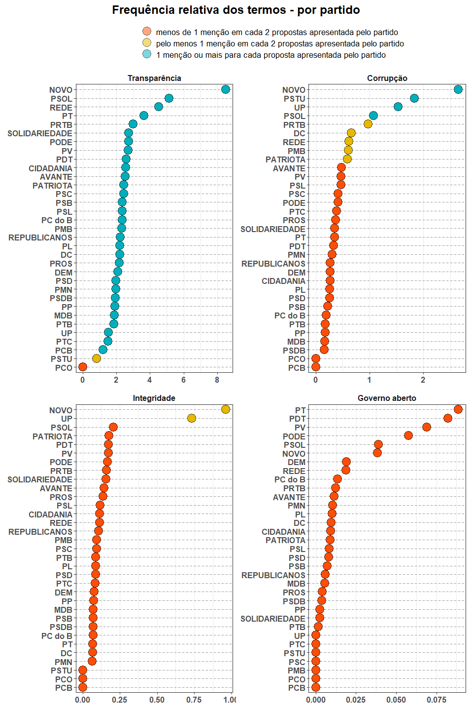
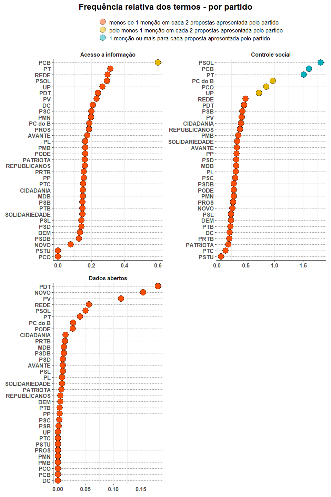
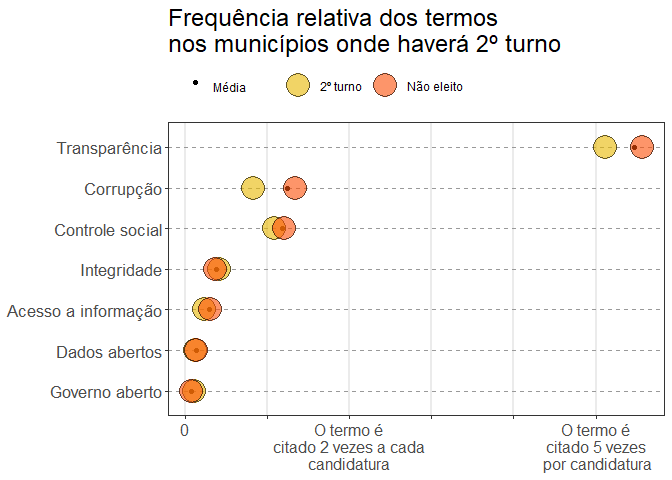
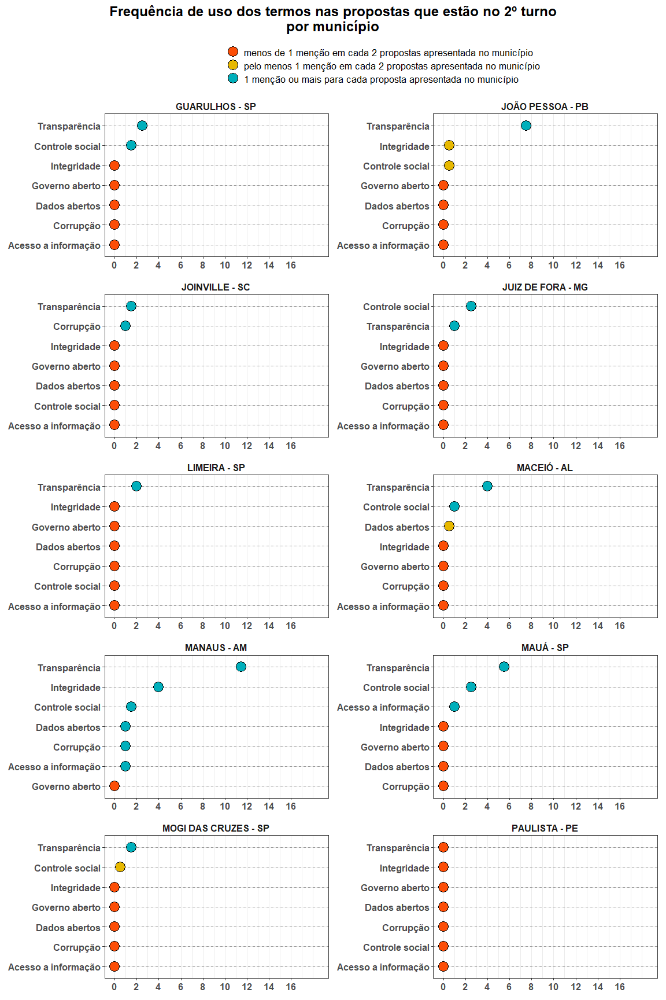

Relatório
================

  - [Total de candidaturas por UF](#total-de-candidaturas-por-uf)
      - [Prevalência dos termos](#prevalência-dos-termos)
      - [Frequência relativa dos
        termos](#frequência-relativa-dos-termos)
          - [Por partido](#por-partido)
          - [Por genero](#por-genero)
          - [Capitais](#capitais)
      - [NMDS](#nmds)
  - [2º Turno](#º-turno)
      - [Total de candidaturas](#total-de-candidaturas)
      - [Total de candidaturas por
        partido](#total-de-candidaturas-por-partido)
      - [Frequencia dos termos segundo o resultado das
        eleições](#frequencia-dos-termos-segundo-o-resultado-das-eleições)
      - [Frequencia relativa dos termos segundo o resultado das
        eleições](#frequencia-relativa-dos-termos-segundo-o-resultado-das-eleições)
      - [Frequência relativa dos termos entre partidos do 2º
        turno](#frequência-relativa-dos-termos-entre-partidos-do-2º-turno)
      - [Frequencia relativa dos termos nas cidades onde há 2º
        turno](#frequencia-relativa-dos-termos-nas-cidades-onde-há-2º-turno)

``` r
library(vegan)
library(sf)
library(janitor)
library(here)
library(patchwork)
```

``` r
source(here("code/propostas0_candidaturas_validas.R"))
source(here("code/propostas2_aplica_buscador.R"))
```

# Total de candidaturas por UF

``` r
propostas1 %>%
  count(sg_uf, sort = TRUE) %>% 
  ggplot(
    aes(x = fct_reorder(sg_uf, n, .desc = T),
        y = n,
        label = format(n, big.mark = ".", decimal.mark = ","))
    ) + 
  geom_col() + 
  geom_text(hjust = -.1, size =3) +
  coord_flip() +
  scale_y_continuous(breaks = c(0,1000,2000, 3000),
                     labels = format(c(0,1000,2000, 3000), big.mark = ".", decimal.mark = ","),
                     limits = c(0,2500),
                     expand = c(.005,0)) +
  theme_bw() +
  theme(panel.grid = element_blank()) +
  labs(
    x = NULL,
    y = NULL,
    title = "Total de candidaturas por Unidade da Federação",
    subtitle = "Eleições municipais 2020"
  )
```


## Prevalência dos termos

``` r

termos_resumo <- propostas2 %>% 
  select(-texto_tidy) %>% 
  pivot_longer(-c(index:nm_urna_candidato), names_to = "termo", values_to = "qtd_mencoes") %>% 
  group_by(termo) %>% 
  summarise(qtd_mencoes = sum(qtd_mencoes)) %>% 
  ungroup() %>% 
  mutate(
    termo = termo %>% 
      str_replace_all("_", " ") %>% 
      str_to_sentence() %>% 
      str_replace("cao", "ção") %>% 
      str_replace("en", "ên") %>% 
      fct_reorder(qtd_mencoes),
   per = qtd_mencoes / sum(qtd_mencoes)

  ) 

lbl <- paste0(format(termos_resumo$qtd_mencoes, decimal.mark = ",", big.mark = ".", justify = "centre"),
               " (",  scales::percent(termos_resumo$per, justify = "centre", accuracy = 0.1), ")")

termos_resumo %>% 
  ggplot(aes(x = termo, y = qtd_mencoes)) + 
  geom_col(fill = "#00AFBB", color = "black") + 
  geom_text(aes(label = lbl), hjust = -.1) +
  scale_y_continuous(breaks = seq(0,30000, 10000),
                     labels = format(seq(0,30000, 10000), decimal.mark = ",", big.mark = "."),
                     limits = c(0, 50000)) +
  coord_flip() +
  labs(x = NULL, y = NULL, title = "Quantidade de menções de cada termo em todas as candidaturas") +
  theme_bw() + 
  theme(panel.grid = element_blank(),
        axis.text = element_text(size = 12))
```



## Frequência relativa dos termos

### Por partido

``` r
pivot_termos <- propostas2 %>% 
  select(-texto_tidy) %>% 
  pivot_longer(transparencia:dados_abertos, values_to = "qtd", names_to = "termo") %>% 
  mutate(
    termo = termo%>% 
      str_replace_all("_", " ") %>% 
      str_to_sentence() %>% 
      str_replace("cao", "ção") %>% 
      str_replace("en", "ên")
  ) %>% 
  group_by(termo, sg_partido) %>% 
  mutate(qt_termo_partido = sum(qtd),
         qt_candidatura = n(),
         freq_termo = qt_termo_partido / qt_candidatura) %>% 
  ungroup()  %>%
  mutate(
    grau = case_when(
      freq_termo < 0.5 ~ "menos de 1 menção em cada 2 propostas apresentada pelo partido",
      freq_termo < 1.0 ~ "pelo menos 1 menção em cada 2 propostas apresentada pelo partido",
      freq_termo >= 1.0 ~ "1 menção ou mais para cada proposta apresentada pelo partido"
    ) %>%
      factor(
        levels = c(
          "menos de 1 menção em cada 2 propostas apresentada pelo partido",
          "pelo menos 1 menção em cada 2 propostas apresentada pelo partido",
          "1 menção ou mais para cada proposta apresentada pelo partido"
        )
      )
  )

termo <- pivot_termos %>% distinct(termo) %>% pull()

plot_freq_termos <- function(token) {
  
  pivot_termos %>% 
    filter(termo == token) %>% 
    mutate(sg_partido = fct_reorder(sg_partido, freq_termo),
           termo = fct_reorder(termo, freq_termo)) %>% 
    ggplot(aes(x = sg_partido, y = freq_termo, fill = grau)) +
    geom_vline(aes(xintercept = sg_partido), lty = 2, color = "gray60") + 
    geom_point(shape = 21, size = 6, alpha = .5) +
    scale_fill_manual(values = c("#FC4E07", "#E7B800", "#00AFBB"), drop=FALSE) +
    facet_wrap(~termo, scales = "free_x") +
    labs(x = NULL,
         y = NULL,
         fill = NULL) + 
    coord_flip() +
    theme_bw() +
    theme(plot.title = element_text(hjust = .5, vjust = .5, size = 18),
          legend.text = element_text(size = 13),
          axis.text = element_text(size = 12, face = "bold"),
          strip.text = element_text(size = 12, face = "bold"),
          strip.background = element_blank()
    ) + 
    guides(fill = guide_legend(ncol = 1))
  
  
}
```

``` r
p1 <- map(termo[1:2], plot_freq_termos) %>%
  reduce(~ `+`(.x, .y)) +
  plot_layout(guides = "collect") &
  theme(legend.position = 'top')

p2 <- map(termo[3:4], plot_freq_termos) %>% 
  reduce(~ `+`(.x, .y)) &
  theme(legend.position = 'none')

p1 / p2 + 
  plot_annotation(title = 'Frequência relativa dos termos - por partido') & 
  theme(plot.title = element_text(hjust = .5, vjust = .5, size = 18, face = "bold"))
```



``` r
p3 <- map(termo[5:6], plot_freq_termos) %>%
  reduce(~ `+`(.x, .y)) +
  plot_layout(guides = "collect") &
  theme(legend.position = 'top')

p4 <- map(termo[7], plot_freq_termos) %>%
  reduce(~ `+`(.x, .y)) &
  theme(legend.position = 'none')

(p3 + p4) + 
  plot_layout(nrow = 2) +
  plot_annotation(title = 'Frequência relativa dos termos - por partido') & 
  theme(plot.title = element_text(hjust = .5, vjust = .5, size = 18, face = "bold"))
```



### Por genero

``` r
caract <- propostas %>% select(index, ds_genero)

propostas3 <- left_join(propostas2, caract)

colunas <- c(
  "transparencia",
  "corrupcao",
  "integridade",
  "governo_aberto",
  "acesso_a_informacao", 
  "controle_social",
  "dados_abertos"
)

genero <- propostas3 %>% 
  count(ds_genero) %>%
  mutate(tot = sum(n), per = n / tot,
         proposta_legivel = "Propostas\nlegíveis\npor máquina") %>% 
  bind_rows(
    
    caract %>% 
      anti_join(.,select(propostas3, index, ds_genero)) %>% 
      count(ds_genero) %>% 
      mutate(tot = sum(n), per = n / tot,
             proposta_legivel = "Sem proposta ou\nproposta\nilegível")
    
  )

lbl <- paste0(format(genero$n, decimal.mark = ",", big.mark = ".", justify = "centre"),
              " (",  scales::percent(genero$per, justify = "centre", accuracy = 1), ")")

genero %>% 
  ggplot(aes(x = proposta_legivel, y = n, fill = ds_genero)) +
  geom_col(position = "dodge",
           color = "black") +
  geom_text(
    aes(label = lbl),
    size = 4.5,
    hjust = -.01,
    position=position_dodge(0.9)
  ) +
  coord_flip() +
  labs(x = NULL,
       y = NULL,
       title = "Número e percentual de candidaturas por gênero",
       fill = NULL) + 
  ylim(c(0,16000)) +
  theme_bw() +
  theme(panel.grid = element_blank(),
        legend.position = "top",
        plot.title = element_text(size = 18),
        # plot.title = element_text(hjust = .5, vjust = .5),
        legend.justification = c(0,1),
        axis.text.y = element_text(size = 15)) +
  scale_fill_manual(values = c( "#00AFBB", "#E7B800"))
```


``` r
genero_freq <- propostas3 %>% 
  select(-texto_tidy) %>% 
  pivot_longer(col = all_of(colunas), names_to = "termo", values_to = "qt_mencoes") %>%
  mutate(
    termo = termo%>% 
      str_replace_all("_", " ") %>% 
      str_to_sentence() %>% 
      str_replace("cao", "ção") %>% 
      str_replace("en", "ên")
  ) %>% 
  group_by(termo, ds_genero) %>% 
  summarise(qt_mencao_termo_genero = sum(qt_mencoes),
            qt_candidatura_genero = n(),
            freq_termo_genero = mean(qt_mencoes)) %>% 
  ungroup() %>%
  group_by(termo) %>% 
  mutate(freq_mencoes_termo = sum(qt_mencao_termo_genero) / sum(qt_candidatura_genero)) %>% 
  ungroup()

genero_freq %>% 
  mutate(termo = fct_reorder(termo, freq_mencoes_termo)) %>% 
  ggplot(aes(x = freq_termo_genero, y = termo)) +
  geom_hline(aes(yintercept = termo), lty = 2, color = "gray60") +
  # geom_vline(aes(xintercept = .5), color = "gray60") +
  geom_point(aes(x = freq_mencoes_termo, color = "Média")) +
  geom_point(aes(fill = ds_genero), shape = 21, alpha = .6, size = 8) +
  scale_color_manual(values = c("Média" = "black")) +
  scale_x_continuous(breaks = c(0, .5,  2),
                     labels = c(
                       "0",
                       "O termo é\ncitado 1 vez a cada\n2 candidaturas",
                       "O termo é\ncitado 2 vezes\n por candidaturas")
                     ) +
  scale_fill_manual(values = c("#00AFBB", "#E7B800")) +
  labs(
    fill = NULL,
    color = NULL,
    x = NULL,
    y = NULL,
    title = "Frequência relativa dos termos - por gênero"
  )+
  theme_bw() +
  theme(legend.position = "top",
        panel.grid.major.y = element_blank(),
        panel.grid.minor.x = element_blank(),
        panel.grid.major.x = element_line(size = 2),
        plot.title = element_text(size = 18),
        legend.justification = c(0,1),
        axis.text.y = element_text(size = 13),
        axis.text.x = element_text(size = 12)) +
  guides(color = guide_legend(label.vjust = .2), fill = guide_legend(reverse = T))
```


### Capitais

``` r
capitais <- toupper(
  c(
    "Rio Branco",
    "Maceió",
    "Macapá",
    "Manaus",
    "Salvador",
    "Fortaleza",
    "Brasília",
    "Vitória",
    "Goiânia",
    "São Luís",
    "Cuiabá",
    "Campo Grande",
    "Belo Horizonte",
    "Belém",
    "João Pessoa",
    "Curitiba",
    "Recife",
    "Teresina",
    "Rio de Janeiro",
    "Natal",
    "Porto Alegre",
    "Porto Velho",
    "Boa Vista",
    "Florianópolis",
    "São Paulo",
    "Aracaju",
    "Palmas"
  )
)

pivot_termos <- propostas2 %>% 
  filter(nm_ue %in% capitais) %>% 
  select(-texto_tidy) %>% 
  pivot_longer(transparencia:dados_abertos, values_to = "qtd", names_to = "termo") %>% 
  mutate(
    termo = termo%>% 
      str_replace_all("_", " ") %>% 
      str_to_sentence() %>% 
      str_replace("cao", "ção") %>% 
      str_replace("en", "ên")
  ) %>% 
  group_by(termo, nm_ue) %>% 
  mutate(qt_termo_capital = sum(qtd),
         qt_candidatura = n(),
         freq_termo = qt_termo_capital / qt_candidatura) %>% 
  ungroup() %>% 
  mutate(
    grau = case_when(
      freq_termo < 0.5 ~ "menos de 1 menção em cada 2 propostas apresentada no município",
      freq_termo < 1.0 ~ "pelo menos 1 menção em cada 2 propostas apresentada no município",
      freq_termo >= 1.0 ~ "1 menção ou mais para cada proposta apresentada no município"
    ) %>%
      factor(
        levels = c(
          "menos de 1 menção em cada 2 propostas apresentada no município",
          "pelo menos 1 menção em cada 2 propostas apresentada no município",
          "1 menção ou mais para cada proposta apresentada no município"
        )
      )
  )

pivot_termos_brasil <- propostas2 %>% 
  select(-texto_tidy) %>% 
  pivot_longer(transparencia:dados_abertos, values_to = "qtd", names_to = "termo") %>% 
  mutate(
    termo = termo%>% 
      str_replace_all("_", " ") %>% 
      str_to_sentence() %>% 
      str_replace("cao", "ção") %>% 
      str_replace("en", "ên")
  ) %>% 
  group_by(termo) %>% 
  summarise(qt_termo_capital = sum(qtd),
         qt_candidatura = n(),
         freq_termo = qt_termo_capital / qt_candidatura) %>% 
  ungroup() %>% 
  mutate(
    grau = case_when(
      freq_termo < 0.5 ~ "menos de 1 menção em cada 2 propostas apresentada no município",
      freq_termo < 1.0 ~ "pelo menos 1 menção em cada 2 propostas apresentada no município",
      freq_termo >= 1.0 ~ "1 menção ou mais para cada proposta apresentada no município"
    ) %>%
      factor(
        levels = c(
          "menos de 1 menção em cada 2 propostas apresentada no município",
          "pelo menos 1 menção em cada 2 propostas apresentada no município",
          "1 menção ou mais para cada proposta apresentada no município"
        )
      )
  )

plot_freq_termos <- function(token) {
    
    pivot_termos %>% 
      filter(termo == token) %>% 
      mutate(nm_ue = fct_reorder(nm_ue, freq_termo),
             termo = fct_reorder(termo, freq_termo)) %>% 
      ggplot(aes(x = nm_ue, y = freq_termo, fill = grau)) +
      geom_vline(aes(xintercept = nm_ue), lty = 2, color = "gray60") + 
      geom_point(shape = 21, size = 6, alpha = .5) +
      geom_hline(data = pivot_termos_brasil %>% filter(termo == token),
                 aes(yintercept = freq_termo, color = "Média\nBrasil"),
                 lty = 2,
                 size = 1) +
      scale_fill_manual(values = c("#FC4E07", "#E7B800", "#00AFBB"), drop=FALSE) +
      scale_color_manual(values = "red") +
      facet_wrap(~termo, scales = "free_x") +
      labs(x = NULL,
           y = NULL,
           fill = NULL,
           color = NULL) + 
      coord_flip() +
      theme_bw() +
      theme(plot.title = element_text(hjust = .5, vjust = .5, size = 18),
            legend.text = element_text(size = 13),
            axis.text = element_text(size = 12, face = "bold"),
            strip.text = element_text(size = 12, face = "bold"),
            strip.background = element_blank()
      ) + 
      guides(fill = guide_legend(ncol = 1), 
             color = guide_legend(title.position = "top", title.hjust = .5))
    
  }
  
```

``` r
p1 <- map(termo[1:2], plot_freq_termos) %>%
  reduce(~ `+`(.x, .y)) +
  plot_layout(guides = "collect") &
  theme(legend.position = 'top')

p2 <- map(termo[3:4], plot_freq_termos) %>% 
  reduce(~ `+`(.x, .y)) &
  theme(legend.position = 'none')

p1 / p2 + 
  plot_annotation(title = 'Frequência relativa dos termos - por capital') & 
  theme(plot.title = element_text(hjust = .5, vjust = .5, size = 18, face = "bold"))
```


``` r
p3 <- map(termo[5:6], plot_freq_termos) %>%
  reduce(~ `+`(.x, .y)) +
  plot_layout(guides = "collect") &
  theme(legend.position = 'top')

p4 <- map(termo[7], plot_freq_termos) %>%
  reduce(~ `+`(.x, .y)) &
  theme(legend.position = 'none')

(p3 + p4) + 
  plot_layout(nrow = 2) +
  plot_annotation(title = 'Frequência relativa dos termos - por capital') & 
  theme(plot.title = element_text(hjust = .5, vjust = .5, size = 18, face = "bold"))
```


## NMDS


# 2º Turno

## Total de candidaturas

``` r
# resultados -------------------------------------------------------------------
resultados <- read_delim(here("load_data", "resultados.csv"), 
                         ";",
                         escape_double = FALSE,
                         locale = locale(encoding = "Latin1"), 
                         trim_ws = TRUE) %>%
  select(sq_candidato,
         sg_ue,
         nm_urna_candidato,
         sg_partido,
         ds_situacao,
         qt_votos_candidato,
         qt_votos_computados,
         qt_votos_brancos,
         qt_votos_nulos)

# propostas + resultados -------------------------------------------------------
sg_ue <- propostas %>% select(index, sg_ue, sq_candidato)

pr <- propostas2 %>% 
  left_join(sg_ue) %>%
  mutate(sg_ue = as.integer(sg_ue)) %>% 
  left_join(resultados) %>% 
  mutate(pr_votos_candidato = qt_votos_candidato / qt_votos_computados)

# total no 2º turno
res_2t <- resultados %>% 
  filter(ds_situacao == "2º turno") %>% 
  select(sg_ue, nm_urna_candidato, sg_partido, qt_votos_candidato, qt_votos_computados) %>%
  mutate(perc_votos_validos = qt_votos_candidato / qt_votos_computados) %>% 
  group_by(sg_ue) %>% 
  mutate(pos = ifelse(perc_votos_validos == max(perc_votos_validos), 1, 2)) %>% 
  ungroup()

# apresentação de propostas ----------------------------------------------------
res_2t_ <- pr %>% 
  filter(ds_situacao == "2º turno") %>% 
  select(sg_ue, nm_ue, nm_urna_candidato, qt_votos_candidato, qt_votos_computados) %>%
  mutate(perc_votos_validos = qt_votos_candidato / qt_votos_computados) %>% 
  full_join(res_2t) %>%
  mutate(proposta = ifelse(is.na(nm_ue), "Não apresentou\nproposta\nde governo", "Apresentou\nproposta\nde governo")) %>% 
  arrange(sg_ue) %>% 
  fill(nm_ue) %>% 
  arrange(sg_ue, pos)

# res_2t_ %>% 
#   googlesheets4::write_sheet(ss = "1uH61t_mkKU-a5FySNRRqWe58Goqrif4pkqmlfaL9FYc", sheet = "2º turno")

res_2t_  %>% 
  count(proposta) %>% 
  mutate(perc = n / sum(n)) %>% 
  ggplot(aes(x = fct_reorder(proposta, n),
             y = n,
             label = paste0(n, " (", scales::percent(perc), ")"))) +
  geom_col(fill = "#00AFBB", color = "black") +
  geom_text(hjust = -.3) +
  coord_flip() +
  scale_y_continuous(limits = c(0, 120), breaks = c(0, 10, 50, 100)) +
  labs(
    x = NULL,
    y = "Quantidade de candidaturas",
    title = "Candidaturas do 2º turno e apresentação de propostas pelos candidatos"
  ) +
  theme_bw() +
  theme(axis.text = element_text(size = 12),
        panel.grid = element_blank())
```


## Total de candidaturas por partido

``` r
pr %>% 
  filter(ds_situacao == "2º turno") %>% 
  count(sg_partido, sort = T) %>% 
  mutate(sg_partido = fct_reorder(sg_partido, n)) %>% 
  ggplot(aes(x = sg_partido, y = n, label = n)) +
  geom_col(fill = "#00AFBB", color = "black") +
  geom_text(hjust = -.4) +
  coord_flip() +
  labs(x = NULL,
       y = "Quantidade de candidaturas",
       title = "Quantidade de candidaturas no 2º turno - por partido") +
  theme_bw() +
  theme(axis.text = element_text(size = 12, face = "bold"),
        plot.title = element_text(size = 18),
        axis.title = element_text(size = 12),
        panel.grid = element_blank())
```


## Frequencia dos termos segundo o resultado das eleições

``` r
pr %>% 
  filter(ds_situacao == "2º turno") %>% 
  filter(transparencia > 0)
#> # A tibble: 94 x 21
#>     index sg_uf nm_ue sg_partido nm_urna_candida~ texto_tidy transparencia
#>     <dbl> <chr> <chr> <chr>      <chr>            <chr>              <dbl>
#>  1 433444 GO    ANÁP~ PP         ROBERTO NAVES    "\"o dese~             4
#>  2  10495 SE    ARAC~ CIDADANIA  DELEGADA DANIEL~ "este foi~            13
#>  3 526238 SE    ARAC~ PDT        EDVALDO          "este doc~            10
#>  4  39603 SP    BAURU PATRIOTA   SUÉLLEN ROSIM    "plano de~             2
#>  5 342679 SP    BAURU DEM        DR RAUL          "plano de~             3
#>  6 373188 PA    BELÉM PATRIOTA   DELEGADO FEDERA~ "sumario ~            11
#>  7 534663 PA    BELÉM PSOL       EDMILSON RODRIG~ "elei coe~             3
#>  8 353755 SC    BLUM~ PODE       MÁRIO HILDEBRAN~ "1 progra~             5
#>  9 506070 SC    BLUM~ DEM        JOÃO PAULO KLEI~ "pae nº 3~             1
#> 10 403012 RR    BOA ~ SOLIDARIE~ OTTACI           "plano de~             4
#> # ... with 84 more rows, and 14 more variables: corrupcao <dbl>,
#> #   integridade <dbl>, governo_aberto <dbl>, acesso_a_informacao <dbl>,
#> #   controle_social <dbl>, dados_abertos <dbl>, sg_ue <dbl>,
#> #   sq_candidato <dbl>, ds_situacao <chr>, qt_votos_candidato <dbl>,
#> #   qt_votos_computados <dbl>, qt_votos_brancos <dbl>, qt_votos_nulos <dbl>,
#> #   pr_votos_candidato <dbl>

# resultados -------------------------------------------------------------------
resultados <- read_delim(here("load_data", "resultados.csv"), 
                         ";",
                         escape_double = FALSE,
                         locale = locale(encoding = "Latin1"), 
                         trim_ws = TRUE) %>%
  select(sq_candidato,
         sg_ue,
         nm_urna_candidato,
         sg_partido,
         ds_situacao,
         qt_votos_candidato,
         qt_votos_computados,
         qt_votos_brancos,
         qt_votos_nulos)

# propostas + resultados -------------------------------------------------------
sg_ue <- propostas %>% select(index, sg_ue, sq_candidato)

pr <- propostas2 %>% 
  left_join(sg_ue) %>%
  mutate(sg_ue = as.integer(sg_ue)) %>% 
  left_join(resultados) %>% 
  mutate(pr_votos_candidato = qt_votos_candidato / qt_votos_computados)

# colunas para operações -------------------------------------------------------
colunas <- c(
  "transparencia",
  "corrupcao",
  "integridade",
  "governo_aberto",
  "acesso_a_informacao", 
  "controle_social",
  "dados_abertos"
)

# cod cidades no 2ºT -----------------------------------------------------------
sg_ue_2t <- pr %>% 
  filter(ds_situacao == "2º turno") %>% 
  distinct(sg_ue, nm_ue) %>% 
  pull()

# uso dos termos: situação -----------------------------------------------------
situacao_freq <- pr %>%
  select(index:ds_situacao, -texto_tidy) %>%
  # 
  filter(sg_ue %in% sg_ue_2t) %>% #filtra somente cidades no 2° turno
  # 
  pivot_longer(
    col = all_of(colunas),
    names_to = "termo",
    values_to = "qt_mencoes"
  ) %>%
  filter(!is.na(ds_situacao)) %>% 
  mutate(
    termo = termo%>% 
      str_replace_all("_", " ") %>% 
      str_to_sentence() %>% 
      str_replace("cao", "ção") %>% 
      str_replace("en", "ên")
  ) %>% 
  group_by(termo, ds_situacao) %>% 
  summarise(
    qt_mencao_termo_situacao = sum(qt_mencoes),
    qt_candidatura_situacao = n(),
    freq_termo_situacao = mean(qt_mencoes)
  ) %>% 
  ungroup() %>% 
  group_by(termo) %>% 
  mutate(freq_mencoes_termo = sum(qt_mencao_termo_situacao) / sum(qt_candidatura_situacao)) %>% 
  ungroup()
```

``` r
termos_resumo2t <- situacao_freq %>% 
  group_by(termo, ds_situacao) %>% 
  summarise(qt_termo = sum(qt_mencao_termo_situacao)) %>% 
  ungroup() 

termos_resumo2t %>% 
  mutate(termo = fct_reorder(termo, 
                             qt_termo)) %>% 
  group_by(termo) %>% 
  mutate(q = sum(qt_termo)) %>% 
  ungroup() %>%
  group_by() %>% 
  mutate(p_q = q / sum(qt_termo)) %>% 
  ggplot(aes(x = termo, y = qt_termo, fill = ds_situacao)) +
  geom_col(color = "black", alpha =.6) +
  geom_text(
    inherit.aes = F,
    aes(
      label = paste0(format(q, big.mark = ".", decimal.mark = ","), " (",
                     scales::percent(p_q, accuracy = 1, decimal.mark = ","), ")"),
      y = q,
      x = termo
    ),
    check_overlap = T,
    hjust = -.15
  ) +
  coord_flip() + 
  scale_y_continuous(
    breaks = c(0, 250, 500, 1000, 2500),
    labels = format(c(0, 250, 500, 1000, 2500),
                    decimal.mark = ",",
                    trim = T,
                    big.mark = "."),
    limits = c(0, 3300)
  ) +
  labs(
    x = NULL,
    y = NULL,
    title = "Quantidade de menções de cada termo nas\npropostas dos municípios onde haverá 2° turno",
    fill = NULL
  ) +
  theme_bw() + 
  theme(
    legend.position = "top",
    panel.grid.major.y = element_blank(),
    panel.grid.minor.x = element_blank(),
    panel.grid.major.x = element_line(size = 1),
    plot.title = element_text(size = 18),
    legend.justification = c(0,1),
    axis.text.y = element_text(size = 13),
    axis.text.x = element_text(size = 12)
  ) +
  scale_fill_manual(
    values = c("Não eleito" = "#FC4E07","Eleito" = "#00AFBB", "2º turno" = "#E7B800")
  )
```


``` r

fr <- situacao_freq %>% 
  group_by(termo) %>% 
  mutate(
    qt_mencao_termo = sum(qt_mencao_termo_situacao),
    fr = qt_mencao_termo_situacao / qt_mencao_termo,
    termo = fct_reorder(termo, fr)
  ) %>% 
  ungroup() %>% 
  filter(ds_situacao == "2º turno") %>% 
  pull(fr)

termo <- situacao_freq %>% distinct(termo) %>% mutate(fr = fr, termo2 = fct_reorder(termo, fr))

situacao_freq %>%
  left_join(termo) %>% 
  group_by(termo) %>% 
  mutate(
    qt_mencao_termo = sum(qt_mencao_termo_situacao),
    fr = qt_mencao_termo_situacao / qt_mencao_termo
  ) %>% 
  ungroup() %>% 
  mutate(
    ds_situacao = factor(ds_situacao, levels = c("Não eleito", "2º turno", "Eleito"))
  ) %>% 
  ggplot(aes(x = fr, y = termo2)) +
  geom_bar(
    aes(fill = ds_situacao),
    alpha = .6,
    position = "fill",
    stat = "identity",
    color = "gray40"
  ) +
    geom_text(
    data = . %>% filter(ds_situacao == "2º turno"),
    aes(label = scales::percent(fr, accuracy = 0.1, decimal.mark = ",")),
    hjust = 1.2
  ) +
  labs(
    x = NULL,
    y = NULL,
    title = "Percentual de menções dos termos nos\nmunicípios onde haverá 2º turno",
    subtitle = "Relação entre candidatos não eleitos e candidatos no 2° turno",
    fill = NULL
  ) +
  theme_bw() +
  theme(
    legend.position = "top",
    panel.grid.major.y = element_blank(),
    panel.grid.minor.x = element_blank(),
    panel.grid.major.x = element_line(size = 1),
    plot.title = element_text(size = 18),
    legend.justification = c(0,1),
    axis.text.y = element_text(size = 13),
    axis.text.x = element_text(size = 12)
  ) +
  scale_fill_manual(values = c("Não eleito" = "#FC4E07","Eleito" = "#00AFBB", "2º turno" = "#E7B800")) +
  scale_x_continuous(labels = scales::percent_format())
```


## Frequencia relativa dos termos segundo o resultado das eleições

``` r
situacao_freq %>% 
  mutate(termo = fct_reorder(termo, freq_mencoes_termo),
         ds_situacao = factor(ds_situacao, levels = c("Não eleito", "2º turno", "Eleito"))) %>% 
  ggplot(aes(x = freq_termo_situacao, y = termo)) +
  geom_hline(aes(yintercept = termo), lty = 2, color = "gray60") +
  geom_point(aes(x = freq_mencoes_termo, color = "Média")) +
  geom_point(aes(fill = ds_situacao), shape = 21, alpha = .6, size = 8) +
  scale_color_manual(values = c("Média" = "black")) +
  scale_x_continuous(breaks = c(0, 1, 2, 3, 4, 5, 6),
                     labels = c(
                       "0", "",
                       "O termo é\ncitado 2 vezes a cada\ncandidatura", "", "",
                       "O termo é\ncitado 5 vezes\n por candidatura", "")
  ) +
  scale_fill_manual(values = c("Não eleito" = "#FC4E07","Eleito" = "#00AFBB", "2º turno" = "#E7B800")) +
  labs(
    fill = NULL,
    color = NULL,
    x = NULL,
    y = NULL,
    title = "Frequência relativa dos termos\nnos municípios onde haverá 2º turno"
  )+
  theme_bw() +
  theme(legend.position = "top",
        panel.grid.major.y = element_blank(),
        panel.grid.minor.x = element_blank(),
        panel.grid.major.x = element_line(size = 1),
        plot.title = element_text(size = 18),
        legend.justification = c(0,1),
        axis.text.y = element_text(size = 13),
        axis.text.x = element_text(size = 12)) +
  guides(color = guide_legend(label.vjust = .2), fill = guide_legend(reverse = T))
```



## Frequência relativa dos termos entre partidos do 2º turno

``` r
# partidos no 2T ---------------------------------------------------------------

partidos_2t <- pr %>% 
  filter(ds_situacao == "2º turno") %>% 
  distinct(sg_partido) %>% 
  pull()

# frequencia por partido no 2T -------------------------------------------------

pivot_termos <- pr %>% 
  filter(sg_partido %in% partidos_2t) %>% 
  select(-texto_tidy) %>% 
  pivot_longer(all_of(colunas), values_to = "qtd", names_to = "termo") %>% 
  mutate(
    termo = termo%>% 
      str_replace_all("_", " ") %>% 
      str_to_sentence() %>% 
      str_replace("cao", "ção") %>% 
      str_replace("en", "ên")
  ) %>% 
  group_by(termo, sg_partido) %>% 
  mutate(qt_termo_partido = sum(qtd),
         qt_candidatura = n(),
         freq_termo = qt_termo_partido / qt_candidatura) %>% 
  ungroup()  %>%
  mutate(
    grau = case_when(
      freq_termo < 0.5 ~ "menos de 1 menção em cada 2 propostas apresentada pelo partido",
      freq_termo < 1.0 ~ "pelo menos 1 menção em cada 2 propostas apresentada pelo partido",
      freq_termo >= 1.0 ~ "1 menção ou mais para cada proposta apresentada pelo partido"
    ) %>%
      factor(
        levels = c(
          "menos de 1 menção em cada 2 propostas apresentada pelo partido",
          "pelo menos 1 menção em cada 2 propostas apresentada pelo partido",
          "1 menção ou mais para cada proposta apresentada pelo partido"
        )
      )
  )

pivot_termos_2t <- pr %>% 
  filter(ds_situacao == "2º turno") %>%
  select(-texto_tidy) %>% 
  pivot_longer(all_of(colunas), values_to = "qtd", names_to = "termo") %>% 
  mutate(
    termo = termo%>% 
      str_replace_all("_", " ") %>% 
      str_to_sentence() %>% 
      str_replace("cao", "ção") %>% 
      str_replace("en", "ên")
  ) %>% 
  group_by(termo, sg_partido) %>% 
  mutate(qt_termo_partido = sum(qtd),
         qt_candidatura = n(),
         freq_termo = qt_termo_partido / qt_candidatura) %>% 
  ungroup()  %>%
  mutate(
    grau = case_when(
      freq_termo < 0.5 ~ "menos de 1 menção em cada 2 propostas apresentada pelo partido",
      freq_termo < 1.0 ~ "pelo menos 1 menção em cada 2 propostas apresentada pelo partido",
      freq_termo >= 1.0 ~ "1 menção ou mais para cada proposta apresentada pelo partido"
    ) %>%
      factor(
        levels = c(
          "menos de 1 menção em cada 2 propostas apresentada pelo partido",
          "pelo menos 1 menção em cada 2 propostas apresentada pelo partido",
          "1 menção ou mais para cada proposta apresentada pelo partido"
        )
      )
  )


termo <- pivot_termos %>% distinct(termo) %>% pull()

plot_freq_termos <- function(token) {
  
  pivot_termos <- pivot_termos %>%
    filter(termo == token) %>%
    mutate(sg_partido = fct_reorder(sg_partido, freq_termo),
           termo = fct_reorder(termo, freq_termo))
  
  pivot_termos_2t %>%
    filter(termo == token) %>%
    mutate(sg_partido = fct_reorder(sg_partido, freq_termo),
           termo = fct_reorder(termo, freq_termo)) %>%
    ggplot(aes(x = sg_partido, y = freq_termo, fill = grau)) +
    geom_vline(aes(xintercept = sg_partido), lty = 2, color = "gray60") +
    geom_point(shape = 21, size = 6) +
    geom_point(data = pivot_termos,
               aes(x = sg_partido, y = freq_termo, shape = "Média do partido no Brasil")) +
    scale_fill_manual(values = c("#FC4E07", "#E7B800", "#00AFBB"), drop=FALSE) +
    facet_wrap(~termo, scales = "free_x") +
    labs(x = NULL,
         y = NULL,
         fill = NULL,
         shape = NULL) + 
    coord_flip() +
    theme_bw() +
    theme(plot.title = element_text(hjust = .5, vjust = .5, size = 18),
          legend.text = element_text(size = 13),
          axis.text = element_text(size = 12, face = "bold"),
          strip.text = element_text(size = 12, face = "bold"),
          strip.background = element_blank()
    ) + 
    guides(fill = guide_legend(ncol = 1))
  
  
}
```

``` r
p1 <- map(termo[1:2], plot_freq_termos) %>%
  reduce(~ `+`(.x, .y)) +
  plot_layout(guides = "collect") &
  theme(legend.position = 'top')

p2 <- map(termo[3:4], plot_freq_termos) %>% 
  reduce(~ `+`(.x, .y)) &
  theme(legend.position = 'none')

(p1 / p2) + 
  plot_annotation(title = 'Frequência relativa dos termos no 2º turno - por partido') & 
  theme(plot.title = element_text(hjust = .5, vjust = .5, size = 18, face = "bold"))
```


``` r
p3 <- map(termo[5:6], plot_freq_termos) %>%
  reduce(~ `+`(.x, .y)) +
  plot_layout(guides = "collect") &
  theme(legend.position = 'top')

p4 <- map(termo[7], plot_freq_termos) %>%
  reduce(~ `+`(.x, .y)) &
  theme(legend.position = 'none')

(p3 + p4) + 
  plot_layout(nrow = 2) +
  plot_annotation(title = 'Frequência relativa dos termos no 2º turno - por partido') & 
  theme(plot.title = element_text(hjust = .5, vjust = .5, size = 18, face = "bold"))
```


## Frequencia relativa dos termos nas cidades onde há 2º turno

``` r
# cod cidades no 2ºT -----------------------------------------------------------
sg_ue_2t <- pr %>% 
  filter(ds_situacao == "2º turno") %>% 
  distinct(sg_ue, nm_ue) %>% 
  pull()

pivot_termos <- pr %>% 
  filter(sg_ue %in% sg_ue_2t) %>%  
  select(index:ds_situacao, -texto_tidy) %>% 
  pivot_longer(col = all_of(colunas), names_to = "termo", values_to = "qt_mencoes") %>%
  filter(ds_situacao == "2º turno") %>% 
  mutate(
    termo = termo%>% 
      str_replace_all("_", " ") %>% 
      str_to_sentence() %>% 
      str_replace("cao", "ção") %>% 
      str_replace("en", "ên")
    
  ) %>% 
  group_by(termo, nm_ue) %>% 
  mutate(qt_termo = sum(qt_mencoes),
         qt_candidatura = n(),
         freq_termo = qt_termo / qt_candidatura) %>% 
  ungroup() %>% 
  mutate(
    grau = case_when(
      freq_termo < 0.5 ~ "menos de 1 menção em cada 2 propostas apresentada no município",
      freq_termo < 1.0 ~ "pelo menos 1 menção em cada 2 propostas apresentada no município",
      freq_termo >= 1.0 ~ "1 menção ou mais para cada proposta apresentada no município"
    ) %>%
      factor(
        levels = c(
          "menos de 1 menção em cada 2 propostas apresentada no município",
          "pelo menos 1 menção em cada 2 propostas apresentada no município",
          "1 menção ou mais para cada proposta apresentada no município"
        )
      )
  )

# pivot_termos_candidato <- pr %>% 
#   mutate(across(transparencia:dados_abertos, ~ ifelse(index == 232917, . / 3, .))) %>% 
#   filter(sg_ue %in% sg_ue_2t) %>% 
#   select(index:ds_situacao, -texto_tidy) %>% 
#   pivot_longer(col = all_of(colunas), names_to = "termo", values_to = "qt_mencoes") %>%
#   filter(!is.na(ds_situacao)) %>% 
#   mutate(
#     termo = termo%>% 
#       str_replace_all("_", " ") %>% 
#       str_to_sentence() %>% 
#       str_replace("cao", "ção") %>% 
#       str_replace("en", "ên")
#     
#   ) %>% 
#   group_by(termo, nm_urna_candidato) %>% 
#   mutate(qt_termo = sum(qt_mencoes),
#          qt_candidatura = n(),
#          freq_termo = qt_termo / qt_candidatura) %>% 
#   ungroup() %>% 
#   mutate(
#     grau = case_when(
#       freq_termo < 0.5 ~ "menos de 1 menção em cada 2 propostas apresentada no município",
#       freq_termo < 1.0 ~ "pelo menos 1 menção em cada 2 propostas apresentada no município",
#       freq_termo >= 1.0 ~ "1 menção ou mais para cada proposta apresentada no município"
#     ) %>%
#       factor(
#         levels = c(
#           "menos de 1 menção em cada 2 propostas apresentada no município",
#           "pelo menos 1 menção em cada 2 propostas apresentada no município",
#           "1 menção ou mais para cada proposta apresentada no município"
#         )
#       )
#   )

munics_2t <- pivot_termos %>%
  filter(ds_situacao == "2º turno") %>% 
  mutate(nm_ue = paste(nm_ue, "-", sg_uf)) %>% 
  distinct(nm_ue) %>%
  pull()

plot_freq_termos <- function(city) {
    
    pivot_termos <- pivot_termos %>% 
      mutate(nm_ue = paste(nm_ue, "-", sg_uf)) %>% 
      filter(ds_situacao == "2º turno") %>% 
      select(nm_ue, termo, freq_termo, grau) %>% 
      distinct()
  
    pivot_termos %>% 
      filter(nm_ue == city) %>% 
      #filter(termo == token) %>% 
      mutate(nm_ue = fct_reorder(nm_ue, freq_termo),
             termo = fct_reorder(termo, freq_termo)) %>% 
      ggplot(aes(x = termo, y = freq_termo, fill = grau)) +
      geom_vline(aes(xintercept = termo), lty = 2, color = "gray60") + 
      geom_point(shape = 21, size = 6) +
      # geom_point(data = pivot_termos_candidato  %>% 
      #              mutate(nm_ue = paste(nm_ue, "-", sg_uf)) %>% 
      #              filter(nm_ue == city),
      #             aes(shape = ds_situacao, color = ds_situacao), size = 3) +
      scale_fill_manual(values = c("#FC4E07", "#E7B800", "#00AFBB"), drop=FALSE) +
      scale_shape_manual(values = c(1, 4)) +
      scale_y_continuous(
        limits = c(0, 18.5),
        breaks = seq(0,16, 2),
        labels = seq(0,16, 2),
      ) +
      facet_wrap(~ nm_ue, scales = "free_x") +
      labs(x = NULL,
           y = NULL,
           fill = NULL,
           color = NULL,
           shape = "Situação\ndo candidato") + 
      coord_flip() +
      theme_bw() +
      theme(plot.title = element_text(hjust = .5, vjust = .5, size = 18),
            legend.text = element_text(size = 13),
            axis.text = element_text(size = 12, face = "bold"),
            strip.text = element_text(size = 12, face = "bold"),
            strip.background = element_blank()
      ) + 
      guides(fill = guide_legend(ncol = 1, override.aes = list(shape = 21)), 
             color = FALSE,
             shape = guide_legend(nrow = 2, title.position = "top", title.hjust = .5))
    
}

my_title <- "Frequência de uso dos termos nas propostas que estão no 2º turno\npor município"
```

``` r
p1 <- map(munics_2t[1:10], plot_freq_termos) %>%
  reduce(~ `+`(.x, .y)) +
  plot_layout(guides = "collect") &
  theme(legend.position = 'top')

(p1) + 
  plot_layout(nrow = 5) +
  plot_annotation(title = my_title) & 
  theme(plot.title = element_text(hjust = .5, vjust = .5, size = 18, face = "bold"))
```


``` r
p2 <- map(munics_2t[11:20], plot_freq_termos) %>%
  reduce(~ `+`(.x, .y)) +
  plot_layout(guides = "collect") &
  theme(legend.position = 'top')

(p2) + 
  plot_layout(nrow = 5) +
  plot_annotation(title = my_title) & 
  theme(plot.title = element_text(hjust = .5, vjust = .5, size = 18, face = "bold"))
```


``` r
p1 <- map(munics_2t[21:30], plot_freq_termos) %>%
  reduce(~ `+`(.x, .y)) +
  plot_layout(guides = "collect") &
  theme(legend.position = 'top')

(p1) + 
  plot_layout(nrow = 5) +
  plot_annotation(title = my_title) & 
  theme(plot.title = element_text(hjust = .5, vjust = .5, size = 18, face = "bold"))
```



``` r
p1 <- map(munics_2t[31:40], plot_freq_termos) %>%
  reduce(~ `+`(.x, .y)) +
  plot_layout(guides = "collect") &
  theme(legend.position = 'top')

(p1) + 
  plot_layout(nrow = 5) +
  plot_annotation(title = my_title) & 
  theme(plot.title = element_text(hjust = .5, vjust = .5, size = 18, face = "bold"))
```


``` r
p1 <- map(munics_2t[41:50], plot_freq_termos) %>%
  reduce(~ `+`(.x, .y)) +
  plot_layout(guides = "collect") &
  theme(legend.position = 'top')

(p1) + 
  plot_layout(nrow = 5) +
  plot_annotation(title = my_title) & 
  theme(plot.title = element_text(hjust = .5, vjust = .5, size = 18, face = "bold"))
```


``` r
p1 <- map(munics_2t[51:57], plot_freq_termos) %>%
  reduce(~ `+`(.x, .y)) +
  plot_layout(guides = "collect") &
  theme(legend.position = 'top')

(p1) + 
  plot_layout(nrow = 5) +
  plot_annotation(title = my_title) & 
  theme(plot.title = element_text(hjust = .5, vjust = .5, size = 18, face = "bold"))
```


