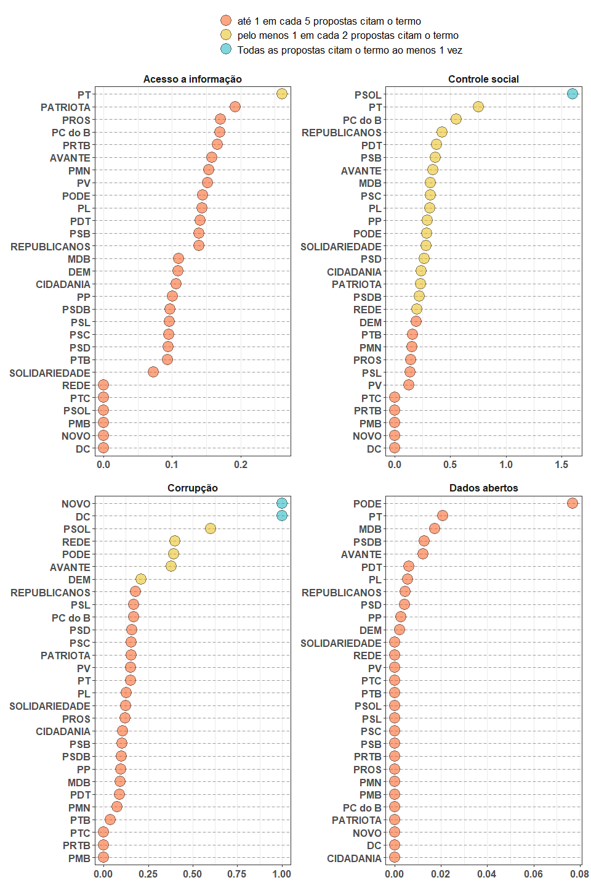
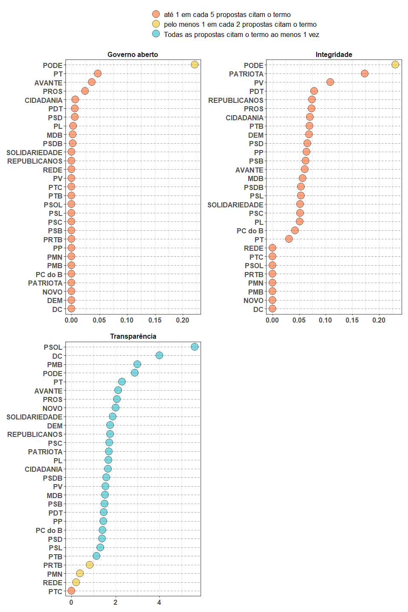

Relatório
================

  - [Leitura de dados](#leitura-de-dados)
      - [Bibliotecas](#bibliotecas)
      - [Prefeitos eleitos](#prefeitos-eleitos)
      - [Propostas eleitorais eleitas](#propostas-eleitorais-eleitas)
  - [Gráficos](#gráficos)
      - [Frequência relativa de menções de cada termo entre prefeitos
        eleitos](#frequência-relativa-de-menções-de-cada-termo-entre-prefeitos-eleitos)
      - [Frequência relativa dos termos - por
        partido](#frequência-relativa-dos-termos---por-partido)

## Leitura de dados

### Bibliotecas

``` r
library(tidyverse)
library(here)
library(patchwork)
```

### Prefeitos eleitos

``` r
# arquivos com resultados eleitorais
here("load_data") %>% list.files(pattern = "resultados")
#> [1] "resultados_2o_turno.csv" "resultados2.csv"
```

<details>

<summary>

Clique para ver código de carregamento da base

</summary>

``` r
# seleciona arquivos com resultados 1º e 2º turno
eleitos_plans <- here("load_data") %>% list.files(pattern = "resultados", full.names = T)

# abre e combina os datasets
base_candidatos <- eleitos_plans %>% 
  map(data.table::fread) %>%
  reduce(bind_rows) %>% 
  as_tibble()

eleitos <- base_candidatos %>% filter(ds_situacao == "Eleito")

glimpse(eleitos)
#> Rows: 5,474
#> Columns: 40
#> $ seq                          <int> 1, 1, 1, 1, 1, 1, 1, 1, 1, 1, 1, 1, 1,...
#> $ sq_candidato                 <int64> 250000769687, 210000668382, 25000089...
#> $ sg_ue                        <int> 63770, 88013, 71072, 66893, 93734, 473...
#> $ nr_candidato                 <int> 13, 15, 45, 13, 15, 13, 45, 19, 15, 12...
#> $ nm_urna_candidato            <chr> "FILIPPI", "SEBASTIÃO MELO", "BRUNO CO...
#> $ sg_partido                   <chr> "PT", "MDB", "PSDB", "PT", "MDB", "PT"...
#> $ ds_composicao_coligacao      <chr> "PT - SOLIDARIEDADE / PL / PT / AVANTE...
#> $ ds_situacao                  <chr> "Eleito", "Eleito", "Eleito", "Eleito"...
#> $ qt_votos_candidato           <int> 106849, 370550, 3169121, 91459, 277497...
#> $ pr_votos_candidato           <chr> "51,35", "54,63", "59,38", "50,74", "5...
#> $ cd_eleicao                   <int> 427, 427, 427, 427, 427, 427, 427, 427...
#> $ sg_abrangencia               <chr> "MUNICIPAL", "MUNICIPAL", "MUNICIPAL",...
#> $ turno                        <int> 2, 2, 2, 2, 2, 2, 2, 2, 2, 2, 2, 2, 2,...
#> $ cd_cargo                     <int> 11, 11, 11, 11, 11, 11, 11, 11, 11, 11...
#> $ qt_sessoes                   <int> 807, 2629, 22399, 764, 2667, 1096, 875...
#> $ qt_sessoes_t                 <int> 807, 2629, 22399, 764, 2667, 1096, 875...
#> $ qt_sessoes_nt                <int> 0, 0, 0, 0, 0, 0, 0, 0, 0, 0, 0, 0, 0,...
#> $ qt_sessoes_i                 <int> 807, 2629, 22399, 764, 2667, 1096, 875...
#> $ qt_sessoes_ni                <int> 0, 0, 0, 0, 0, 0, 0, 0, 0, 0, 0, 0, 0,...
#> $ qt_sessoes_apuradas          <int> 807, 2629, 22399, 764, 2667, 1096, 875...
#> $ qt_sessoes_nao_apuradas      <int> 0, 0, 0, 0, 0, 0, 0, 0, 0, 0, 0, 0, 0,...
#> $ qt_eleitores                 <int> 329171, 1082726, 8986687, 306518, 9712...
#> $ qt_eleitores_aptos           <int> 329171, 1082726, 8986687, 306518, 9712...
#> $ qt_eleitores_nao_aptos       <int> 0, 0, 0, 0, 0, 0, 0, 0, 0, 0, 0, 0, 0,...
#> $ qt_eleitores_si              <int> 329171, 1082726, 8986687, 306518, 9712...
#> $ qt_eleitores_sni             <int> 0, 0, 0, 0, 0, 0, 0, 0, 0, 0, 0, 0, 0,...
#> $ qt_eleitores_compareceram    <int> 233234, 728034, 6217508, 219897, 61427...
#> $ qt_abstencoes                <int> 95937, 354692, 2769179, 86621, 356949,...
#> $ vscv                         <int> 0, 0, 0, 0, 0, 0, 0, 0, 0, 0, 0, 0, 0,...
#> $ qt_votos_nominais            <int> 208080, 678295, 5337230, 180242, 52753...
#> $ qt_votos_computados          <int> 208080, 678295, 5337230, 180242, 52753...
#> $ qt_votos_brancos             <int> 7859, 20938, 273216, 11092, 26193, 799...
#> $ qt_votos_nulos               <int> 17295, 28801, 607062, 28563, 60546, 19...
#> $ qt_votos_nulos_vn            <int> 17295, 28801, 607062, 28563, 60546, 19...
#> $ qt_votos_nulos_vnt           <int> 0, 0, 0, 0, 0, 0, 0, 0, 0, 0, 0, 0, 0,...
#> $ qt_votos_vp                  <int> 0, 0, 0, 0, 0, 0, 0, 0, 0, 0, 0, 0, 0,...
#> $ qt_votos_validos             <int> 208080, 678295, 5337230, 180242, 52753...
#> $ qt_votos_an                  <int> 0, 0, 0, 0, 0, 0, 0, 0, 0, 0, 0, 0, 0,...
#> $ qt_votos_anulados_sob_judice <int> 0, 0, 0, 0, 0, 0, 0, 0, 0, 0, 0, 0, 0,...
#> $ qt_votos_total               <int> 233234, 728034, 6217508, 219897, 61427...
```

</details>

### Propostas eleitorais eleitas

<details>

<summary>

Clique para ver código de carregamento da base

</summary>

``` r
# carrega as propostas eleitorais
source(here("code/propostas0_candidaturas_validas.R"))
source(here("code/propostas2_aplica_buscador.R"))

propostas_eleitas <- eleitos %>% left_join(propostas2, by = c("nm_urna_candidato", "sg_partido"))

glimpse(propostas_eleitas)
#> Rows: 5,646
#> Columns: 51
#> $ seq                          <int> 1, 1, 1, 1, 1, 1, 1, 1, 1, 1, 1, 1, 1,...
#> $ sq_candidato                 <int64> 250000769687, 210000668382, 25000089...
#> $ sg_ue                        <int> 63770, 88013, 71072, 66893, 93734, 473...
#> $ nr_candidato                 <int> 13, 15, 45, 13, 15, 13, 45, 19, 15, 12...
#> $ nm_urna_candidato            <chr> "FILIPPI", "SEBASTIÃO MELO", "BRUNO CO...
#> $ sg_partido                   <chr> "PT", "MDB", "PSDB", "PT", "MDB", "PT"...
#> $ ds_composicao_coligacao      <chr> "PT - SOLIDARIEDADE / PL / PT / AVANTE...
#> $ ds_situacao                  <chr> "Eleito", "Eleito", "Eleito", "Eleito"...
#> $ qt_votos_candidato           <int> 106849, 370550, 3169121, 91459, 277497...
#> $ pr_votos_candidato           <chr> "51,35", "54,63", "59,38", "50,74", "5...
#> $ cd_eleicao                   <int> 427, 427, 427, 427, 427, 427, 427, 427...
#> $ sg_abrangencia               <chr> "MUNICIPAL", "MUNICIPAL", "MUNICIPAL",...
#> $ turno                        <int> 2, 2, 2, 2, 2, 2, 2, 2, 2, 2, 2, 2, 2,...
#> $ cd_cargo                     <int> 11, 11, 11, 11, 11, 11, 11, 11, 11, 11...
#> $ qt_sessoes                   <int> 807, 2629, 22399, 764, 2667, 1096, 875...
#> $ qt_sessoes_t                 <int> 807, 2629, 22399, 764, 2667, 1096, 875...
#> $ qt_sessoes_nt                <int> 0, 0, 0, 0, 0, 0, 0, 0, 0, 0, 0, 0, 0,...
#> $ qt_sessoes_i                 <int> 807, 2629, 22399, 764, 2667, 1096, 875...
#> $ qt_sessoes_ni                <int> 0, 0, 0, 0, 0, 0, 0, 0, 0, 0, 0, 0, 0,...
#> $ qt_sessoes_apuradas          <int> 807, 2629, 22399, 764, 2667, 1096, 875...
#> $ qt_sessoes_nao_apuradas      <int> 0, 0, 0, 0, 0, 0, 0, 0, 0, 0, 0, 0, 0,...
#> $ qt_eleitores                 <int> 329171, 1082726, 8986687, 306518, 9712...
#> $ qt_eleitores_aptos           <int> 329171, 1082726, 8986687, 306518, 9712...
#> $ qt_eleitores_nao_aptos       <int> 0, 0, 0, 0, 0, 0, 0, 0, 0, 0, 0, 0, 0,...
#> $ qt_eleitores_si              <int> 329171, 1082726, 8986687, 306518, 9712...
#> $ qt_eleitores_sni             <int> 0, 0, 0, 0, 0, 0, 0, 0, 0, 0, 0, 0, 0,...
#> $ qt_eleitores_compareceram    <int> 233234, 728034, 6217508, 219897, 61427...
#> $ qt_abstencoes                <int> 95937, 354692, 2769179, 86621, 356949,...
#> $ vscv                         <int> 0, 0, 0, 0, 0, 0, 0, 0, 0, 0, 0, 0, 0,...
#> $ qt_votos_nominais            <int> 208080, 678295, 5337230, 180242, 52753...
#> $ qt_votos_computados          <int> 208080, 678295, 5337230, 180242, 52753...
#> $ qt_votos_brancos             <int> 7859, 20938, 273216, 11092, 26193, 799...
#> $ qt_votos_nulos               <int> 17295, 28801, 607062, 28563, 60546, 19...
#> $ qt_votos_nulos_vn            <int> 17295, 28801, 607062, 28563, 60546, 19...
#> $ qt_votos_nulos_vnt           <int> 0, 0, 0, 0, 0, 0, 0, 0, 0, 0, 0, 0, 0,...
#> $ qt_votos_vp                  <int> 0, 0, 0, 0, 0, 0, 0, 0, 0, 0, 0, 0, 0,...
#> $ qt_votos_validos             <int> 208080, 678295, 5337230, 180242, 52753...
#> $ qt_votos_an                  <int> 0, 0, 0, 0, 0, 0, 0, 0, 0, 0, 0, 0, 0,...
#> $ qt_votos_anulados_sob_judice <int> 0, 0, 0, 0, 0, 0, 0, 0, 0, 0, 0, 0, 0,...
#> $ qt_votos_total               <int> 233234, 728034, 6217508, 219897, 61427...
#> $ index                        <dbl> 528, 302225, 67060, 446319, 367476, 44...
#> $ sg_uf                        <chr> "SP", "RS", "SP", "SP", "GO", "MG", "R...
#> $ nm_ue                        <chr> "DIADEMA", "PORTO ALEGRE", "SÃO PAULO"...
#> $ texto_tidy                   <chr> "1 diadema de toda gente: desenvolvime...
#> $ transparencia                <dbl> 2, 4, 6, 7, 12, 0, 6, 4, 1, 10, 2, NA,...
#> $ corrupcao                    <dbl> 0, 0, 2, 0, 1, 0, 0, 1, 1, 0, 1, NA, 0...
#> $ integridade                  <dbl> 0, 0, 0, 0, 4, 0, 0, 1, 0, 3, 0, NA, 0...
#> $ governo_aberto               <dbl> 1, 0, 0, 0, 0, 0, 0, 0, 0, 0, 0, NA, 0...
#> $ acesso_a_informacao          <dbl> 0, 0, 0, 2, 1, 0, 0, 0, 0, 2, 0, NA, 0...
#> $ controle_social              <dbl> 1, 0, 0, 5, 1, 4, 0, 0, 1, 1, 0, NA, 1...
#> $ dados_abertos                <dbl> 0, 0, 0, 0, 0, 0, 0, 0, 0, 0, 0, NA, 0...
```

</details>

Faz um select simples para uma inspeção básica:

``` r
# consulta simples na base:
propostas_eleitas %>% 
  select(nm_urna_candidato,
         sg_partido,
         ds_situacao,
         qt_votos_candidato,
         pr_votos_candidato,
         transparencia,
         corrupcao,
         integridade,
         governo_aberto,
         acesso_a_informacao,
         controle_social,
         dados_abertos) %>% 
  glimpse()
#> Rows: 5,646
#> Columns: 12
#> $ nm_urna_candidato   <chr> "FILIPPI", "SEBASTIÃO MELO", "BRUNO COVAS", "MA...
#> $ sg_partido          <chr> "PT", "MDB", "PSDB", "PT", "MDB", "PT", "PSDB",...
#> $ ds_situacao         <chr> "Eleito", "Eleito", "Eleito", "Eleito", "Eleito...
#> $ qt_votos_candidato  <int> 106849, 370550, 3169121, 91459, 277497, 144529,...
#> $ pr_votos_candidato  <chr> "51,35", "54,63", "59,38", "50,74", "52,6", "54...
#> $ transparencia       <dbl> 2, 4, 6, 7, 12, 0, 6, 4, 1, 10, 2, NA, 2, 9, 9,...
#> $ corrupcao           <dbl> 0, 0, 2, 0, 1, 0, 0, 1, 1, 0, 1, NA, 0, 0, 0, 1...
#> $ integridade         <dbl> 0, 0, 0, 0, 4, 0, 0, 1, 0, 3, 0, NA, 0, 0, 0, 0...
#> $ governo_aberto      <dbl> 1, 0, 0, 0, 0, 0, 0, 0, 0, 0, 0, NA, 0, 0, 1, 0...
#> $ acesso_a_informacao <dbl> 0, 0, 0, 2, 1, 0, 0, 0, 0, 2, 0, NA, 0, 2, 1, 0...
#> $ controle_social     <dbl> 1, 0, 0, 5, 1, 4, 0, 0, 1, 1, 0, NA, 1, 6, 3, 0...
#> $ dados_abertos       <dbl> 0, 0, 0, 0, 0, 0, 0, 0, 0, 0, 0, NA, 0, 1, 0, 1...
```

## Gráficos

### Frequência relativa de menções de cada termo entre prefeitos eleitos

#### em (%)

<details>

<summary>

ver código

</summary>

``` r

termos_resumo <- function(df) {
  
  # set to test:
  #df <- propostas2
  #df <- propostas_eleitas
  
  cols_to_pivot <- names(propostas2)[names(propostas2) != "texto_tidy"]
  
  df <- df %>% 
    select(all_of(cols_to_pivot)) %>% 
    pivot_longer(-c(index:nm_urna_candidato), names_to = "termo", values_to = "qtd_mencoes") %>% 
    group_by(termo) %>% 
    summarise(qtd_mencoes = sum(qtd_mencoes, na.rm = T)) %>% 
    ungroup() %>% 
    mutate(
      
      termo = termo %>% 
        str_replace_all("_", " ") %>% 
        str_to_sentence() %>% 
        str_replace("cao", "ção") %>% 
        str_replace("en", "ên") %>% 
        fct_reorder(qtd_mencoes),
      per = qtd_mencoes / sum(qtd_mencoes)
  
    ) 
  
  return(df)
  
}


termos_resumo_plot <- function() {
  
  vec_base <- c("O ponto em vermelho\né a frequência dos termos\nentre todos os candidatos",
                "Candidatos eleitos")
  
  df <- list(propostas2, propostas_eleitas) %>% 
    map(termos_resumo) %>% 
    set_names(vec_base) %>% 
    enframe(name = "base") %>% 
    unnest(value)
  
  df %>%
    ggplot(aes(x = termo, y = per)) +
    geom_col(data = . %>% filter(base == vec_base[2])) +
    geom_point(data = . %>% filter(base == vec_base[1]), aes(color = base)) +
    coord_flip() +
    scale_y_continuous(labels = scales::percent_format()) +
    labs(
      x = NULL,
      y = NULL,
      color = NULL
    ) +
    theme(legend.position = c(.7, .1))

}

# call plot
#termos_resumo_plot()
```

</details>


> Destaques:
> 
> Candidaturas eleitas…
> 
>   - utilizaram **mais** o termo transparência
> 
>   - utilizaram **menos** o termo

</br>

### Frequência relativa dos termos - por partido

<details>

<summary>

ver código

</summary>

``` r
pivot_termos <- function(df) {
  
  # set to test:
  #df <- propostas2
  #df <- propostas_eleitas
  
  cols_to_pivot <- names(propostas2)[names(propostas2) != "texto_tidy"]
  
  df <- df %>% 
    select(all_of(cols_to_pivot)) %>% 
    pivot_longer(transparencia:dados_abertos, values_to = "qtd", names_to = "termo") %>% 
    mutate(
      termo = termo%>% 
        str_replace_all("_", " ") %>% 
        str_to_sentence() %>% 
        str_replace("cao", "ção") %>% 
        str_replace("en", "ên")
    ) %>% 
    group_by(termo, sg_partido) %>% 
    summarise(qt_termo_partido = sum(qtd, na.rm = T),
           qt_candidatura = n(),
           freq_termo = qt_termo_partido / qt_candidatura) %>% 
    ungroup()  %>%
    mutate(
      
      grau = case_when(
          freq_termo <  0.2 ~ "até 1 em cada 5 propostas citam o termo",
          freq_termo <  1.0 ~ "pelo menos 1 em cada 2 propostas citam o termo",
          TRUE ~ "Todas as propostas citam o termo ao menos 1 vez"
        ) %>%
        factor(
          levels = c(
            "até 1 em cada 5 propostas citam o termo",
            "pelo menos 1 em cada 2 propostas citam o termo",
            "Todas as propostas citam o termo ao menos 1 vez"
          )
        )
      
    )

  return(df)
  
}

plot_freq_termos <- function(df, token) {
  
  # set to test:
  #df <- propostas2
  #df <- propostas_eleitas
  #token <- "Transparência"
  
  pivot_termos(df) %>% 
    filter(termo == token) %>% 
    mutate(sg_partido = fct_reorder(sg_partido, freq_termo),
           termo = fct_reorder(termo, freq_termo)) %>% 
    ggplot(aes(x = sg_partido, y = freq_termo, fill = grau)) +
    geom_vline(aes(xintercept = sg_partido), lty = 2, color = "gray60") + 
    geom_point(shape = 21, size = 6, alpha = .5) +
    scale_fill_manual(values = c("#FC4E07", "#E7B800", "#00AFBB"), drop=FALSE) +
    facet_wrap(~termo, scales = "free_x") +
    labs(x = NULL,
         y = NULL,
         fill = NULL) + 
    coord_flip() +
    theme_bw() +
    theme(plot.title = element_text(hjust = .5, vjust = .5, size = 18),
          legend.text = element_text(size = 13),
          axis.text = element_text(size = 12, face = "bold"),
          strip.text = element_text(size = 12, face = "bold"),
          strip.background = element_blank()
    ) + 
    guides(fill = guide_legend(ncol = 1))
  
}

termo <- pivot_termos(propostas_eleitas) %>% distinct(termo) %>% pull()

#test
#plot_freq_termos(propostas_eleitas, termo[1])


# junta os gráficos com patchwork
p1 <- map(termo[1:2], ~ plot_freq_termos(propostas_eleitas, .x)) %>%
  reduce(~ `+`(.x, .y)) +
  plot_layout(guides = "collect") &
  theme(legend.position = 'top')

p2 <- map(termo[3:4], ~ plot_freq_termos(propostas_eleitas, .x)) %>% 
  reduce(~ `+`(.x, .y)) &
  theme(legend.position = 'none')

p3 <- p1 / p2 & theme(plot.title = element_text(hjust = .5, vjust = .5, size = 18, face = "bold"))

p4 <- map(termo[5:6], ~ plot_freq_termos(propostas_eleitas, .x)) %>%
  reduce(~ `+`(.x, .y)) +
  plot_layout(guides = "collect") &
  theme(legend.position = 'top')

p5 <- map(termo[7], ~ plot_freq_termos(propostas_eleitas, .x)) %>%
  reduce(~ `+`(.x, .y)) &
  theme(legend.position = 'none')

p6 <- (p4 + p5) + 
  plot_layout(nrow = 2) +
  theme(plot.title = element_text(hjust = .5, vjust = .5, size = 18, face = "bold"))
#p3
```

</details>




