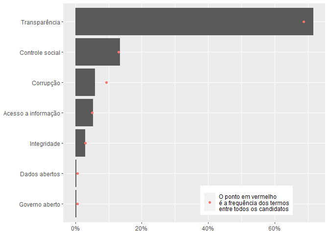
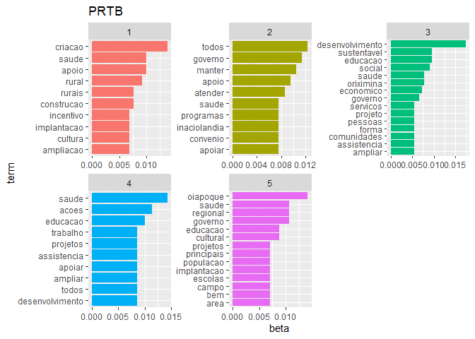

Relatório
================

-   [Leitura de dados](#leitura-de-dados)
    -   [Bibliotecas](#bibliotecas)
    -   [Base de resultados das
        eleições](#base-de-resultados-das-eleições)
    -   [Base das propostas eleitorais](#base-das-propostas-eleitorais)
    -   [Juntando prefeitos eleitos e propostas
        eleitorais](#juntando-prefeitos-eleitos-e-propostas-eleitorais)
    -   [Faz a contagem dos termos em cada
        proposta](#faz-a-contagem-dos-termos-em-cada-proposta)
    -   [Faz a contagem dos termos em cada proposta e agrupa *por
        partido*](#faz-a-contagem-dos-termos-em-cada-proposta-e-agrupa-por-partido)
-   [Análise NMDS](#análise-nmds)
-   [Topic Modeling](#topic-modeling)
    -   [Processamento de texto](#processamento-de-texto)
    -   [Stopwords](#stopwords)
    -   [Tokenização](#tokenização)
    -   [Distribuição de frequência das
        palavras](#distribuição-de-frequência-das-palavras)
    -   [Top 30 palavras mais usadas](#top-30-palavras-mais-usadas)
    -   [Topic modeling](#topic-modeling-1)

## Leitura de dados

### Bibliotecas

``` r
library(tidyverse)
library(here)
library(patchwork)
library(vegan) # NMDS
library(ggrepel)
library(tidytext) # topic modeling
library(topicmodels) # topic modeling
library(tm) # topic modeling
```

### Base de resultados das eleições

``` r
# seleciona arquivos csv com resultados 1º e 2º turno
resultado_eleicao_csv_path <- here("load_data") %>% 
  list.files(pattern = "resultados", full.names = T)

# inspec
resultado_eleicao_csv_path %>% str_extract("resultados.+\\.csv")
#> [1] "resultados_2o_turno.csv" "resultados2.csv"

# abre csv e combina os datasets em df único
resultado_eleicao <- resultado_eleicao_csv_path %>%
  purrr::map(data.table::fread) %>%
  purrr::reduce(bind_rows) %>%
  as_tibble()

# extrai somente candidatos eleitos
prefs_eleitos <- resultado_eleicao %>% filter(ds_situacao == "Eleito") %>% 
  mutate(sq_candidato = as.character(sq_candidato))

# inspec
glimpse(prefs_eleitos)
#> Rows: 5,474
#> Columns: 40
#> $ seq                          <int> 1, 1, 1, 1, 1, 1, 1, 1, 1, 1, 1, 1, 1,...
#> $ sq_candidato                 <chr> "250000769687", "210000668382", "25000...
#> $ sg_ue                        <int> 63770, 88013, 71072, 66893, 93734, 473...
#> $ nr_candidato                 <int> 13, 15, 45, 13, 15, 13, 45, 19, 15, 12...
#> $ nm_urna_candidato            <chr> "FILIPPI", "SEBASTIÃO MELO", "BRUNO CO...
#> $ sg_partido                   <chr> "PT", "MDB", "PSDB", "PT", "MDB", "PT"...
#> $ ds_composicao_coligacao      <chr> "PT - SOLIDARIEDADE / PL / PT / AVANTE...
#> $ ds_situacao                  <chr> "Eleito", "Eleito", "Eleito", "Eleito"...
#> $ qt_votos_candidato           <int> 106849, 370550, 3169121, 91459, 277497...
#> $ pr_votos_candidato           <chr> "51,35", "54,63", "59,38", "50,74", "5...
#> $ cd_eleicao                   <int> 427, 427, 427, 427, 427, 427, 427, 427...
#> $ sg_abrangencia               <chr> "MUNICIPAL", "MUNICIPAL", "MUNICIPAL",...
#> $ turno                        <int> 2, 2, 2, 2, 2, 2, 2, 2, 2, 2, 2, 2, 2,...
#> $ cd_cargo                     <int> 11, 11, 11, 11, 11, 11, 11, 11, 11, 11...
#> $ qt_sessoes                   <int> 807, 2629, 22399, 764, 2667, 1096, 875...
#> $ qt_sessoes_t                 <int> 807, 2629, 22399, 764, 2667, 1096, 875...
#> $ qt_sessoes_nt                <int> 0, 0, 0, 0, 0, 0, 0, 0, 0, 0, 0, 0, 0,...
#> $ qt_sessoes_i                 <int> 807, 2629, 22399, 764, 2667, 1096, 875...
#> $ qt_sessoes_ni                <int> 0, 0, 0, 0, 0, 0, 0, 0, 0, 0, 0, 0, 0,...
#> $ qt_sessoes_apuradas          <int> 807, 2629, 22399, 764, 2667, 1096, 875...
#> $ qt_sessoes_nao_apuradas      <int> 0, 0, 0, 0, 0, 0, 0, 0, 0, 0, 0, 0, 0,...
#> $ qt_eleitores                 <int> 329171, 1082726, 8986687, 306518, 9712...
#> $ qt_eleitores_aptos           <int> 329171, 1082726, 8986687, 306518, 9712...
#> $ qt_eleitores_nao_aptos       <int> 0, 0, 0, 0, 0, 0, 0, 0, 0, 0, 0, 0, 0,...
#> $ qt_eleitores_si              <int> 329171, 1082726, 8986687, 306518, 9712...
#> $ qt_eleitores_sni             <int> 0, 0, 0, 0, 0, 0, 0, 0, 0, 0, 0, 0, 0,...
#> $ qt_eleitores_compareceram    <int> 233234, 728034, 6217508, 219897, 61427...
#> $ qt_abstencoes                <int> 95937, 354692, 2769179, 86621, 356949,...
#> $ vscv                         <int> 0, 0, 0, 0, 0, 0, 0, 0, 0, 0, 0, 0, 0,...
#> $ qt_votos_nominais            <int> 208080, 678295, 5337230, 180242, 52753...
#> $ qt_votos_computados          <int> 208080, 678295, 5337230, 180242, 52753...
#> $ qt_votos_brancos             <int> 7859, 20938, 273216, 11092, 26193, 799...
#> $ qt_votos_nulos               <int> 17295, 28801, 607062, 28563, 60546, 19...
#> $ qt_votos_nulos_vn            <int> 17295, 28801, 607062, 28563, 60546, 19...
#> $ qt_votos_nulos_vnt           <int> 0, 0, 0, 0, 0, 0, 0, 0, 0, 0, 0, 0, 0,...
#> $ qt_votos_vp                  <int> 0, 0, 0, 0, 0, 0, 0, 0, 0, 0, 0, 0, 0,...
#> $ qt_votos_validos             <int> 208080, 678295, 5337230, 180242, 52753...
#> $ qt_votos_an                  <int> 0, 0, 0, 0, 0, 0, 0, 0, 0, 0, 0, 0, 0,...
#> $ qt_votos_anulados_sob_judice <int> 0, 0, 0, 0, 0, 0, 0, 0, 0, 0, 0, 0, 0,...
#> $ qt_votos_total               <int> 233234, 728034, 6217508, 219897, 61427...
```

### Base das propostas eleitorais

``` r
# carrega as propostas eleitorais
source(here("code/propostas0_candidaturas_validas.R"))
source(here("code/propostas2_aplica_buscador.R"))
# o source() traz objetos que não usa aqui:
rm("candidaturas_validas")
rm("deferidos_expost")
rm("dupl2")
rm("dupl3")

# inspec Global Environment
ls.str()
#> buscador : function (df)  
#> prefs_eleitos : tibble [5,474 x 40] (S3: tbl_df/tbl/data.frame)
#> propostas : tibble [19,230 x 70] (S3: spec_tbl_df/tbl_df/tbl/data.frame)
#> propostas0 : tibble [15,731 x 6] (S3: tbl_df/tbl/data.frame)
#> propostas1 : tibble [15,731 x 6] (S3: tbl_df/tbl/data.frame)
#> propostas2 : tibble [15,731 x 13] (S3: tbl_df/tbl/data.frame)
#> resultado_eleicao : tibble [18,700 x 40] (S3: tbl_df/tbl/data.frame)
#> resultado_eleicao_csv_path :  chr [1:2] "C:/Users/rauld/Documents/propostas-eleicoes-2020/load_data/resultados_2o_turno.csv" ...
```

### Juntando prefeitos eleitos e propostas eleitorais

``` r
# de-para: propostas + resultados eleições
depara_propostas_prefs_eleitos <- propostas %>% transmute(index, sq_candidato = as.character(id_divulga))

# junta as propostas e leitorais com a base de prefeitos eleitos
# full: inclui os candidatos eleitos sem proposta ou com texto de proposta não processado p/ análise
propostas_prefs_eleitos_full <- propostas2 %>% 
  left_join(depara_propostas_prefs_eleitos) %>%
  right_join(prefs_eleitos)

# inspec
glimpse(propostas_prefs_eleitos_full)
#> Rows: 5,474
#> Columns: 51
#> $ index                        <dbl> 415400, 139730, 247533, 201332, 118569...
#> $ sg_uf                        <chr> "GO", "GO", "MG", "PA", "CE", "BA", "B...
#> $ nm_ue                        <chr> "ABADIA DE GOIÁS", "ABADIÂNIA", "ABAET...
#> $ sg_partido                   <chr> "PP", "PP", "DEM", "PSDB", "PT", "DEM"...
#> $ nm_urna_candidato            <chr> "WANDER SARAIVA", "ZÉ DINIZ", "IVANIR ...
#> $ texto_tidy                   <chr> "wander saraiva - abadia de goias plan...
#> $ transparencia                <dbl> 3, 2, 1, 7, 0, 0, 2, 0, 0, 1, 0, 0, 3,...
#> $ corrupcao                    <dbl> 0, 0, 0, 1, 0, 0, 0, 0, 0, 0, 0, 0, 0,...
#> $ integridade                  <dbl> 0, 0, 0, 0, 0, 0, 0, 0, 0, 0, 0, 1, 0,...
#> $ governo_aberto               <dbl> 0, 0, 0, 0, 0, 0, 0, 0, 0, 0, 0, 0, 0,...
#> $ acesso_a_informacao          <dbl> 0, 0, 0, 0, 0, 0, 0, 0, 0, 1, 0, 0, 0,...
#> $ controle_social              <dbl> 0, 0, 0, 4, 1, 0, 0, 0, 0, 1, 0, 0, 0,...
#> $ dados_abertos                <dbl> 0, 0, 0, 0, 0, 0, 0, 0, 0, 0, 0, 0, 0,...
#> $ sq_candidato                 <chr> "90000817867", "90000887583", "1300010...
#> $ seq                          <int> 1, 1, 1, 1, 1, 1, 1, 1, 1, 1, 1, 1, 1,...
#> $ sg_ue                        <int> 93360, 92010, 40037, 4014, 13013, 3301...
#> $ nr_candidato                 <int> 11, 11, 25, 45, 13, 25, 13, 12, 15, 22...
#> $ ds_composicao_coligacao      <chr> "PP - PP / PSD / PATRIOTA / REPUBLICAN...
#> $ ds_situacao                  <chr> "Eleito", "Eleito", "Eleito", "Eleito"...
#> $ qt_votos_candidato           <int> 5053, 4503, 5014, 26153, 3149, 3047, 7...
#> $ pr_votos_candidato           <chr> "64,23", "55,16", "36,33", "28,64", "5...
#> $ cd_eleicao                   <int> 426, 426, 426, 426, 426, 426, 426, 426...
#> $ sg_abrangencia               <chr> "MUNICIPAL", "MUNICIPAL", "MUNICIPAL",...
#> $ turno                        <int> 1, 1, 1, 1, 1, 1, 1, 1, 1, 1, 1, 1, 1,...
#> $ cd_cargo                     <int> 11, 11, 11, 11, 11, 11, 11, 11, 11, 11...
#> $ qt_sessoes                   <int> 29, 28, 52, 346, 24, 27, 35, 15, 10, 1...
#> $ qt_sessoes_t                 <int> 29, 28, 52, 346, 24, 27, 35, 15, 10, 1...
#> $ qt_sessoes_nt                <int> 0, 0, 0, 0, 0, 0, 0, 0, 0, 0, 0, 0, 0,...
#> $ qt_sessoes_i                 <int> 29, 28, 52, 346, 24, 27, 35, 15, 10, 1...
#> $ qt_sessoes_ni                <int> 0, 0, 0, 0, 0, 0, 0, 0, 0, 0, 0, 0, 0,...
#> $ qt_sessoes_apuradas          <int> 29, 28, 52, 346, 24, 27, 35, 15, 10, 1...
#> $ qt_sessoes_nao_apuradas      <int> 0, 0, 0, 0, 0, 0, 0, 0, 0, 0, 0, 0, 0,...
#> $ qt_eleitores                 <int> 10121, 10287, 18813, 113661, 6947, 711...
#> $ qt_eleitores_aptos           <int> 10121, 10287, 18813, 113661, 6947, 711...
#> $ qt_eleitores_nao_aptos       <int> 0, 0, 0, 0, 0, 0, 0, 0, 0, 0, 0, 0, 0,...
#> $ qt_eleitores_si              <int> 10121, 10287, 18813, 113661, 6947, 711...
#> $ qt_eleitores_sni             <int> 0, 0, 0, 0, 0, 0, 0, 0, 0, 0, 0, 0, 0,...
#> $ qt_eleitores_compareceram    <int> 8260, 8509, 14368, 95032, 6143, 5724, ...
#> $ qt_abstencoes                <int> 1861, 1778, 4445, 18629, 804, 1394, 17...
#> $ vscv                         <int> 0, 0, 0, 0, 0, 0, 0, 0, 0, 0, 0, 0, 0,...
#> $ qt_votos_nominais            <int> 7867, 8164, 13802, 91313, 5733, 5331, ...
#> $ qt_votos_computados          <int> 7867, 8164, 13802, 91313, 5733, 5331, ...
#> $ qt_votos_brancos             <int> 113, 94, 234, 1095, 99, 66, 70, 83, 11...
#> $ qt_votos_nulos               <int> 280, 251, 332, 2624, 311, 327, 462, 16...
#> $ qt_votos_nulos_vn            <int> 280, 251, 332, 2624, 311, 327, 462, 16...
#> $ qt_votos_nulos_vnt           <int> 0, 0, 0, 0, 0, 0, 0, 0, 0, 0, 0, 0, 0,...
#> $ qt_votos_vp                  <int> 0, 0, 0, 0, 0, 0, 0, 0, 0, 0, 0, 0, 0,...
#> $ qt_votos_validos             <int> 7867, 8164, 13802, 91313, 5733, 5331, ...
#> $ qt_votos_an                  <int> 0, 0, 0, 0, 0, 0, 0, 0, 0, 0, 0, 0, 0,...
#> $ qt_votos_anulados_sob_judice <int> 0, 0, 0, 0, 0, 0, 0, 0, 0, 0, 0, 0, 0,...
#> $ qt_votos_total               <int> 8260, 8509, 14368, 95032, 6143, 5724, ...
```

### Faz a contagem dos termos em cada proposta

``` r
contagem_dos_termos <- function(df) {
  
  # set to test:
  # df <- propostas2
  # df <- propostas_prefs_eleitos_full
  
  # uma string com os termos para contar e fazer o pivot na base de propostas
  cols_to_pivot <- names(propostas2)[names(propostas2) != "texto_tidy"]

  # pega a base de propostas e realiza pivot com contagem de termos
  df <- df %>%
    select(all_of(cols_to_pivot)) %>%
    pivot_longer(-c(index:nm_urna_candidato), names_to = "termo", values_to = "qtd_mencoes") %>%
    group_by(termo) %>%
    summarise(qtd_mencoes = sum(qtd_mencoes, na.rm = T)) %>%
    ungroup() %>%
    mutate(
      
      # corrige os termos extraídos
      termo = termo %>%
        str_replace_all("_", " ") %>%
        str_to_sentence() %>%
        str_replace("cao", "ção") %>%
        str_replace("en", "ên") %>%
        fct_reorder(qtd_mencoes),
      # percentual de menções
      per = qtd_mencoes / sum(qtd_mencoes)
      
    )

  return(df)
  
}

# conta termos de todos os candidatos (eleitos + não-eleitos)
contagem_dos_termos(propostas2)
#> # A tibble: 7 x 3
#>   termo               qtd_mencoes     per
#>   <fct>                     <dbl>   <dbl>
#> 1 Acesso a informação        2701 0.0499 
#> 2 Controle social            7000 0.129  
#> 3 Corrupção                  5019 0.0928 
#> 4 Dados abertos               341 0.00631
#> 5 Governo aberto              308 0.00570
#> 6 Integridade                1590 0.0294 
#> 7 Transparência             37123 0.686

# conta termos só de quem foi eleito
contagem_dos_termos(propostas_prefs_eleitos_full)
#> # A tibble: 7 x 3
#>   termo               qtd_mencoes     per
#>   <fct>                     <dbl>   <dbl>
#> 1 Acesso a informação         644 0.0529 
#> 2 Controle social            1640 0.135  
#> 3 Corrupção                   729 0.0598 
#> 4 Dados abertos                44 0.00361
#> 5 Governo aberto               42 0.00345
#> 6 Integridade                 358 0.0294 
#> 7 Transparência              8728 0.716
```

#### Coloca a contagem em um gráfico

``` r
contagem_dos_termos_plot <- function() {
  
  # legendas
  vec_base <- c(
    "O ponto em vermelho\né a frequência dos termos\nentre todos os candidatos",
    "Candidatos eleitos"
  )

  df <- list(
    
    propostas2,       # contagem de termos para todos os candidados 
    propostas_prefs_eleitos_full # contagem de termos só para eleitos
    
    ) %>%
    # aplica a função criada anteriormente
    map(contagem_dos_termos) %>%
    # wrap to df
    set_names(vec_base) %>%
    enframe(name = "base") %>%
    unnest(value)
  
  # plot
  df %>%
    ggplot(aes(x = termo, y = per)) +
    geom_col(data = . %>% filter(base == vec_base[2])) +
    geom_point(data = . %>% filter(base == vec_base[1]), aes(color = base)) +
    coord_flip() +
    scale_y_continuous(labels = scales::percent_format()) +
    labs(
      x = NULL,
      y = NULL,
      color = NULL
    ) +
    theme(legend.position = c(.7, .1))
}
```

#### Frequência relativa de menções de cada termo entre prefeitos eleitos

``` r
# call plot
contagem_dos_termos_plot()
```



> Destaques:
>
> Candidaturas eleitas…
>
> -   utilizaram **mais** o termo transparência
>
> -   utilizaram **menos** o termo corrupção

</br>

### Faz a contagem dos termos em cada proposta e agrupa *por partido*

``` r
contagem_dos_termos_por_partido <- function(df) {

  # set to test:
  # df <- propostas2
  # df <- propostas_prefs_eleitos_full

  cols_to_pivot <- names(propostas2)[names(propostas2) != "texto_tidy"]

  df <- df %>%
    select(all_of(cols_to_pivot)) %>%
    pivot_longer(transparencia:dados_abertos, values_to = "qtd", names_to = "termo") %>%
    mutate(
      termo = termo %>%
        str_replace_all("_", " ") %>%
        str_to_sentence() %>%
        str_replace("cao", "ção") %>%
        str_replace("en", "ên")
    ) %>%
    group_by(termo, sg_partido) %>%
    summarise(
      qt_termo_partido = sum(qtd, na.rm = T),
      qt_candidatura = n(),
      freq_termo = qt_termo_partido / qt_candidatura
    ) %>%
    ungroup() %>%
    mutate(
      grau = case_when(
        freq_termo < 0.2 ~ "até 1 em cada 5 propostas citam o termo",
        freq_termo < 1.0 ~ "pelo menos 1 em cada 2 propostas citam o termo",
        TRUE ~ "Todas as propostas citam o termo ao menos 1 vez"
      ) %>%
        factor(
          levels = c(
            "até 1 em cada 5 propostas citam o termo",
            "pelo menos 1 em cada 2 propostas citam o termo",
            "Todas as propostas citam o termo ao menos 1 vez"
          )
        )
    )

  return(df)
}

glimpse(contagem_dos_termos_por_partido(propostas2))
#> Rows: 231
#> Columns: 6
#> $ termo            <chr> "Acesso a informação", "Acesso a informação", "Ace...
#> $ sg_partido       <chr> "AVANTE", "CIDADANIA", "DC", "DEM", "MDB", "NOVO",...
#> $ qt_termo_partido <dbl> 62, 65, 22, 125, 239, 2, 55, 42, 3, 0, 192, 128, 7...
#> $ qt_candidatura   <int> 352, 436, 105, 949, 1614, 26, 341, 222, 5, 14, 803...
#> $ freq_termo       <dbl> 0.17613636, 0.14908257, 0.20952381, 0.13171760, 0....
#> $ grau             <fct> até 1 em cada 5 propostas citam o termo, até 1 em ...
glimpse(contagem_dos_termos_por_partido(propostas_prefs_eleitos_full))
#> Rows: 203
#> Columns: 6
#> $ termo            <chr> "Acesso a informação", "Acesso a informação", "Ace...
#> $ sg_partido       <chr> "AVANTE", "CIDADANIA", "DC", "DEM", "MDB", "NOVO",...
#> $ qt_termo_partido <dbl> 13, 14, 0, 49, 85, 0, 10, 8, 45, 50, 0, 2, 15, 68,...
#> $ qt_candidatura   <int> 81, 139, 1, 469, 784, 1, 50, 46, 314, 346, 1, 13, ...
#> $ freq_termo       <dbl> 0.16049383, 0.10071942, 0.00000000, 0.10447761, 0....
#> $ grau             <fct> até 1 em cada 5 propostas citam o termo, até 1 em ...
```

#### Coloca a contagem em um gráfico

``` r
contagem_dos_termos_por_partido_plot <- function(df, token) {

  # set to test:
  # df <- propostas2
  # df <- propostas_eleitas
  # token <- "Transparência"

  contagem_dos_termos_por_partido(df) %>%
    filter(termo == token) %>%
    mutate(
      sg_partido = fct_reorder(sg_partido, freq_termo),
      termo = fct_reorder(termo, freq_termo)
    ) %>%
    ggplot(aes(x = sg_partido, y = freq_termo, fill = grau)) +
    geom_vline(aes(xintercept = sg_partido), lty = 2, color = "gray60") +
    geom_point(shape = 21, size = 6, alpha = .5) +
    scale_fill_manual(values = c("#FC4E07", "#E7B800", "#00AFBB"), drop = FALSE) +
    facet_wrap(~termo, scales = "free_x") +
    labs(
      x = NULL,
      y = NULL,
      fill = NULL
    ) +
    coord_flip() +
    theme_bw() +
    theme(
      plot.title = element_text(hjust = .5, vjust = .5, size = 18),
      legend.text = element_text(size = 13),
      axis.text = element_text(size = 12, face = "bold"),
      strip.text = element_text(size = 12, face = "bold"),
      strip.background = element_blank()
    ) +
    guides(fill = guide_legend(ncol = 1))
  
}
```

Monta o grid de gráficos

``` r
termo <- contagem_dos_termos_por_partido(propostas_prefs_eleitos_full) %>%
  distinct(termo) %>%
  pull()

termo 
#> [1] "Acesso a informação" "Controle social"     "Corrupção"          
#> [4] "Dados abertos"       "Governo aberto"      "Integridade"        
#> [7] "Transparência"

# test
# plot_freq_termos(propostas_prefs_eleitos_full, termo[1])

# junta os gráficos com patchwork
p1 <- map(termo[1:2], ~ contagem_dos_termos_por_partido_plot(propostas_prefs_eleitos_full, .x)) %>%
  reduce(~ `+`(.x, .y)) +
  plot_layout(guides = "collect") &
  theme(legend.position = "top")

p2 <- map(termo[3:4], ~ contagem_dos_termos_por_partido_plot(propostas_prefs_eleitos_full, .x)) %>%
  reduce(~ `+`(.x, .y)) &
  theme(legend.position = "none")

p3 <- p1 / p2 & theme(plot.title = element_text(hjust = .5, vjust = .5, size = 18, face = "bold"))

p4 <- map(termo[5:6], ~ contagem_dos_termos_por_partido_plot(propostas_prefs_eleitos_full, .x)) %>%
  reduce(~ `+`(.x, .y)) +
  plot_layout(guides = "collect") &
  theme(legend.position = "top")

p5 <- map(termo[7], ~ contagem_dos_termos_por_partido_plot(propostas_prefs_eleitos_full, .x)) %>%
  reduce(~ `+`(.x, .y)) &
  theme(legend.position = "none")

p6 <- (p4 + p5) +
  plot_layout(nrow = 2) +
  theme(plot.title = element_text(hjust = .5, vjust = .5, size = 18, face = "bold"))
# p3
```

#### Frequência relativa de menções de cada termo entre prefeitos eleitos


## Análise NMDS

<details>
<summary>
<b>Clique para ver código completo</b>
</summary>

``` r
colunas <- c(
  
  "transparencia",
  "corrupcao",
  "integridade",
  "governo_aberto",
  "acesso_a_informacao",
  "controle_social",
  "dados_abertos"
  
)


# define a semente para reproduzir resultado
# escolhe um valor aleatoreamente
# s <- sample(1:999, 1)
# s = 120 ajustou bem
set.seed(10)

# PARTIDOS =====================================================================
{
  # . Matriz input -------------------------------------------------------------
  partidos <- propostas_prefs_eleitos_full %>%
    select(-index) %>%
    mutate(across(all_of(colunas), ~ ifelse(. == 0, ., 1))) %>%
    group_by(sg_partido) %>%
    summarise(
      qt_candidaturas = n(),
      across(where(is.double), ~ sum(., na.rm = T))
    ) %>%
    ungroup() %>%
    rowwise() %>%
    mutate(sumVar = sum(c_across(all_of(colunas)))) %>%
    mutate(across(all_of(colunas), ~ (. / qt_candidaturas))) %>%
    select(-c(qt_candidaturas, sumVar)) %>%
    column_to_rownames("sg_partido") %>%
    t()

  # inspec
  as_tibble(partidos)

  # . nmds ---------------------------------------------------------------------
  nmds_partido <- metaMDS(decostand(partidos, "hellinger"),
    distance = "euclidean",
    k = 4,
    trymax = 10
  )
  # fit
  nmds_partido
  nmds_partido$stress
  stressplot(nmds_partido, main = "Diagrama de Shepard")

  # . tidy nmds data -----------------------------------------------------------
  # Using the scores function from vegan to extract the site scores and convert to a data.frame
  site_scores_partido <- as.data.frame(scores(nmds_partido, "site"))
  site_scores_partido <- site_scores_partido %>%
    mutate(
      site = rownames(site_scores_partido),
      site = str_replace_all(site, "_", " ") %>%
        str_to_sentence() %>%
        str_replace("cao", "ção") %>%
        str_replace("en", "ên")
    )

  # Using the scores function from vegan to extract the species scores and convert to a data.frame
  species_scores_partido <- as.data.frame(scores(nmds_partido, "species"))
  species_scores_partido <- species_scores_partido %>% mutate(species = rownames(species_scores_partido))
} # Processa matriz para partidos
#> Run 0 stress 0 
#> Run 1 stress 9.758472e-05 
#> ... Procrustes: rmse 0.1656915  max resid 0.2563775 
#> Run 2 stress 9.304797e-05 
#> ... Procrustes: rmse 0.1995681  max resid 0.2657108 
#> Run 3 stress 9.829723e-05 
#> ... Procrustes: rmse 0.1784004  max resid 0.234714 
#> Run 4 stress 8.673932e-05 
#> ... Procrustes: rmse 0.1767422  max resid 0.2423937 
#> Run 5 stress 1.359883e-05 
#> ... Procrustes: rmse 0.2039963  max resid 0.2761523 
#> Run 6 stress 6.754348e-05 
#> ... Procrustes: rmse 0.2186417  max resid 0.3706745 
#> Run 7 stress 0.0001422648 
#> ... Procrustes: rmse 0.1707357  max resid 0.3396991 
#> Run 8 stress 9.844592e-05 
#> ... Procrustes: rmse 0.2266725  max resid 0.3641565 
#> Run 9 stress 9.998518e-05 
#> ... Procrustes: rmse 0.1090924  max resid 0.1432319 
#> Run 10 stress 7.851776e-05 
#> ... Procrustes: rmse 0.196447  max resid 0.296383 
#> Run 11 stress 9.034778e-05 
#> ... Procrustes: rmse 0.1713668  max resid 0.2329493 
#> Run 12 stress 9.506853e-05 
#> ... Procrustes: rmse 0.2014314  max resid 0.2718998 
#> Run 13 stress 2.960168e-05 
#> ... Procrustes: rmse 0.09376012  max resid 0.1409171 
#> Run 14 stress 9.470748e-05 
#> ... Procrustes: rmse 0.1965074  max resid 0.2964667 
#> Run 15 stress 9.506001e-05 
#> ... Procrustes: rmse 0.1879197  max resid 0.2941551 
#> Run 16 stress 9.857221e-05 
#> ... Procrustes: rmse 0.2041036  max resid 0.3424734 
#> Run 17 stress 9.397744e-05 
#> ... Procrustes: rmse 0.13225  max resid 0.2435105 
#> Run 18 stress 9.952024e-05 
#> ... Procrustes: rmse 0.2135473  max resid 0.2569634 
#> Run 19 stress 8.857212e-05 
#> ... Procrustes: rmse 0.2076959  max resid 0.3037239 
#> Run 20 stress 9.633101e-05 
#> ... Procrustes: rmse 0.1574512  max resid 0.3099178 
#> *** No convergence -- monoMDS stopping criteria:
#>      1: no. of iterations >= maxit
#>     19: stress < smin
```


``` r
# CANDIDATOS ===================================================================
{
  # . Matriz input -------------------------------------------------------------
  candidatos <- propostas_prefs_eleitos_full %>%
    # soma na linha
    rowwise() %>%
    mutate(sumVar = sum(c_across(all_of(colunas)))) %>%
    filter(sumVar > 0) %>%
    group_by(sg_partido) %>%
    mutate(qt_candidaturas_partido = n()) %>%
    ungroup() %>%
    mutate(across(all_of(colunas), ~ (. / qt_candidaturas_partido) * sumVar),
      index = paste0(sg_partido, index)
    ) %>%
    select(c("index", colunas)) %>%
    column_to_rownames("index") %>%
    t()

  # inspec
  as_tibble(candidatos)

  # . nmds ---------------------------------------------------------------------
  nmds_candidato <- metaMDS(decostand(candidatos, "hellinger"),
    distance = "euclidean",
    k = 4,
    trymax = 10
  )

  nmds_candidato
  nmds_candidato$stress
  stressplot(nmds_candidato, main = "Diagrama de Shepard")

  # . tidy nmds data -----------------------------------------------------------
  # Using the scores function from vegan to extract the site scores and convert to a data.frame
  site_scores_candidato <- as.data.frame(scores(nmds_candidato, "site"))
  site_scores_candidato <- site_scores_candidato %>%
    mutate(
      site = rownames(site_scores_candidato),
      site = str_replace_all(site, "_", " ") %>%
        str_to_sentence() %>%
        str_replace("cao", "ção") %>%
        str_replace("en", "ên")
    )
  site_scores_candidato

  # Using the scores function from vegan to extract the species scores and convert to a data.frame
  species_scores_candidato <- as.data.frame(scores(nmds_candidato, "species"))
  species_scores_candidato <- species_scores_candidato %>%
    mutate(species = rownames(species_scores_candidato))


  species_scores_candidato <- species_scores_candidato %>%
    as_tibble() %>%
    mutate(partido = gsub("(^\\D+)(\\d+$)", "\\1", species))
} # Processa NMDS para cada candidato
#> Run 0 stress 8.529911e-05 
#> Run 1 stress 6.179083e-05 
#> ... New best solution
#> ... Procrustes: rmse 0.2149978  max resid 0.2917286 
#> Run 2 stress 8.66284e-05 
#> ... Procrustes: rmse 0.2279487  max resid 0.3802378 
#> Run 3 stress 9.267726e-05 
#> ... Procrustes: rmse 0.1428989  max resid 0.2620181 
#> Run 4 stress 0.1256434 
#> Run 5 stress 8.988897e-05 
#> ... Procrustes: rmse 0.1296495  max resid 0.1860162 
#> Run 6 stress 0 
#> ... New best solution
#> ... Procrustes: rmse 0.1872261  max resid 0.2934075 
#> Run 7 stress 9.87118e-05 
#> ... Procrustes: rmse 0.1351393  max resid 0.2051963 
#> Run 8 stress 9.761615e-05 
#> ... Procrustes: rmse 0.1926298  max resid 0.2662129 
#> Run 9 stress 9.969623e-05 
#> ... Procrustes: rmse 0.1005567  max resid 0.1937655 
#> Run 10 stress 8.66672e-05 
#> ... Procrustes: rmse 0.03596778  max resid 0.06553582 
#> Run 11 stress 0.1256434 
#> Run 12 stress 9.10258e-05 
#> ... Procrustes: rmse 0.1888864  max resid 0.2861276 
#> Run 13 stress 9.379198e-05 
#> ... Procrustes: rmse 0.2102798  max resid 0.2987182 
#> Run 14 stress 9.621374e-05 
#> ... Procrustes: rmse 0.183073  max resid 0.27127 
#> Run 15 stress 8.29983e-05 
#> ... Procrustes: rmse 0.2016777  max resid 0.3347303 
#> Run 16 stress 7.388735e-05 
#> ... Procrustes: rmse 0.2233695  max resid 0.2821197 
#> Run 17 stress 9.307389e-05 
#> ... Procrustes: rmse 0.2038594  max resid 0.297364 
#> Run 18 stress 6.469776e-05 
#> ... Procrustes: rmse 0.2156713  max resid 0.2814215 
#> Run 19 stress 9.567379e-05 
#> ... Procrustes: rmse 0.1823185  max resid 0.3012227 
#> Run 20 stress 7.369015e-05 
#> ... Procrustes: rmse 0.170827  max resid 0.249668 
#> *** No convergence -- monoMDS stopping criteria:
#>     18: stress < smin
#>      2: stress ratio > sratmax
```


``` r
# VISUALIZAÇÂO =================================================================

{
  candidatos_grp <- species_scores_candidato %>%
    left_join(

      # quantidade de candidaturas iguais (nas repetições de termos):
      propostas2 %>%
        mutate(species = paste0(sg_partido, index)) %>%
        group_by(
          transparencia,
          corrupcao,
          integridade,
          governo_aberto,
          acesso_a_informacao,
          controle_social,
          dados_abertos
        ) %>%
        mutate(qt_candidaturas = n()) %>%
        ungroup() %>%
        arrange(desc(qt_candidaturas)) %>%
        select(species, qt_candidaturas)
    ) %>%
    filter(!is.nan(NMDS1)) %>%
    distinct(qt_candidaturas, NMDS1, NMDS2, NMDS3, NMDS4, .keep_all = T) %>%
    mutate(
      fx = case_when(
        qt_candidaturas < 5 ~ "1 a 5",
        qt_candidaturas < 11 ~ "1 a 10",
        qt_candidaturas < 31 ~ "11 a 30",
        qt_candidaturas < 61 ~ "31 a 60",
        qt_candidaturas < 101 ~ "61 a 100",
        TRUE ~ "> 100"
      )
    )

  plot_nmds <- function(dim1, dim2) {
    d1 <- enquo(dim1)
    d2 <- enquo(dim2)

    # labs
    x_lbl <- rlang::as_name(d1) %>% str_extract("\\d")
    y_lbl <- rlang::as_name(d2) %>% str_extract("\\d")
    size_lbl <- c("1 a 5", "6 a 10", "11 a 30", "31 a 60", "61 a 100", ">100")

    ggplot() +
      geom_jitter(
        data = candidatos_grp,
        aes(
          x = !!d1,
          y = !!d2,
          size = qt_candidaturas
        ),
        alpha = .1,
        shape = 21,
        fill = "seashell",
        color = "black",
        # stroke = 3,
        # show.legend = F,
        width = 0.02,
        height = 0.02
      ) +
      geom_text(
        data = site_scores_candidato,
        aes(
          x = !!d1,
          y = !!d2,
          label = site
        ),
        alpha = .8,
        fontface = "bold",
        size = 4.5
      ) +
      geom_text_repel(
        data = species_scores_partido,
        aes(
          x = !!d1,
          y = !!d2,
          label = species,
          color = cluster
        ),
        color = "red",
        size = 3.5,
        show.legend = F
      ) +
      geom_point(
        data = species_scores_partido,
        aes(
          x = !!d1,
          y = !!d2
        ),
        color = "firebrick",
        size = 2,
        show.legend = F
      ) +
      theme_minimal() +
      scale_size_continuous(
        range = c(2, 30),
        breaks = c(5, 10, 30, 60, 100, 500),
        labels = size_lbl,
        limits = c(0, 2500)
      ) +
      labs(
        title = "Análise NMDS:\nsimilaridade de partidos em torno do tema \"transparência\"",
        size = "Quantidade de\ncandidaturas\nna posição:",
        x = paste("Dimensão", x_lbl),
        y = paste("Dimensão", y_lbl),
        # subtitle = paste("SEED:", s),
        caption = "stress-value=0"
      ) +
      theme(
        plot.title = element_text(hjust = .5, vjust = .5, size = 18),
        axis.title = element_text(size = 10),
        axis.text = element_blank(),
        panel.grid = element_blank(),
        panel.border = element_rect(fill = "transparent"),
        legend.title = element_text(hjust = .5, vjust = .5, size = 12),
        legend.text = element_text(size = 12),
        plot.caption = element_text(size = 8, face = "italic")
      )
  }
} # Processa visualização
```

</details>

``` r
# Explora eixos
plot_nmds(dim1 = NMDS1, dim2 = NMDS2)
```


``` r
plot_nmds(dim1 = NMDS1, dim2 = NMDS3)
```


``` r
plot_nmds(dim1 = NMDS1, dim2 = NMDS4)
```


``` r
plot_nmds(dim1 = NMDS2, dim2 = NMDS3)
```


``` r
plot_nmds(dim1 = NMDS2, dim2 = NMDS4)
```


``` r
#
plot_nmds(dim1 = NMDS3, dim2 = NMDS4)
```


## Topic Modeling

### Processamento de texto

``` r
propostas_prefs_eleitos <- propostas_prefs_eleitos_full %>% 
  filter(!is.na(texto_tidy)) %>%
  mutate(
    
   # realiza mais alguns tratamentos para tokenização
    texto_tidy = str_replace_all(texto_tidy, "[[:punct:]]", " ") %>% str_squish(),
    texto_tidy = str_remove_all(texto_tidy, "[[:punct:]]"),
    texto_tidy = stringi::stri_trans_general(texto_tidy, "Latin-ASCII"),
    texto_tidy = iconv(texto_tidy, to = "ASCII//TRANSLIT"),
    texto_tidy = str_replace_all(texto_tidy, "pc do b", "pcdob")
  
  )
```

### Stopwords

``` r
# . stopwords função -----------------------------------------------------------
df_stopwords_fun <- get_stopwords("pt") %>% 
  mutate(word = stringi::stri_trans_general(word, "Latin-ASCII"),
         word = iconv(word, to = "ASCII//TRANSLIT"))

# . stopwords custom -----------------------------------------------------------
df_stopwords_custom <- tibble(
  word = c("azc", "az", "io", "fim", "esf", "ano", "pra", "ser", "ars", "cid",
           "yi", "demais", "if", "aa", "pag"),
  lexicon = "Custom"
)

df_stopwords_extra <- tibble(
  word = c("municipio", "municipal", "cidade"),
  lexicon = "Extra"
)

# . stopwords partidos ---------------------------------------------------------
df_stopwords_partidos <- propostas_prefs_eleitos %>% 
  distinct(sg_partido) %>% 
  transmute(
    word = sg_partido %>% 
      tolower() %>% 
      iconv(., to = "ASCII//TRANSLIT"),
    lexicon = "Partidos"
  )

# . junta stopwords ------------------------------------------------------------
df_stopwords <- bind_rows(
  
  df_stopwords_fun,
  df_stopwords_custom,
  #df_stopwords_partidos,
  df_stopwords_extra
  
)
```

### Tokenização

``` r
# . unnest_tokens --------------------------------------------------------------
df_words <- propostas_prefs_eleitos %>% 
  select(sq_candidato, texto_tidy, sg_partido) %>% #sample_frac(.4) %>%  
  # . . remove stopwords ---------------
  unnest_tokens(word, texto_tidy) %>%
  mutate(
    
    word = word %>% 
      str_remove_all("\\d") %>%
      gsub("^(a)(a.+)$", "\\2", .) %>% 
      gsub("([^rs])\\1+", "\\1", .) %>% 
      gsub("^ss+|ss+$", "s", .) %>% 
      gsub("^rr+|rr+$", "r", .)
    
  ) %>% 
  filter(!str_detect(word, "^[[:alpha:]]$")) %>%
  filter(!str_detect(word, "^$")) %>% 
  anti_join(df_stopwords)
```

#### Processamentos adicionais após a tokenização

``` r
# . . remove textos muito sujo ---------
# alguns pdf estão ruins, texto sem espaço
textos_muito_sujos <- df_words %>% mutate(e = str_count(word)) %>%
  arrange(desc(e)) %>% 
  filter(e > 21) %>%
  #filter(sq_candidato == "50001028167") %>% 
  count(sq_candidato, sort = T) %>% 
  filter(n > 8) %>% 
  pull(sq_candidato)

#helper
`%notin%` <- function(x, y) !(x %in% y)

# . . remove palavras muito grande ------
df_words <- df_words %>%
  filter(sq_candidato %notin% textos_muito_sujos) %>% 
  filter(str_count(word) < 21) %>% 
  group_by(word) %>% 
  filter(n() > 1) %>% ungroup()
```

### Distribuição de frequência das palavras

``` r
# . candidato ------------------------------------------------------------------
# contagem_prefs <- df_words %>% count(sq_candidato, word, sort = T)
# 
# contagem_prefs <- contagem_prefs %>% 
#   left_join(propostas_prefs_eleitos %>% select(sq_candidato, sg_partido))
```

### Top 30 palavras mais usadas

``` r
df_words_rnkg <- df_words %>% 
  count(word, sort = T) %>% 
  mutate(rank = row_number())

(df_words_rnkg_transparencia <- df_words_rnkg %>% filter(word == "transparencia"))
#> # A tibble: 1 x 3
#>   word              n  rank
#>   <chr>         <int> <int>
#> 1 transparencia  6607   219

df_words_rnkg %>% filter(rank < 31) %>% 
  bind_rows(df_words_rnkg_transparencia) %>%
  ggplot(aes(x = fct_reorder(word, n), y = n)) + 
  geom_col() +
  coord_flip() +
  labs(x = NULL, y = "Quantidade")
```


### Topic modeling

``` r
my_topic_model <- function(df, id, partido) {
  
  id <- enquo(id)
  
  # cria uma document term matrix (matriz esparsa, necessária pra rodar o LDA)
  propostas_dtm <- df %>% cast_dtm(document = !!id, word, n)
  
  # roda LDA. No meu pc deu quase 10min
  propostas_lda <- LDA(propostas_dtm, k = 5, control = list(seed = 420))
  
  # extrai os topicos
  propostas_topics <- tidy(propostas_lda, matrix = "beta")
  
  # pega as 10 palavras mais associadas a cada tópico
  top_terms <- propostas_topics %>%
    group_by(topic) %>%
    top_n(10, beta) %>%
    ungroup() %>%
    arrange(topic, -beta)
  
  # gráfico com os top terms
  plot <- top_terms %>%
    mutate(term = reorder_within(term, beta, topic)) %>%
    ggplot(aes(term, beta, fill = factor(topic))) +
    geom_col(show.legend = FALSE) +
    facet_wrap(~ topic, scales = "free") +
    coord_flip() +
    scale_x_reordered() + labs(title = glue::glue("{partido}"))
  
  return(list(
    
    propostas_dtm = propostas_dtm,
    propostas_lda = propostas_lda,
    propostas_topics = propostas_topics,
    top_terms = top_terms,
    plot = plot
    
  ))
  
}

# teste
# my_topic_model(df = df_words %>% filter(sg_partido == partidos[1]) %>% count(sq_candidato, word),
#                id = sq_candidato,
#                partido = partidos[1])

topic_model_partido <- function(partido) {
  
  message(glue::glue("\nProcessando propostas do partido: {partido}\n"))
  
  l <- df_words %>%
    filter(sg_partido == partido) %>% 
    count(sq_candidato, word, sort = TRUE) %>% 
    my_topic_model(df = ., id = sq_candidato, partido = partido)

  return(l)
  
}
```

``` r
(partidos <- df_words %>% distinct(sg_partido) %>% pull())
#>  [1] "PP"            "DEM"           "PSDB"          "PT"           
#>  [5] "PDT"           "MDB"           "PL"            "PSL"          
#>  [9] "REPUBLICANOS"  "PSB"           "SOLIDARIEDADE" "PSD"          
#> [13] "PODE"          "PSC"           "CIDADANIA"     "AVANTE"       
#> [17] "PTB"           "PV"            "PATRIOTA"      "PROS"         
#> [21] "PC do B"       "REDE"          "PMN"           "PSOL"         
#> [25] "DC"            "PRTB"          "PMB"           "NOVO"         
#> [29] "PTC"

map(partidos, topic_model_partido) %>% set_names(partidos)
#> $PP
#> $PP$propostas_dtm
#> <<DocumentTermMatrix (documents: 571, terms: 28519)>>
#> Non-/sparse entries: 470313/15814036
#> Sparsity           : 97%
#> Maximal term length: 20
#> Weighting          : term frequency (tf)
#> 
#> $PP$propostas_lda
#> A LDA_VEM topic model with 5 topics.
#> 
#> $PP$propostas_topics
#> # A tibble: 142,595 x 3
#>    topic term         beta
#>    <int> <chr>       <dbl>
#>  1     1 saude    8.11e- 3
#>  2     2 saude    1.02e- 2
#>  3     3 saude    5.26e- 3
#>  4     4 saude    1.29e- 2
#>  5     5 saude    8.87e- 3
#>  6     1 londrina 2.72e-71
#>  7     2 londrina 2.52e-40
#>  8     3 londrina 9.90e- 6
#>  9     4 londrina 5.50e-64
#> 10     5 londrina 1.21e- 3
#> # ... with 142,585 more rows
#> 
#> $PP$top_terms
#> # A tibble: 50 x 3
#>    topic term          beta
#>    <int> <chr>        <dbl>
#>  1     1 governo    0.00885
#>  2     1 saude      0.00811
#>  3     1 educacao   0.00665
#>  4     1 plano      0.00629
#>  5     1 social     0.00528
#>  6     1 prefeito   0.00468
#>  7     1 coligacao  0.00468
#>  8     1 construcao 0.00467
#>  9     1 acoes      0.00462
#> 10     1 criar      0.00445
#> # ... with 40 more rows
#> 
#> $PP$plot
```


    #> 
    #> 
    #> $DEM
    #> $DEM$propostas_dtm
    #> <<DocumentTermMatrix (documents: 380, terms: 26509)>>
    #> Non-/sparse entries: 345754/9727666
    #> Sparsity           : 97%
    #> Maximal term length: 20
    #> Weighting          : term frequency (tf)
    #> 
    #> $DEM$propostas_lda
    #> A LDA_VEM topic model with 5 topics.
    #> 
    #> $DEM$propostas_topics
    #> # A tibble: 132,545 x 3
    #>    topic term         beta
    #>    <int> <chr>       <dbl>
    #>  1     1 acoes    7.91e- 3
    #>  2     2 acoes    5.98e- 3
    #>  3     3 acoes    9.81e- 3
    #>  4     4 acoes    3.48e- 3
    #>  5     5 acoes    3.69e- 3
    #>  6     1 salvador 1.37e-16
    #>  7     2 salvador 8.63e- 5
    #>  8     3 salvador 2.50e- 3
    #>  9     4 salvador 6.61e-15
    #> 10     5 salvador 1.15e-15
    #> # ... with 132,535 more rows
    #> 
    #> $DEM$top_terms
    #> # A tibble: 50 x 3
    #>    topic term               beta
    #>    <int> <chr>             <dbl>
    #>  1     1 saude           0.0110 
    #>  2     1 acoes           0.00791
    #>  3     1 educacao        0.00783
    #>  4     1 social          0.00701
    #>  5     1 governo         0.00626
    #>  6     1 desenvolvimento 0.00619
    #>  7     1 plano           0.00562
    #>  8     1 ampliar         0.00561
    #>  9     1 atendimento     0.00548
    #> 10     1 programa        0.00540
    #> # ... with 40 more rows
    #> 
    #> $DEM$plot


    #> 
    #> 
    #> $PSDB
    #> $PSDB$propostas_dtm
    #> <<DocumentTermMatrix (documents: 431, terms: 28887)>>
    #> Non-/sparse entries: 395850/12054447
    #> Sparsity           : 97%
    #> Maximal term length: 20
    #> Weighting          : term frequency (tf)
    #> 
    #> $PSDB$propostas_lda
    #> A LDA_VEM topic model with 5 topics.
    #> 
    #> $PSDB$propostas_topics
    #> # A tibble: 144,435 x 3
    #>    topic term         beta
    #>    <int> <chr>       <dbl>
    #>  1     1 santos  0.00812  
    #>  2     2 santos  0.000112 
    #>  3     3 santos  0.0000251
    #>  4     4 santos  0.00124  
    #>  5     5 santos  0.0000899
    #>  6     1 central 0.00595  
    #>  7     2 central 0.000395 
    #>  8     3 central 0.000521 
    #>  9     4 central 0.000795 
    #> 10     5 central 0.000765 
    #> # ... with 144,425 more rows
    #> 
    #> $PSDB$top_terms
    #> # A tibble: 50 x 3
    #>    topic term         beta
    #>    <int> <chr>       <dbl>
    #>  1     1 santos    0.00812
    #>  2     1 area      0.00679
    #>  3     1 zona      0.00652
    #>  4     1 central   0.00595
    #>  5     1 saude     0.00536
    #>  6     1 historica 0.00520
    #>  7     1 orla      0.00519
    #>  8     1 social    0.00519
    #>  9     1 gestao    0.00517
    #> 10     1 noroeste  0.00507
    #> # ... with 40 more rows
    #> 
    #> $PSDB$plot


    #> 
    #> 
    #> $PT
    #> $PT$propostas_dtm
    #> <<DocumentTermMatrix (documents: 160, terms: 18218)>>
    #> Non-/sparse entries: 151237/2763643
    #> Sparsity           : 95%
    #> Maximal term length: 20
    #> Weighting          : term frequency (tf)
    #> 
    #> $PT$propostas_lda
    #> A LDA_VEM topic model with 5 topics.
    #> 
    #> $PT$propostas_topics
    #> # A tibble: 91,090 x 3
    #>    topic term        beta
    #>    <int> <chr>      <dbl>
    #>  1     1 acoes    0.00659
    #>  2     2 acoes    0.00456
    #>  3     3 acoes    0.00771
    #>  4     4 acoes    0.00618
    #>  5     5 acoes    0.00574
    #>  6     1 educacao 0.00901
    #>  7     2 educacao 0.00605
    #>  8     3 educacao 0.00583
    #>  9     4 educacao 0.00789
    #> 10     5 educacao 0.00602
    #> # ... with 91,080 more rows
    #> 
    #> $PT$top_terms
    #> # A tibble: 50 x 3
    #>    topic term           beta
    #>    <int> <chr>         <dbl>
    #>  1     1 saude       0.0101 
    #>  2     1 educacao    0.00901
    #>  3     1 social      0.00807
    #>  4     1 acoes       0.00659
    #>  5     1 programa    0.00634
    #>  6     1 governo     0.00615
    #>  7     1 atendimento 0.00577
    #>  8     1 criar       0.00562
    #>  9     1 servicos    0.00465
    #> 10     1 populacao   0.00460
    #> # ... with 40 more rows
    #> 
    #> $PT$plot


    #> 
    #> 
    #> $PDT
    #> $PDT$propostas_dtm
    #> <<DocumentTermMatrix (documents: 274, terms: 21270)>>
    #> Non-/sparse entries: 235001/5592979
    #> Sparsity           : 96%
    #> Maximal term length: 20
    #> Weighting          : term frequency (tf)
    #> 
    #> $PDT$propostas_lda
    #> A LDA_VEM topic model with 5 topics.
    #> 
    #> $PDT$propostas_topics
    #> # A tibble: 106,350 x 3
    #>    topic term         beta
    #>    <int> <chr>       <dbl>
    #>  1     1 saude    1.22e- 2
    #>  2     2 saude    8.59e- 3
    #>  3     3 saude    1.21e- 2
    #>  4     4 saude    7.27e- 3
    #>  5     5 saude    7.33e- 3
    #>  6     1 redencao 5.36e-38
    #>  7     2 redencao 2.87e-93
    #>  8     3 redencao 5.19e-12
    #>  9     4 redencao 1.03e- 3
    #> 10     5 redencao 7.40e-91
    #> # ... with 106,340 more rows
    #> 
    #> $PDT$top_terms
    #> # A tibble: 50 x 3
    #>    topic term           beta
    #>    <int> <chr>         <dbl>
    #>  1     1 saude       0.0122 
    #>  2     1 atendimento 0.00703
    #>  3     1 ampliar     0.00702
    #>  4     1 construcao  0.00636
    #>  5     1 educacao    0.00629
    #>  6     1 programa    0.00628
    #>  7     1 acoes       0.00586
    #>  8     1 manter      0.00550
    #>  9     1 social      0.00522
    #> 10     1 criacao     0.00483
    #> # ... with 40 more rows
    #> 
    #> $PDT$plot


    #> 
    #> 
    #> $MDB
    #> $MDB$propostas_dtm
    #> <<DocumentTermMatrix (documents: 668, terms: 31398)>>
    #> Non-/sparse entries: 557438/20416426
    #> Sparsity           : 97%
    #> Maximal term length: 20
    #> Weighting          : term frequency (tf)
    #> 
    #> $MDB$propostas_lda
    #> A LDA_VEM topic model with 5 topics.
    #> 
    #> $MDB$propostas_topics
    #> # A tibble: 156,990 x 3
    #>    topic term         beta
    #>    <int> <chr>       <dbl>
    #>  1     1 teresina 5.91e-16
    #>  2     2 teresina 2.00e- 5
    #>  3     3 teresina 4.44e- 3
    #>  4     4 teresina 1.24e-16
    #>  5     5 teresina 1.98e-37
    #>  6     1 saude    6.91e- 3
    #>  7     2 saude    7.61e- 3
    #>  8     3 saude    8.76e- 3
    #>  9     4 saude    1.29e- 2
    #> 10     5 saude    9.08e- 3
    #> # ... with 156,980 more rows
    #> 
    #> $MDB$top_terms
    #> # A tibble: 50 x 3
    #>    topic term               beta
    #>    <int> <chr>             <dbl>
    #>  1     1 desenvolvimento 0.00837
    #>  2     1 acoes           0.00828
    #>  3     1 gestao          0.00780
    #>  4     1 governo         0.00742
    #>  5     1 saude           0.00691
    #>  6     1 social          0.00640
    #>  7     1 populacao       0.00574
    #>  8     1 plano           0.00560
    #>  9     1 educacao        0.00537
    #> 10     1 qualidade       0.00521
    #> # ... with 40 more rows
    #> 
    #> $MDB$plot


    #> 
    #> 
    #> $PL
    #> $PL$propostas_dtm
    #> <<DocumentTermMatrix (documents: 287, terms: 21238)>>
    #> Non-/sparse entries: 244418/5850888
    #> Sparsity           : 96%
    #> Maximal term length: 20
    #> Weighting          : term frequency (tf)
    #> 
    #> $PL$propostas_lda
    #> A LDA_VEM topic model with 5 topics.
    #> 
    #> $PL$propostas_topics
    #> # A tibble: 106,190 x 3
    #>    topic term        beta
    #>    <int> <chr>      <dbl>
    #>  1     1 dr     7.54e-  3
    #>  2     2 dr     2.08e-  5
    #>  3     3 dr     1.97e-  4
    #>  4     4 dr     4.25e-  5
    #>  5     5 dr     4.54e-  5
    #>  6     1 moacir 6.78e-  3
    #>  7     2 moacir 2.02e- 25
    #>  8     3 moacir 8.59e- 34
    #>  9     4 moacir 3.48e-100
    #> 10     5 moacir 4.13e- 43
    #> # ... with 106,180 more rows
    #> 
    #> $PL$top_terms
    #> # A tibble: 50 x 3
    #>    topic term          beta
    #>    <int> <chr>        <dbl>
    #>  1     1 programa   0.00977
    #>  2     1 saude      0.00800
    #>  3     1 educacao   0.00758
    #>  4     1 dr         0.00754
    #>  5     1 acoes      0.00712
    #>  6     1 moacir     0.00678
    #>  7     1 social     0.00671
    #>  8     1 servicos   0.00566
    #>  9     1 construcao 0.00544
    #> 10     1 manutencao 0.00513
    #> # ... with 40 more rows
    #> 
    #> $PL$plot


    #> 
    #> 
    #> $PSL
    #> $PSL$propostas_dtm
    #> <<DocumentTermMatrix (documents: 81, terms: 11602)>>
    #> Non-/sparse entries: 63586/876176
    #> Sparsity           : 93%
    #> Maximal term length: 20
    #> Weighting          : term frequency (tf)
    #> 
    #> $PSL$propostas_lda
    #> A LDA_VEM topic model with 5 topics.
    #> 
    #> $PSL$propostas_topics
    #> # A tibble: 58,010 x 3
    #>    topic term        beta
    #>    <int> <chr>      <dbl>
    #>  1     1 programa 0.00643
    #>  2     2 programa 0.00547
    #>  3     3 programa 0.00443
    #>  4     4 programa 0.00915
    #>  5     5 programa 0.00844
    #>  6     1 saude    0.00824
    #>  7     2 saude    0.0105 
    #>  8     3 saude    0.00745
    #>  9     4 saude    0.0114 
    #> 10     5 saude    0.00933
    #> # ... with 58,000 more rows
    #> 
    #> $PSL$top_terms
    #> # A tibble: 50 x 3
    #>    topic term               beta
    #>    <int> <chr>             <dbl>
    #>  1     1 saude           0.00824
    #>  2     1 educacao        0.00644
    #>  3     1 programa        0.00643
    #>  4     1 governo         0.00563
    #>  5     1 desenvolvimento 0.00552
    #>  6     1 gestao          0.00520
    #>  7     1 implantacao     0.00503
    #>  8     1 social          0.00467
    #>  9     1 plano           0.00447
    #> 10     1 criacao         0.00429
    #> # ... with 40 more rows
    #> 
    #> $PSL$plot


    #> 
    #> 
    #> $REPUBLICANOS
    #> $REPUBLICANOS$propostas_dtm
    #> <<DocumentTermMatrix (documents: 179, terms: 18939)>>
    #> Non-/sparse entries: 169762/3220319
    #> Sparsity           : 95%
    #> Maximal term length: 20
    #> Weighting          : term frequency (tf)
    #> 
    #> $REPUBLICANOS$propostas_lda
    #> A LDA_VEM topic model with 5 topics.
    #> 
    #> $REPUBLICANOS$propostas_topics
    #> # A tibble: 94,695 x 3
    #>    topic term                beta
    #>    <int> <chr>              <dbl>
    #>  1     1 desenvolvimento 4.34e- 3
    #>  2     2 desenvolvimento 7.84e- 3
    #>  3     3 desenvolvimento 5.33e- 3
    #>  4     4 desenvolvimento 2.60e- 3
    #>  5     5 desenvolvimento 6.33e- 3
    #>  6     1 ods             5.95e-15
    #>  7     2 ods             4.00e- 3
    #>  8     3 ods             3.28e-26
    #>  9     4 ods             1.28e-13
    #> 10     5 ods             4.47e- 5
    #> # ... with 94,685 more rows
    #> 
    #> $REPUBLICANOS$top_terms
    #> # A tibble: 50 x 3
    #>    topic term        beta
    #>    <int> <chr>      <dbl>
    #>  1     1 saude    0.0116 
    #>  2     1 educacao 0.00729
    #>  3     1 programa 0.00701
    #>  4     1 social   0.00655
    #>  5     1 acoes    0.00624
    #>  6     1 gestao   0.00547
    #>  7     1 servicos 0.00540
    #>  8     1 criar    0.00540
    #>  9     1 plano    0.00488
    #> 10     1 governo  0.00480
    #> # ... with 40 more rows
    #> 
    #> $REPUBLICANOS$plot


    #> 
    #> 
    #> $PSB
    #> $PSB$propostas_dtm
    #> <<DocumentTermMatrix (documents: 213, terms: 19397)>>
    #> Non-/sparse entries: 184861/3946700
    #> Sparsity           : 96%
    #> Maximal term length: 20
    #> Weighting          : term frequency (tf)
    #> 
    #> $PSB$propostas_lda
    #> A LDA_VEM topic model with 5 topics.
    #> 
    #> $PSB$propostas_topics
    #> # A tibble: 96,985 x 3
    #>    topic term           beta
    #>    <int> <chr>         <dbl>
    #>  1     1 afogados  2.22e-  3
    #>  2     2 afogados  6.82e-103
    #>  3     3 afogados  1.70e- 21
    #>  4     4 afogados  5.26e- 99
    #>  5     5 afogados  8.19e- 71
    #>  6     1 ingazeira 2.66e-  3
    #>  7     2 ingazeira 8.52e- 96
    #>  8     3 ingazeira 1.43e-  5
    #>  9     4 ingazeira 8.19e- 94
    #> 10     5 ingazeira 2.38e- 69
    #> # ... with 96,975 more rows
    #> 
    #> $PSB$top_terms
    #> # A tibble: 50 x 3
    #>    topic term           beta
    #>    <int> <chr>         <dbl>
    #>  1     1 programa    0.00756
    #>  2     1 construcao  0.00695
    #>  3     1 saude       0.00688
    #>  4     1 atendimento 0.00530
    #>  5     1 educacao    0.00507
    #>  6     1 ampliar     0.00507
    #>  7     1 criacao     0.00498
    #>  8     1 ampliacao   0.00478
    #>  9     1 implantacao 0.00443
    #> 10     1 acoes       0.00433
    #> # ... with 40 more rows
    #> 
    #> $PSB$plot


    #> 
    #> 
    #> $SOLIDARIEDADE
    #> $SOLIDARIEDADE$propostas_dtm
    #> <<DocumentTermMatrix (documents: 84, terms: 12913)>>
    #> Non-/sparse entries: 77250/1007442
    #> Sparsity           : 93%
    #> Maximal term length: 20
    #> Weighting          : term frequency (tf)
    #> 
    #> $SOLIDARIEDADE$propostas_lda
    #> A LDA_VEM topic model with 5 topics.
    #> 
    #> $SOLIDARIEDADE$propostas_topics
    #> # A tibble: 64,565 x 3
    #>    topic term          beta
    #>    <int> <chr>        <dbl>
    #>  1     1 mansidao 2.77e-215
    #>  2     2 mansidao 5.84e-207
    #>  3     3 mansidao 1.91e-  3
    #>  4     4 mansidao 1.01e-208
    #>  5     5 mansidao 9.26e-214
    #>  6     1 ifz      5.90e-196
    #>  7     2 ifz      3.30e-204
    #>  8     3 ifz      5.23e-202
    #>  9     4 ifz      1.79e-  3
    #> 10     5 ifz      7.63e-202
    #> # ... with 64,555 more rows
    #> 
    #> $SOLIDARIEDADE$top_terms
    #> # A tibble: 50 x 3
    #>    topic term           beta
    #>    <int> <chr>         <dbl>
    #>  1     1 saude       0.0102 
    #>  2     1 educacao    0.00641
    #>  3     1 criacao     0.00570
    #>  4     1 social      0.00544
    #>  5     1 atendimento 0.00478
    #>  6     1 garantir    0.00456
    #>  7     1 populacao   0.00438
    #>  8     1 programa    0.00435
    #>  9     1 acoes       0.00415
    #> 10     1 governo     0.00414
    #> # ... with 40 more rows
    #> 
    #> $SOLIDARIEDADE$plot


    #> 
    #> 
    #> $PSD
    #> $PSD$propostas_dtm
    #> <<DocumentTermMatrix (documents: 549, terms: 28706)>>
    #> Non-/sparse entries: 470083/15289511
    #> Sparsity           : 97%
    #> Maximal term length: 20
    #> Weighting          : term frequency (tf)
    #> 
    #> $PSD$propostas_lda
    #> A LDA_VEM topic model with 5 topics.
    #> 
    #> $PSD$propostas_topics
    #> # A tibble: 143,530 x 3
    #>    topic term         beta
    #>    <int> <chr>       <dbl>
    #>  1     1 proposta 0.000183
    #>  2     2 proposta 0.000900
    #>  3     3 proposta 0.00290 
    #>  4     4 proposta 0.000337
    #>  5     5 proposta 0.000900
    #>  6     1 saude    0.0107  
    #>  7     2 saude    0.00975 
    #>  8     3 saude    0.00525 
    #>  9     4 saude    0.00639 
    #> 10     5 saude    0.0119  
    #> # ... with 143,520 more rows
    #> 
    #> $PSD$top_terms
    #> # A tibble: 50 x 3
    #>    topic term           beta
    #>    <int> <chr>         <dbl>
    #>  1     1 saude       0.0107 
    #>  2     1 programa    0.00814
    #>  3     1 atendimento 0.00739
    #>  4     1 construcao  0.00734
    #>  5     1 educacao    0.00558
    #>  6     1 apoio       0.00537
    #>  7     1 ampliar     0.00524
    #>  8     1 manter      0.00504
    #>  9     1 criacao     0.00497
    #> 10     1 ampliacao   0.00489
    #> # ... with 40 more rows
    #> 
    #> $PSD$plot


    #> 
    #> 
    #> $PODE
    #> $PODE$propostas_dtm
    #> <<DocumentTermMatrix (documents: 96, terms: 15235)>>
    #> Non-/sparse entries: 91555/1371005
    #> Sparsity           : 94%
    #> Maximal term length: 20
    #> Weighting          : term frequency (tf)
    #> 
    #> $PODE$propostas_lda
    #> A LDA_VEM topic model with 5 topics.
    #> 
    #> $PODE$propostas_topics
    #> # A tibble: 76,175 x 3
    #>    topic term        beta
    #>    <int> <chr>      <dbl>
    #>  1     1 osasco 2.78e-143
    #>  2     2 osasco 6.66e- 77
    #>  3     3 osasco 1.75e-142
    #>  4     4 osasco 3.65e-  3
    #>  5     5 osasco 3.58e-151
    #>  6     1 social 5.64e-  3
    #>  7     2 social 5.54e-  3
    #>  8     3 social 4.33e-  3
    #>  9     4 social 5.46e-  3
    #> 10     5 social 3.55e-  3
    #> # ... with 76,165 more rows
    #> 
    #> $PODE$top_terms
    #> # A tibble: 50 x 3
    #>    topic term           beta
    #>    <int> <chr>         <dbl>
    #>  1     1 saude       0.00863
    #>  2     1 plano       0.00666
    #>  3     1 governo     0.00642
    #>  4     1 educacao    0.00641
    #>  5     1 social      0.00564
    #>  6     1 programa    0.00509
    #>  7     1 criar       0.00501
    #>  8     1 atendimento 0.00487
    #>  9     1 promover    0.00481
    #> 10     1 ampliar     0.00469
    #> # ... with 40 more rows
    #> 
    #> $PODE$plot


    #> 
    #> 
    #> $PSC
    #> $PSC$propostas_dtm
    #> <<DocumentTermMatrix (documents: 93, terms: 13119)>>
    #> Non-/sparse entries: 77346/1142721
    #> Sparsity           : 94%
    #> Maximal term length: 20
    #> Weighting          : term frequency (tf)
    #> 
    #> $PSC$propostas_lda
    #> A LDA_VEM topic model with 5 topics.
    #> 
    #> $PSC$propostas_topics
    #> # A tibble: 65,595 x 3
    #>    topic term                beta
    #>    <int> <chr>              <dbl>
    #>  1     1 proposta        0.000953
    #>  2     2 proposta        0.00112 
    #>  3     3 proposta        0.00435 
    #>  4     4 proposta        0.000105
    #>  5     5 proposta        0.000131
    #>  6     1 desenvolvimento 0.00304 
    #>  7     2 desenvolvimento 0.00360 
    #>  8     3 desenvolvimento 0.00376 
    #>  9     4 desenvolvimento 0.00871 
    #> 10     5 desenvolvimento 0.00240 
    #> # ... with 65,585 more rows
    #> 
    #> $PSC$top_terms
    #> # A tibble: 50 x 3
    #>    topic term           beta
    #>    <int> <chr>         <dbl>
    #>  1     1 saude       0.00940
    #>  2     1 construcao  0.00605
    #>  3     1 governo     0.00540
    #>  4     1 criacao     0.00539
    #>  5     1 social      0.00508
    #>  6     1 atendimento 0.00481
    #>  7     1 plano       0.00466
    #>  8     1 populacao   0.00456
    #>  9     1 educacao    0.00453
    #> 10     1 programa    0.00442
    #> # ... with 40 more rows
    #> 
    #> $PSC$plot


    #> 
    #> 
    #> $CIDADANIA
    #> $CIDADANIA$propostas_dtm
    #> <<DocumentTermMatrix (documents: 120, terms: 15459)>>
    #> Non-/sparse entries: 107516/1747564
    #> Sparsity           : 94%
    #> Maximal term length: 20
    #> Weighting          : term frequency (tf)
    #> 
    #> $CIDADANIA$propostas_lda
    #> A LDA_VEM topic model with 5 topics.
    #> 
    #> $CIDADANIA$propostas_topics
    #> # A tibble: 77,295 x 3
    #>    topic term       beta
    #>    <int> <chr>     <dbl>
    #>  1     1 prata 4.61e-104
    #>  2     2 prata 4.06e- 87
    #>  3     3 prata 2.63e-104
    #>  4     4 prata 3.97e-  3
    #>  5     5 prata 4.67e-  4
    #>  6     1 saude 1.31e-  2
    #>  7     2 saude 9.25e-  3
    #>  8     3 saude 1.18e-  2
    #>  9     4 saude 7.95e-  3
    #> 10     5 saude 7.31e-  3
    #> # ... with 77,285 more rows
    #> 
    #> $CIDADANIA$top_terms
    #> # A tibble: 50 x 3
    #>    topic term           beta
    #>    <int> <chr>         <dbl>
    #>  1     1 saude       0.0131 
    #>  2     1 educacao    0.00744
    #>  3     1 social      0.00648
    #>  4     1 governo     0.00628
    #>  5     1 ampliar     0.00608
    #>  6     1 acoes       0.00595
    #>  7     1 plano       0.00572
    #>  8     1 garantir    0.00516
    #>  9     1 atendimento 0.00502
    #> 10     1 construcao  0.00490
    #> # ... with 40 more rows
    #> 
    #> $CIDADANIA$plot


    #> 
    #> 
    #> $AVANTE
    #> $AVANTE$propostas_dtm
    #> <<DocumentTermMatrix (documents: 77, terms: 12319)>>
    #> Non-/sparse entries: 68619/879944
    #> Sparsity           : 93%
    #> Maximal term length: 20
    #> Weighting          : term frequency (tf)
    #> 
    #> $AVANTE$propostas_lda
    #> A LDA_VEM topic model with 5 topics.
    #> 
    #> $AVANTE$propostas_topics
    #> # A tibble: 61,595 x 3
    #>    topic term          beta
    #>    <int> <chr>        <dbl>
    #>  1     1 bocaiuva 5.46e-  3
    #>  2     2 bocaiuva 3.76e-128
    #>  3     3 bocaiuva 9.63e-114
    #>  4     4 bocaiuva 7.95e-131
    #>  5     5 bocaiuva 6.45e- 88
    #>  6     1 governo  7.36e-  3
    #>  7     2 governo  5.21e-  3
    #>  8     3 governo  5.13e-  3
    #>  9     4 governo  2.90e-  3
    #> 10     5 governo  4.31e-  3
    #> # ... with 61,585 more rows
    #> 
    #> $AVANTE$top_terms
    #> # A tibble: 50 x 3
    #>    topic term               beta
    #>    <int> <chr>             <dbl>
    #>  1     1 saude           0.00930
    #>  2     1 governo         0.00736
    #>  3     1 programa        0.00602
    #>  4     1 educacao        0.00589
    #>  5     1 bocaiuva        0.00546
    #>  6     1 desenvolvimento 0.00538
    #>  7     1 acoes           0.00443
    #>  8     1 plano           0.00441
    #>  9     1 publica         0.00437
    #> 10     1 social          0.00428
    #> # ... with 40 more rows
    #> 
    #> $AVANTE$plot


    #> 
    #> 
    #> $PTB
    #> $PTB$propostas_dtm
    #> <<DocumentTermMatrix (documents: 173, terms: 16249)>>
    #> Non-/sparse entries: 135429/2675648
    #> Sparsity           : 95%
    #> Maximal term length: 20
    #> Weighting          : term frequency (tf)
    #> 
    #> $PTB$propostas_lda
    #> A LDA_VEM topic model with 5 topics.
    #> 
    #> $PTB$propostas_topics
    #> # A tibble: 81,245 x 3
    #>    topic term       beta
    #>    <int> <chr>     <dbl>
    #>  1     1 saude   0.0111 
    #>  2     2 saude   0.00830
    #>  3     3 saude   0.0111 
    #>  4     4 saude   0.00664
    #>  5     5 saude   0.00939
    #>  6     1 atraves 0.00216
    #>  7     2 atraves 0.00467
    #>  8     3 atraves 0.00301
    #>  9     4 atraves 0.00342
    #> 10     5 atraves 0.00348
    #> # ... with 81,235 more rows
    #> 
    #> $PTB$top_terms
    #> # A tibble: 50 x 3
    #>    topic term               beta
    #>    <int> <chr>             <dbl>
    #>  1     1 saude           0.0111 
    #>  2     1 social          0.00637
    #>  3     1 educacao        0.00591
    #>  4     1 gestao          0.00570
    #>  5     1 governo         0.00553
    #>  6     1 desenvolvimento 0.00513
    #>  7     1 publica         0.00486
    #>  8     1 qualidade       0.00447
    #>  9     1 populacao       0.00425
    #> 10     1 servicos        0.00420
    #> # ... with 40 more rows
    #> 
    #> $PTB$plot


    #> 
    #> 
    #> $PV
    #> $PV$propostas_dtm
    #> <<DocumentTermMatrix (documents: 38, terms: 8708)>>
    #> Non-/sparse entries: 33008/297896
    #> Sparsity           : 90%
    #> Maximal term length: 20
    #> Weighting          : term frequency (tf)
    #> 
    #> $PV$propostas_lda
    #> A LDA_VEM topic model with 5 topics.
    #> 
    #> $PV$propostas_topics
    #> # A tibble: 43,540 x 3
    #>    topic term      beta
    #>    <int> <chr>    <dbl>
    #>  1     1 vamos 4.55e- 3
    #>  2     2 vamos 1.15e- 3
    #>  3     3 vamos 1.03e- 4
    #>  4     4 vamos 7.16e- 4
    #>  5     5 vamos 9.61e-21
    #>  6     1 forma 1.02e- 3
    #>  7     2 forma 1.47e- 3
    #>  8     3 forma 1.35e- 3
    #>  9     4 forma 5.77e- 3
    #> 10     5 forma 2.77e- 3
    #> # ... with 43,530 more rows
    #> 
    #> $PV$top_terms
    #> # A tibble: 50 x 3
    #>    topic term               beta
    #>    <int> <chr>             <dbl>
    #>  1     1 saude           0.00723
    #>  2     1 educacao        0.00662
    #>  3     1 governo         0.00645
    #>  4     1 implantacao     0.00578
    #>  5     1 plano           0.00526
    #>  6     1 programa        0.00486
    #>  7     1 construcao      0.00469
    #>  8     1 desenvolvimento 0.00461
    #>  9     1 vamos           0.00455
    #> 10     1 acoes           0.00444
    #> # ... with 40 more rows
    #> 
    #> $PV$plot


    #> 
    #> 
    #> $PATRIOTA
    #> $PATRIOTA$propostas_dtm
    #> <<DocumentTermMatrix (documents: 35, terms: 9544)>>
    #> Non-/sparse entries: 33359/300681
    #> Sparsity           : 90%
    #> Maximal term length: 20
    #> Weighting          : term frequency (tf)
    #> 
    #> $PATRIOTA$propostas_lda
    #> A LDA_VEM topic model with 5 topics.
    #> 
    #> $PATRIOTA$propostas_topics
    #> # A tibble: 47,720 x 3
    #>    topic term      beta
    #>    <int> <chr>    <dbl>
    #>  1     1 saude  0.0103 
    #>  2     2 saude  0.00874
    #>  3     3 saude  0.00771
    #>  4     4 saude  0.0117 
    #>  5     5 saude  0.00773
    #>  6     1 gestao 0.00694
    #>  7     2 gestao 0.00265
    #>  8     3 gestao 0.00358
    #>  9     4 gestao 0.00359
    #> 10     5 gestao 0.00676
    #> # ... with 47,710 more rows
    #> 
    #> $PATRIOTA$top_terms
    #> # A tibble: 50 x 3
    #>    topic term         beta
    #>    <int> <chr>       <dbl>
    #>  1     1 saude     0.0103 
    #>  2     1 gestao    0.00694
    #>  3     1 acoes     0.00631
    #>  4     1 promover  0.00548
    #>  5     1 educacao  0.00514
    #>  6     1 ampliar   0.00513
    #>  7     1 implantar 0.00506
    #>  8     1 programa  0.00484
    #>  9     1 servicos  0.00457
    #> 10     1 populacao 0.00455
    #> # ... with 40 more rows
    #> 
    #> $PATRIOTA$plot


    #> 
    #> 
    #> $PROS
    #> $PROS$propostas_dtm
    #> <<DocumentTermMatrix (documents: 37, terms: 8987)>>
    #> Non-/sparse entries: 34054/298465
    #> Sparsity           : 90%
    #> Maximal term length: 20
    #> Weighting          : term frequency (tf)
    #> 
    #> $PROS$propostas_lda
    #> A LDA_VEM topic model with 5 topics.
    #> 
    #> $PROS$propostas_topics
    #> # A tibble: 44,935 x 3
    #>    topic term         beta
    #>    <int> <chr>       <dbl>
    #>  1     1 populacao 0.00510
    #>  2     2 populacao 0.00413
    #>  3     3 populacao 0.00422
    #>  4     4 populacao 0.00665
    #>  5     5 populacao 0.0116 
    #>  6     1 social    0.00707
    #>  7     2 social    0.00542
    #>  8     3 social    0.00399
    #>  9     4 social    0.00482
    #> 10     5 social    0.0109 
    #> # ... with 44,925 more rows
    #> 
    #> $PROS$top_terms
    #> # A tibble: 50 x 3
    #>    topic term           beta
    #>    <int> <chr>         <dbl>
    #>  1     1 saude       0.0109 
    #>  2     1 gestao      0.0106 
    #>  3     1 educacao    0.00776
    #>  4     1 acoes       0.00770
    #>  5     1 social      0.00707
    #>  6     1 atendimento 0.00661
    #>  7     1 ampliar     0.00646
    #>  8     1 povo        0.00606
    #>  9     1 programa    0.00546
    #> 10     1 populacao   0.00510
    #> # ... with 40 more rows
    #> 
    #> $PROS$plot


    #> 
    #> 
    #> $`PC do B`
    #> $`PC do B`$propostas_dtm
    #> <<DocumentTermMatrix (documents: 40, terms: 9610)>>
    #> Non-/sparse entries: 38446/345954
    #> Sparsity           : 90%
    #> Maximal term length: 20
    #> Weighting          : term frequency (tf)
    #> 
    #> $`PC do B`$propostas_lda
    #> A LDA_VEM topic model with 5 topics.
    #> 
    #> $`PC do B`$propostas_topics
    #> # A tibble: 48,050 x 3
    #>    topic term             beta
    #>    <int> <chr>           <dbl>
    #>  1     1 paco        2.19e-218
    #>  2     2 paco        6.60e-  5
    #>  3     3 paco        3.46e-192
    #>  4     4 paco        6.23e-  3
    #>  5     5 paco        2.01e- 60
    #>  6     1 compromisso 3.43e-  3
    #>  7     2 compromisso 8.13e-  4
    #>  8     3 compromisso 7.42e-  4
    #>  9     4 compromisso 3.52e-  4
    #> 10     5 compromisso 2.63e-  4
    #> # ... with 48,040 more rows
    #> 
    #> $`PC do B`$top_terms
    #> # A tibble: 50 x 3
    #>    topic term           beta
    #>    <int> <chr>         <dbl>
    #>  1     1 saude       0.0112 
    #>  2     1 programa    0.0104 
    #>  3     1 implantar   0.00895
    #>  4     1 ampliar     0.00835
    #>  5     1 criar       0.00688
    #>  6     1 acoes       0.00646
    #>  7     1 social      0.00601
    #>  8     1 educacao    0.00594
    #>  9     1 governo     0.00504
    #> 10     1 atendimento 0.00497
    #> # ... with 40 more rows
    #> 
    #> $`PC do B`$plot


    #> 
    #> 
    #> $REDE
    #> $REDE$propostas_dtm
    #> <<DocumentTermMatrix (documents: 4, terms: 3443)>>
    #> Non-/sparse entries: 4959/8813
    #> Sparsity           : 64%
    #> Maximal term length: 19
    #> Weighting          : term frequency (tf)
    #> 
    #> $REDE$propostas_lda
    #> A LDA_VEM topic model with 5 topics.
    #> 
    #> $REDE$propostas_topics
    #> # A tibble: 17,215 x 3
    #>    topic term            beta
    #>    <int> <chr>          <dbl>
    #>  1     1 pretendemos 9.16e- 3
    #>  2     2 pretendemos 5.22e- 4
    #>  3     3 pretendemos 2.24e-49
    #>  4     4 pretendemos 1.08e- 2
    #>  5     5 pretendemos 6.03e- 3
    #>  6     1 areal       8.35e- 3
    #>  7     2 areal       4.30e-52
    #>  8     3 areal       3.83e-52
    #>  9     4 areal       1.17e- 2
    #> 10     5 areal       3.80e- 3
    #> # ... with 17,205 more rows
    #> 
    #> $REDE$top_terms
    #> # A tibble: 50 x 3
    #>    topic term           beta
    #>    <int> <chr>         <dbl>
    #>  1     1 modo        0.0118 
    #>  2     1 pretendemos 0.00916
    #>  3     1 areal       0.00835
    #>  4     1 projeto     0.00787
    #>  5     1 ainda       0.00755
    #>  6     1 dessa       0.00679
    #>  7     1 saude       0.00620
    #>  8     1 todos       0.00617
    #>  9     1 populacao   0.00534
    #> 10     1 pois        0.00490
    #> # ... with 40 more rows
    #> 
    #> $REDE$plot


    #> 
    #> 
    #> $PMN
    #> $PMN$propostas_dtm
    #> <<DocumentTermMatrix (documents: 12, terms: 3451)>>
    #> Non-/sparse entries: 7409/34003
    #> Sparsity           : 82%
    #> Maximal term length: 20
    #> Weighting          : term frequency (tf)
    #> 
    #> $PMN$propostas_lda
    #> A LDA_VEM topic model with 5 topics.
    #> 
    #> $PMN$propostas_topics
    #> # A tibble: 17,255 x 3
    #>    topic term       beta
    #>    <int> <chr>     <dbl>
    #>  1     1 saude   0.00975
    #>  2     2 saude   0.0162 
    #>  3     3 saude   0.00811
    #>  4     4 saude   0.00442
    #>  5     5 saude   0.00665
    #>  6     1 governo 0.00792
    #>  7     2 governo 0.0102 
    #>  8     3 governo 0.00288
    #>  9     4 governo 0.00505
    #> 10     5 governo 0.00907
    #> # ... with 17,245 more rows
    #> 
    #> $PMN$top_terms
    #> # A tibble: 57 x 3
    #>    topic term           beta
    #>    <int> <chr>         <dbl>
    #>  1     1 saude       0.00975
    #>  2     1 governo     0.00792
    #>  3     1 programa    0.00731
    #>  4     1 atendimento 0.00701
    #>  5     1 social      0.00701
    #>  6     1 apoiar      0.00670
    #>  7     1 criar       0.00640
    #>  8     1 educacao    0.00609
    #>  9     1 populacao   0.00609
    #> 10     1 plano       0.00579
    #> # ... with 47 more rows
    #> 
    #> $PMN$plot


    #> 
    #> 
    #> $PSOL
    #> $PSOL$propostas_dtm
    #> <<DocumentTermMatrix (documents: 4, terms: 4351)>>
    #> Non-/sparse entries: 6537/10867
    #> Sparsity           : 62%
    #> Maximal term length: 20
    #> Weighting          : term frequency (tf)
    #> 
    #> $PSOL$propostas_lda
    #> A LDA_VEM topic model with 5 topics.
    #> 
    #> $PSOL$propostas_topics
    #> # A tibble: 21,755 x 3
    #>    topic term       beta
    #>    <int> <chr>     <dbl>
    #>  1     1 belem  1.69e-59
    #>  2     2 belem  3.57e-56
    #>  3     3 belem  2.22e- 2
    #>  4     4 belem  4.94e-57
    #>  5     5 belem  6.53e-33
    #>  6     1 social 4.85e- 3
    #>  7     2 social 3.66e- 3
    #>  8     3 social 8.80e- 3
    #>  9     4 social 1.47e- 3
    #> 10     5 social 1.25e- 2
    #> # ... with 21,745 more rows
    #> 
    #> $PSOL$top_terms
    #> # A tibble: 50 x 3
    #>    topic term           beta
    #>    <int> <chr>         <dbl>
    #>  1     1 programa    0.0233 
    #>  2     1 saude       0.0106 
    #>  3     1 janduis     0.00837
    #>  4     1 atraves     0.00705
    #>  5     1 implantacao 0.00661
    #>  6     1 cultura     0.00661
    #>  7     1 programas   0.00573
    #>  8     1 gestao      0.00529
    #>  9     1 criacao     0.00529
    #> 10     1 sistema     0.00529
    #> # ... with 40 more rows
    #> 
    #> $PSOL$plot


    #> 
    #> 
    #> $DC
    #> $DC$propostas_dtm
    #> <<DocumentTermMatrix (documents: 1, terms: 573)>>
    #> Non-/sparse entries: 573/0
    #> Sparsity           : 0%
    #> Maximal term length: 19
    #> Weighting          : term frequency (tf)
    #> 
    #> $DC$propostas_lda
    #> A LDA_VEM topic model with 5 topics.
    #> 
    #> $DC$propostas_topics
    #> # A tibble: 2,865 x 3
    #>    topic term     beta
    #>    <int> <chr>   <dbl>
    #>  1     1 saude 0.0255 
    #>  2     2 saude 0.0122 
    #>  3     3 saude 0.0182 
    #>  4     4 saude 0.0109 
    #>  5     5 saude 0.0169 
    #>  6     1 bom   0.0138 
    #>  7     2 bom   0.00879
    #>  8     3 bom   0.00479
    #>  9     4 bom   0.0202 
    #> 10     5 bom   0.0152 
    #> # ... with 2,855 more rows
    #> 
    #> $DC$top_terms
    #> # A tibble: 50 x 3
    #>    topic term            beta
    #>    <int> <chr>          <dbl>
    #>  1     1 educacao     0.0274 
    #>  2     1 saude        0.0255 
    #>  3     1 populacao    0.0224 
    #>  4     1 garantir     0.0152 
    #>  5     1 bom          0.0138 
    #>  6     1 necessidades 0.0122 
    #>  7     1 criar        0.0101 
    #>  8     1 qualidade    0.0101 
    #>  9     1 principio    0.00960
    #> 10     1 participacao 0.00846
    #> # ... with 40 more rows
    #> 
    #> $DC$plot


    #> 
    #> 
    #> $PRTB
    #> $PRTB$propostas_dtm
    #> <<DocumentTermMatrix (documents: 5, terms: 2095)>>
    #> Non-/sparse entries: 3204/7271
    #> Sparsity           : 69%
    #> Maximal term length: 19
    #> Weighting          : term frequency (tf)
    #> 
    #> $PRTB$propostas_lda
    #> A LDA_VEM topic model with 5 topics.
    #> 
    #> $PRTB$propostas_topics
    #> # A tibble: 10,475 x 3
    #>    topic term                beta
    #>    <int> <chr>              <dbl>
    #>  1     1 desenvolvimento 0.00461 
    #>  2     2 desenvolvimento 0.000949
    #>  3     3 desenvolvimento 0.0174  
    #>  4     4 desenvolvimento 0.00858 
    #>  5     5 desenvolvimento 0.00531 
    #>  6     1 criacao         0.0138  
    #>  7     2 criacao         0.00190 
    #>  8     3 criacao         0.00240 
    #>  9     4 criacao         0.00143 
    #> 10     5 criacao         0.00177 
    #> # ... with 10,465 more rows
    #> 
    #> $PRTB$top_terms
    #> # A tibble: 59 x 3
    #>    topic term           beta
    #>    <int> <chr>         <dbl>
    #>  1     1 criacao     0.0138 
    #>  2     1 apoio       0.00998
    #>  3     1 saude       0.00998
    #>  4     1 rural       0.00922
    #>  5     1 construcao  0.00768
    #>  6     1 rurais      0.00768
    #>  7     1 ampliacao   0.00691
    #>  8     1 cultura     0.00691
    #>  9     1 implantacao 0.00691
    #> 10     1 incentivo   0.00691
    #> # ... with 49 more rows
    #> 
    #> $PRTB$plot



    #> 
    #> 
    #> $PMB
    #> $PMB$propostas_dtm
    #> <<DocumentTermMatrix (documents: 1, terms: 1858)>>
    #> Non-/sparse entries: 1858/0
    #> Sparsity           : 0%
    #> Maximal term length: 18
    #> Weighting          : term frequency (tf)
    #> 
    #> $PMB$propostas_lda
    #> A LDA_VEM topic model with 5 topics.
    #> 
    #> $PMB$propostas_topics
    #> # A tibble: 9,290 x 3
    #>    topic term          beta
    #>    <int> <chr>        <dbl>
    #>  1     1 saude      0.0218 
    #>  2     2 saude      0.0113 
    #>  3     3 saude      0.0124 
    #>  4     4 saude      0.0283 
    #>  5     5 saude      0.00317
    #>  6     1 guapimirim 0.0114 
    #>  7     2 guapimirim 0.0161 
    #>  8     3 guapimirim 0.0124 
    #>  9     4 guapimirim 0.00693
    #> 10     5 guapimirim 0.00354
    #> # ... with 9,280 more rows
    #> 
    #> $PMB$top_terms
    #> # A tibble: 50 x 3
    #>    topic term            beta
    #>    <int> <chr>          <dbl>
    #>  1     1 saude        0.0218 
    #>  2     1 programa     0.0135 
    #>  3     1 guapimirim   0.0114 
    #>  4     1 social       0.0114 
    #>  5     1 republicanos 0.0109 
    #>  6     1 criar        0.0108 
    #>  7     1 marina       0.00870
    #>  8     1 acoes        0.00813
    #>  9     1 seguranca    0.00794
    #> 10     1 centro       0.00634
    #> # ... with 40 more rows
    #> 
    #> $PMB$plot


    #> 
    #> 
    #> $NOVO
    #> $NOVO$propostas_dtm
    #> <<DocumentTermMatrix (documents: 1, terms: 799)>>
    #> Non-/sparse entries: 799/0
    #> Sparsity           : 0%
    #> Maximal term length: 17
    #> Weighting          : term frequency (tf)
    #> 
    #> $NOVO$propostas_lda
    #> A LDA_VEM topic model with 5 topics.
    #> 
    #> $NOVO$propostas_topics
    #> # A tibble: 3,995 x 3
    #>    topic term        beta
    #>    <int> <chr>      <dbl>
    #>  1     1 joinvile 0.0123 
    #>  2     2 joinvile 0.00605
    #>  3     3 joinvile 0.00923
    #>  4     4 joinvile 0.0154 
    #>  5     5 joinvile 0.0176 
    #>  6     1 pessoas  0.00915
    #>  7     2 pessoas  0.00698
    #>  8     3 pessoas  0.00763
    #>  9     4 pessoas  0.0150 
    #> 10     5 pessoas  0.0142 
    #> # ... with 3,985 more rows
    #> 
    #> $NOVO$top_terms
    #> # A tibble: 50 x 3
    #>    topic term          beta
    #>    <int> <chr>        <dbl>
    #>  1     1 eficiencia 0.0159 
    #>  2     1 joinvile   0.0123 
    #>  3     1 privada    0.0106 
    #>  4     1 educacao   0.00931
    #>  5     1 pessoas    0.00915
    #>  6     1 cidadao    0.00914
    #>  7     1 novo       0.00843
    #>  8     1 cultura    0.00809
    #>  9     1 projetos   0.00729
    #> 10     1 buscar     0.00707
    #> # ... with 40 more rows
    #> 
    #> $NOVO$plot


    #> 
    #> 
    #> $PTC
    #> $PTC$propostas_dtm
    #> <<DocumentTermMatrix (documents: 1, terms: 679)>>
    #> Non-/sparse entries: 679/0
    #> Sparsity           : 0%
    #> Maximal term length: 19
    #> Weighting          : term frequency (tf)
    #> 
    #> $PTC$propostas_lda
    #> A LDA_VEM topic model with 5 topics.
    #> 
    #> $PTC$propostas_topics
    #> # A tibble: 3,395 x 3
    #>    topic term           beta
    #>    <int> <chr>         <dbl>
    #>  1     1 apoio      0.0303  
    #>  2     2 apoio      0.00973 
    #>  3     3 apoio      0.0105  
    #>  4     4 apoio      0.0134  
    #>  5     5 apoio      0.0233  
    #>  6     1 construcao 0.0142  
    #>  7     2 construcao 0.0146  
    #>  8     3 construcao 0.000939
    #>  9     4 construcao 0.0210  
    #> 10     5 construcao 0.00746 
    #> # ... with 3,385 more rows
    #> 
    #> $PTC$top_terms
    #> # A tibble: 50 x 3
    #>    topic term           beta
    #>    <int> <chr>         <dbl>
    #>  1     1 apoio       0.0303 
    #>  2     1 criacao     0.0158 
    #>  3     1 saude       0.0146 
    #>  4     1 construcao  0.0142 
    #>  5     1 propostas   0.0122 
    #>  6     1 manutencao  0.0108 
    #>  7     1 trabalho    0.00885
    #>  8     1 atendimento 0.00857
    #>  9     1 educacao    0.00856
    #> 10     1 todos       0.00786
    #> # ... with 40 more rows
    #> 
    #> $PTC$plot


